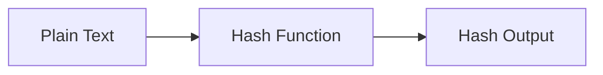

# :material-shield-lock: md5

`md5` computes the MD5 128-bit hash of a string, returning a 32-character hexadecimal string.

### :material-sitemap: Overview



## 📌 :material-shield-lock: Syntax

```sql
md5(expr)
```

- `expr`: `STRING` or `BINARY` input
- Returns: `STRING` — 32-character lowercase hex representation

## 🔍 :material-shield-lock: Behavior

1. Produces a 128-bit hash digest as a 32-character hex string.
2. Deterministic — same input always produces the same output.
3. **Not cryptographically secure** — use `SHA2` for security-sensitive applications.
4. Commonly used for data fingerprinting, deduplication, and change detection.

## 🧪 :material-shield-lock: Practical Examples

### Basic Hash

```sql
SELECT md5('Databricks') AS md5_hash;
-- Result: 'aaborned...' (32-char hex string)
```

### Row-Level Hashing for Change Detection

```sql
CREATE OR REPLACE TEMP VIEW records AS
SELECT * FROM VALUES
  (1, 'Alice', 100),
  (2, 'Bob', 200)
AS records(id, name, amount);

SELECT id, md5(CONCAT_WS('|', name, CAST(amount AS STRING))) AS row_hash
FROM records;
```

### Deduplication Key

```sql
SELECT md5(CONCAT_WS('|', col1, col2, col3)) AS dedup_key, *
FROM source_table;
```

### Compare Source vs Target

```sql
SELECT s.id
FROM source s
JOIN target t ON s.id = t.id
WHERE md5(CONCAT_WS('|', s.name, s.value)) != md5(CONCAT_WS('|', t.name, t.value));
```

## 🧠 :material-shield-lock: MD5 vs SHA

| Function | Output Length | Security | Speed |
|----------|-------------|----------|-------|
| `md5` | 32 chars (128-bit) | Weak | Fastest |
| `sha1` | 40 chars (160-bit) | Weak | Fast |
| `sha2(_, 256)` | 64 chars (256-bit) | Strong | Moderate |
