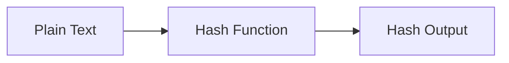

# :material-shield-lock: sha1 / sha2

SHA (Secure Hash Algorithm) functions produce cryptographic hash digests of varying strength.

### :material-sitemap: Overview



## :material-pin: :material-shield-lock: Syntax

```sql
sha1(expr)
sha2(expr, bitLength)
```

- `sha1(expr)`: Returns a 40-character hex string (160-bit hash)
- `sha2(expr, bitLength)`: Returns a hex string of the specified bit length
  - Supported `bitLength` values: `0` (= 256), `224`, `256`, `384`, `512`
- NULL input returns NULL

## :material-magnify: :material-shield-lock: Behavior

1. `SHA1` produces a 160-bit hash — considered weak for cryptographic use.
2. `SHA2` with 256+ bits is recommended for security-sensitive applications.
3. Both are deterministic — same input always yields the same hash.
4. Passing `0` as `bitLength` to `SHA2` defaults to 256.

## :material-flask-outline: :material-shield-lock: Practical Examples

### SHA1

```sql
SELECT sha1('Databricks') AS sha1_hash;
-- Result: 40-character hex string
```

### SHA2 with 256-bit

```sql
SELECT sha2('Databricks', 256) AS sha256_hash;
-- Result: 64-character hex string
```

### SHA2 with 512-bit

```sql
SELECT sha2('Databricks', 512) AS sha512_hash;
-- Result: 128-character hex string
```

### Secure Row Fingerprint

```sql
SELECT
  id,
  sha2(CONCAT_WS('|', name, email, CAST(salary AS STRING)), 256) AS secure_hash
FROM employees;
```

### Comparing Hash Strengths

```sql
SELECT
  sha1('test')          AS sha1_result,
  sha2('test', 256)     AS sha256_result,
  sha2('test', 512)     AS sha512_result;
```

## :material-brain: :material-shield-lock: Choosing the Right SHA Variant

| Function | Output | Strength | Use Case |
|----------|--------|----------|----------|
| `sha1` | 40 chars (160-bit) | Weak | Legacy compatibility |
| `sha2(_, 224)` | 56 chars (224-bit) | Moderate | Truncated fingerprints |
| `sha2(_, 256)` | 64 chars (256-bit) | Strong | **Recommended default** |
| `sha2(_, 384)` | 96 chars (384-bit) | Very strong | High-security needs |
| `sha2(_, 512)` | 128 chars (512-bit) | Strongest | Maximum security |
