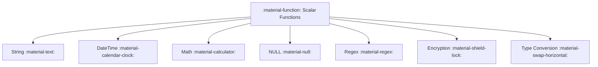

# :material-function: Scalar Functions

Scalar functions operate on individual values and return a single result per input row.
Unlike aggregate functions, they do not reduce multiple rows into one.

### :material-sitemap: Overview



## 📌 :material-function: Categories

| Category | Description | Key Functions |
|----------|-------------|---------------|
| **String** | Text manipulation and pattern matching | `UPPER`, `LOWER`, `TRIM`, `CONCAT`, `SUBSTRING`, `SPLIT` |
| **Math** | Numeric computations and rounding | `ABS`, `ROUND`, `CEIL`, `FLOOR`, `MOD`, `POWER` |
| **DateTime** | Date and timestamp operations | `DATE_ADD`, `DATEDIFF`, `DATE_TRUNC`, `CURRENT_TIMESTAMP` |
| **Predicate** | Boolean checks and conditions | `ISNULL`, `ISNAN`, `ISNOTNULL`, `IF` |
| **Control** | Conditional logic within queries | `CASE WHEN`, `COALESCE`, `NULLIF`, `NVL`, `IIF` |
| **Conversion** | Type casting and format conversion | `CAST`, `TRY_CAST`, `TO_DATE`, `TO_TIMESTAMP` |
| **Count** | Row-level counting operations | `MONOTONICALLY_INCREASING_ID`, `SPARK_PARTITION_ID` |
| **Bitwise** | Bit-level operations on integers | `SHIFTLEFT`, `SHIFTRIGHT`, `BIT_AND`, `BIT_OR` |
| **ACL** | Access control and current user info | `CURRENT_USER`, `IS_MEMBER` |
| **NULL** | NULL-safe value handling | `COALESCE`, `NVL`, `NVL2`, `IFNULL`, `NANVL` |
| **Regex** | Regular expression matching and extraction | `REGEXP_EXTRACT`, `REGEXP_REPLACE`, `RLIKE` |
| **Encryption** | Hashing and data masking | `MD5`, `SHA2`, `CRC32`, `MASK` |
| **Web** | URL parsing | `PARSE_URL` |

## 🧪 :material-function: Quick Examples

```sql
-- String
SELECT UPPER('spark sql'), CONCAT('hello', ' ', 'world');

-- Math
SELECT ROUND(3.14159, 2), ABS(-42);

-- DateTime
SELECT DATE_ADD(CURRENT_DATE(), 7), DATEDIFF('2024-12-31', '2024-01-01');

-- Conversion
SELECT CAST('2024-01-15' AS DATE), TRY_CAST('abc' AS INT);
```
