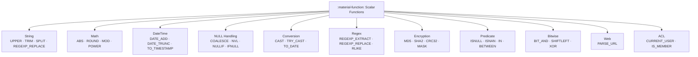

# :material-function: Scalar Functions

Scalar functions operate on **individual values** and return a single result
per input row. They are used in `SELECT`, `WHERE`, `ORDER BY`, `CASE WHEN`,
and anywhere an expression is valid.

---

## :material-sitemap: Categories



---

## :material-compare: Category Summary

| Category | Key Functions | Common use |
|----------|--------------|------------|
| **String** | `UPPER`, `LOWER`, `TRIM`, `LTRIM`, `RTRIM`, `CONCAT`, `CONCAT_WS`, `SPLIT`, `SUBSTRING`, `LEFT`, `RIGHT`, `REPLACE`, `INSTR`, `LENGTH`, `LPAD`, `RPAD`, `REPEAT`, `REVERSE`, `INITCAP` | Normalise, parse, format text |
| **Math** | `ABS`, `ROUND`, `CEIL`, `FLOOR`, `MOD`, `POWER`, `SQRT`, `LOG`, `EXP`, `SIGN`, `GREATEST`, `LEAST`, `RAND`, `RANDN` | Numeric transformations |
| **DateTime** | `CURRENT_DATE`, `CURRENT_TIMESTAMP`, `NOW`, `DATE_ADD`, `DATE_SUB`, `DATEDIFF`, `DATE_TRUNC`, `DATE_FORMAT`, `TO_DATE`, `TO_TIMESTAMP`, `YEAR`, `MONTH`, `DAY`, `HOUR`, `MINUTE`, `SECOND`, `DAYOFWEEK`, `WEEKOFYEAR` | Date/time arithmetic and formatting |
| **NULL** | `COALESCE`, `NVL`, `NVL2`, `NULLIF`, `IFNULL`, `NANVL`, `IS NULL`, `IS NOT NULL` | Safe NULL handling |
| **Conversion** | `CAST`, `TRY_CAST`, `TO_DATE`, `TO_TIMESTAMP`, `TO_UNIX_TIMESTAMP`, `FROM_UNIXTIME`, `HEX`, `UNHEX`, `BIN`, `CONV` | Type conversion |
| **Control** | `IF`, `IIF`, `CASE WHEN`, `DECODE` | Conditional value selection |
| **Regex** | `REGEXP_EXTRACT`, `REGEXP_EXTRACT_ALL`, `REGEXP_REPLACE`, `REGEXP_COUNT`, `REGEXP_INSTR`, `REGEXP_SUBSTR`, `RLIKE`, `ILIKE` | Pattern matching |
| **Encryption** | `MD5`, `SHA1`, `SHA2`, `CRC32`, `HASH`, `XXHASH64`, `MASK`, `MASK_FIRST_N` | Hashing and masking |
| **Predicate** | `ISNULL`, `ISNOTNULL`, `ISNAN`, `ISNOTNAN`, `IN`, `BETWEEN` | Boolean checks |
| **Bitwise** | `BIT_AND`, `BIT_OR`, `BIT_XOR`, `SHIFTLEFT`, `SHIFTRIGHT`, `SHIFTRIGHTUNSIGNED` | Integer bit manipulation |
| **Web** | `PARSE_URL`, `URL_ENCODE`, `URL_DECODE` | URL processing |
| **ACL** | `CURRENT_USER`, `CURRENT_DATABASE`, `IS_MEMBER`, `SPARK_PARTITION_ID` | Session info |

---

## :material-flash: Quick Examples

```sql
-- String
SELECT UPPER(TRIM('  hello world  ')) AS cleaned;          -- 'HELLO WORLD'
SELECT SPLIT('a,b,c', ',');                                 -- ['a', 'b', 'c']
SELECT CONCAT_WS('-', '2024', '06', '01');                  -- '2024-06-01'
SELECT SUBSTRING('Spark SQL', 7, 3);                        -- 'SQL'
SELECT LPAD(CAST(id AS STRING), 8, '0') AS padded_id FROM orders;

-- Math
SELECT ROUND(3.14159, 2), ABS(-42), MOD(17, 5);            -- 3.14, 42, 2
SELECT GREATEST(10, 20, 5), LEAST(10, 20, 5);              -- 20, 5
SELECT POWER(2, 10), SQRT(144);                             -- 1024.0, 12.0

-- DateTime
SELECT DATE_ADD(CURRENT_DATE(), 30);
SELECT DATEDIFF('2024-12-31', '2024-01-01');                -- 365
SELECT DATE_TRUNC('month', order_date) AS month_start FROM orders;
SELECT DATE_FORMAT(order_date, 'yyyy-MM') AS year_month FROM orders;

-- NULL
SELECT COALESCE(NULL, NULL, 'fallback');                    -- 'fallback'
SELECT NULLIF(region, 'N/A') FROM customers;                -- NULL when 'N/A'
SELECT NVL2(email, 'has_email', 'no_email') FROM users;

-- Conversion
SELECT CAST('2024-01-15' AS DATE);
SELECT TRY_CAST('abc' AS INT);                              -- NULL (no error)
SELECT TO_TIMESTAMP('2024-06-01 12:30:00', 'yyyy-MM-dd HH:mm:ss');

-- Regex
SELECT REGEXP_EXTRACT('order_123_US', r'order_(\d+)_(\w+)', 1);  -- '123'
SELECT REGEXP_REPLACE(phone, r'[^0-9]', '');                       -- digits only
SELECT REGEXP_COUNT(text, r'\bspark\b');                           -- word count

-- Hashing
SELECT MD5(email) AS email_hash FROM users;
SELECT SHA2(CAST(id AS STRING), 256) AS id_hash FROM orders;
```

---

## :material-magnify: Behavior Notes

1. **`CAST` vs `TRY_CAST`** — `CAST` throws an error on invalid input; `TRY_CAST` returns NULL, making it safe for dirty data.
2. **String indexing is 1-based** — `SUBSTRING(s, 1, 3)` returns the first 3 characters.
3. **NULL propagation** — most scalar functions return NULL when any argument is NULL; use `COALESCE` to provide defaults.
4. **`CURRENT_DATE()` vs `CURRENT_TIMESTAMP()`** — `CURRENT_DATE()` returns a `DATE`; `CURRENT_TIMESTAMP()` returns a `TIMESTAMP` in the session timezone.
5. **Determinism** — `RAND()`, `RANDN()`, `NOW()`, `UUID()` are non-deterministic; avoid them in `WHERE` predicates if pushdown is needed.

---

## :material-book-open-variant: In This Section

| Page | Contents |
|------|----------|
| [String](string.md) | Text manipulation, formatting, pattern matching |
| [Math](math.md) | Arithmetic, rounding, logarithms, random |
| [DateTime](datetime/index.md) | Dates, timestamps, intervals, timezones |
| [NULL](null.md) | `COALESCE`, `NVL`, `NULLIF`, null-safe comparison |
| [Predicate](predicate.md) | `ISNULL`, `ISNAN`, `IN`, `BETWEEN` |
| [Control](control.md) | `IF`, `IIF`, `CASE`, `DECODE` |
| [Conversion](conversion.md) | `CAST`, `TRY_CAST`, `TO_DATE`, `TO_TIMESTAMP` |
| [Regex](regex/index.md) | `REGEXP_EXTRACT`, `REGEXP_REPLACE`, `RLIKE` |
| [Encryption](encryption/index.md) | `MD5`, `SHA2`, `CRC32`, `MASK` |
| [Bitwise](bitwise.md) | Bit operations on integers |
| [Web](web.md) | `PARSE_URL`, `URL_ENCODE` |
| [ACL](acl.md) | `CURRENT_USER`, `IS_MEMBER` |
