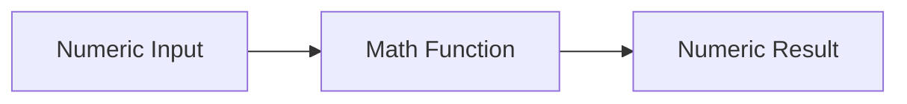

# :material-calculator: Math Functions

Spark SQL provides a rich set of scalar math functions for numeric
calculations.

### :material-sitemap: Overview



---

## :material-pin: :material-calculator: Common Functions

| Function | Purpose |
|----------|---------|
| `ABS` | Absolute value |
| `CEIL`, `FLOOR` | Round up or down |
| `ROUND`, `BROUND` | Round with precision |
| `POWER` | Exponentiation |
| `LOG`, `LOG10`, `LN` | Logarithms |
| `EXP` | e^x |
| `SQRT` | Square root |
| `RAND` | Random number |

---

## :material-flask-outline: :material-calculator: Examples

```sql
SELECT ABS(-10) AS abs_val,
       ROUND(3.14159, 2) AS rounded,
       POWER(2, 3) AS pow;
```

---

## :material-brain: :material-calculator: When to Use

| Scenario | Function |
|----------|----------|
| Normalize values | `ABS`, `ROUND` |
| Compute rates | `LOG`, `EXP` |
| Generate random samples | `RAND` |
