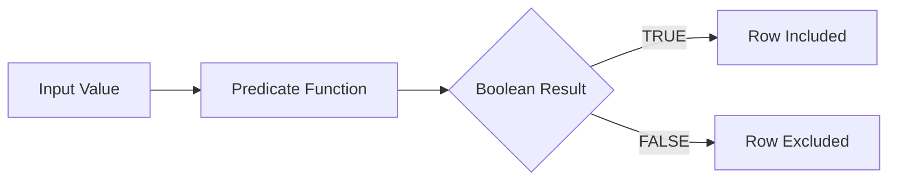

# :material-check-circle: Predicate Functions

Predicate functions return TRUE or FALSE and are often used in filters.

### :material-sitemap: Overview



---

## 📌 :material-check-circle: Common Functions

| Function | Purpose |
|----------|---------|
| `ISNULL` | Check NULL |
| `ISNOTNULL` | Check non-NULL |
| `ISNAN` | Check NaN |
| `INSTR` | Substring check |

---

## 🧪 :material-check-circle: Example

```sql
SELECT * FROM metrics WHERE ISNAN(value) = false;
```

---

## 🧠 :material-check-circle: When to Use

| Scenario | Recommendation |
|----------|----------------|
| Null checks | `ISNULL` / `ISNOTNULL` |
| NaN detection | `ISNAN` |
