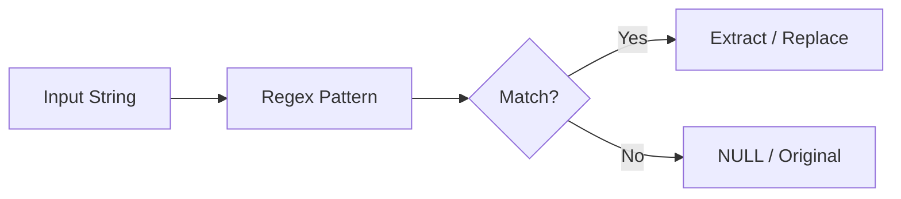

# :material-regex: REGEXP_COUNT

`REGEXP_COUNT` returns the number of matches of a regular expression in a
string.

### :material-sitemap: Overview



---

## 📌 :material-regex: Syntax

```sql
REGEXP_COUNT(str, pattern)
REGEXP_COUNT(str, pattern, position)
REGEXP_COUNT(str, pattern, position, match_type)
```

---

## 🔍 :material-regex: Behavior Notes

1. Returns 0 when there is no match.
2. Position is 1-based; matching starts at that index.
3. `match_type` can include flags like `i` for case-insensitive.

---

## 🧪 :material-regex: Examples

```sql
SELECT REGEXP_COUNT('abcabc', 'ab') AS count;  -- 2
```

```sql
SELECT REGEXP_COUNT('Test123test', 'test', 1, 'i') AS count;  -- 2
```

---

## 🧠 :material-regex: When to Use

| Scenario | Pattern |
|----------|---------|
| Count pattern occurrences | `REGEXP_COUNT` |
| Case-insensitive counts | Provide `match_type` |
