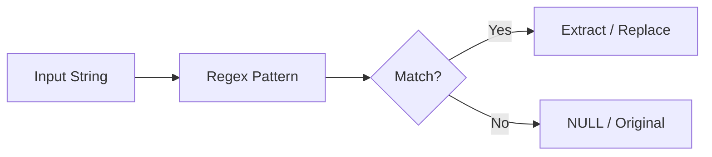

# :material-regex: REGEXP_EXTRACT

`REGEXP_EXTRACT` returns a capturing group from a string that matches a regex.

### :material-sitemap: Overview



---

## :material-pin: :material-regex: Syntax

```sql
REGEXP_EXTRACT(str, pattern, idx)
```

---

## :material-magnify: :material-regex: Behavior

1. `idx` is the capture group index (0 = full match).
2. Returns empty string when there is no match.
3. Regex uses Java syntax.

---

## :material-flask-outline: :material-regex: Example

```sql
SELECT REGEXP_EXTRACT('abc-123', '([a-z]+)-(\d+)', 2) AS num;
```

---

## :material-brain: :material-regex: When to Use

| Scenario | Recommendation |
|----------|----------------|
| Extract tokens | `REGEXP_EXTRACT` |
| Validate format | `REGEXP_LIKE` |
