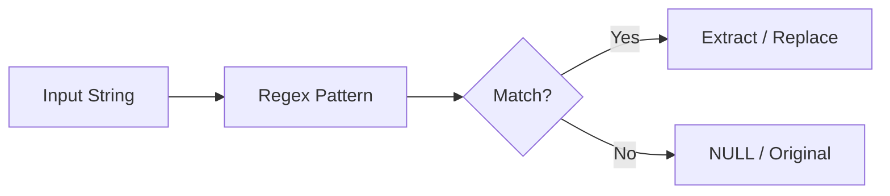

# :material-regex: regexp_instr

`regexp_instr` searches a string for a regular expression pattern and returns the
**1-based position** of the first match.

### :material-sitemap: Overview



## :material-pin: :material-regex: Syntax

```sql
regexp_instr(str, regexp)
```

- `str`: Input string to search
- `regexp`: Java-style regular expression pattern
- Returns: `INT` — 1-based position of the match, or `0` if no match

## :material-magnify: :material-regex: Behavior

1. Positions are **1-based** (not 0-based).
2. Returns `0` if no match is found.
3. Returns the position of the **first** occurrence.

## :material-flask-outline: :material-regex: Practical Examples

### Find Position of Pattern

```sql
SELECT regexp_instr('user@spark.apache.org', '@[^.]*');
-- Result: 5 (position of '@spark')
```

### No Match Returns Zero

```sql
SELECT regexp_instr('hello world', '\\d+');
-- Result: 0
```

### Find First Digit Position

```sql
SELECT regexp_instr('order-ABC-123', '\\d');
-- Result: 11
```

### Combined with SUBSTRING

```sql
-- Extract everything from the first digit onward
SELECT SUBSTRING('item-456-detail', regexp_instr('item-456-detail', '\\d'));
-- Result: '456-detail'
```

## :material-brain: :material-regex: When to Use

| Scenario | Function |
|----------|----------|
| Find **where** a pattern occurs | `regexp_instr` |
| Extract the **match itself** | `regexp_substr` or `regexp_extract` |
| Check **if** a pattern exists | `regexp_like` / `RLIKE` |
