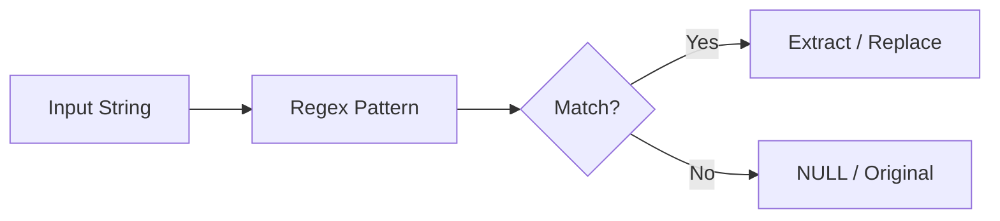

# :material-regex: regexp_like

`regexp_like` tests whether a string matches a regular expression pattern, returning a boolean.

### :material-sitemap: Overview



## :material-pin: :material-regex: Syntax

```sql
regexp_like(str, regexp)
```

- `str`: Input string to test
- `regexp`: Java-style regular expression pattern
- Returns: `BOOLEAN` — `true` if the pattern matches, `false` otherwise

## :material-magnify: :material-regex: Behavior

1. Returns `true` if the pattern matches **anywhere** within the string (partial match).
2. To match the entire string, anchor with `^...$`.
3. Equivalent to the `RLIKE` operator.
4. NULL input returns NULL.

## :material-flask-outline: :material-regex: Practical Examples

### Basic Pattern Match

```sql
SELECT regexp_like('Spark SQL', 'Spark');
-- Result: true
```

### Full String Match with Anchors

```sql
SELECT regexp_like('Spark', '^Spark$');  -- true
SELECT regexp_like('Apache Spark', '^Spark$');  -- false
```

### Escaped String Literals

```sql
SET spark.sql.parser.escapedStringLiterals=true;
SELECT regexp_like('%SystemDrive%\Users\John', '%SystemDrive%\\Users.*');

SET spark.sql.parser.escapedStringLiterals=false;
SELECT regexp_like('%SystemDrive%\\Users\\John', '%SystemDrive%\\\\Users.*');
```

### Validate Email Format

```sql
SELECT regexp_like('user@example.com', '^[\\w.]+@[\\w.]+\\.[a-zA-Z]{2,}$');
-- Result: true
```

### Filter Rows by Pattern

```sql
CREATE OR REPLACE TEMP VIEW logs AS
SELECT * FROM VALUES
  ('ERROR: disk full'), ('INFO: started'), ('WARN: low memory'), ('ERROR: timeout')
AS logs(message);

SELECT message FROM logs WHERE regexp_like(message, '^ERROR');
```

## :material-brain: :material-regex: regexp_like vs RLIKE vs LIKE

| Operator | Pattern Type | Case Sensitive |
|----------|-------------|---------------|
| `regexp_like` | Regex | Yes |
| `RLIKE` | Regex (operator syntax) | Yes |
| `ILIKE` | SQL wildcard (`%`, `_`) | No |
| `LIKE` | SQL wildcard (`%`, `_`) | Yes |
