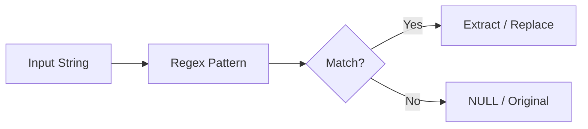

# :material-regex: Regex Functions

Spark SQL regex functions support pattern matching and extraction.

### :material-sitemap: Overview



---

## :material-pin: :material-regex: Common Functions

| Function | Purpose |
|----------|---------|
| `REGEXP_LIKE` / `RLIKE` | Boolean match |
| `REGEXP_EXTRACT` | Extract capture group |
| `REGEXP_REPLACE` | Replace matches |
| `REGEXP_COUNT` | Count matches |
| `REGEXP_INSTR` | Position of match |
| `REGEXP_SUBSTR` | Return matched substring |

---

## :material-flask-outline: :material-regex: Example

```sql
SELECT REGEXP_EXTRACT('abc-123', '([a-z]+)-(\d+)', 2) AS num;
```

---

## :material-brain: :material-regex: When to Use

| Scenario | Function |
|----------|----------|
| Validate strings | `REGEXP_LIKE` |
| Extract tokens | `REGEXP_EXTRACT` |
| Replace patterns | `REGEXP_REPLACE` |
