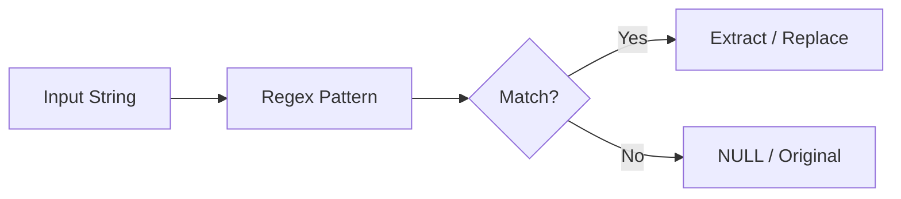

# :material-regex: regexp_substr

`regexp_substr` returns the substring that matches a regular expression pattern.

### :material-sitemap: Overview



## 📌 :material-regex: Syntax

```sql
regexp_substr(str, regexp)
```

- `str`: Input string to search
- `regexp`: Java-style regular expression pattern
- Returns: `STRING` — the matched substring, or `NULL` if no match

## 🔍 :material-regex: Behavior

1. Scans the string for the **first** occurrence matching the pattern.
2. Returns the entire matched substring (not a capturing group).
3. Returns `NULL` if no match is found.
4. Equivalent to `REGEXP_EXTRACT(str, regexp, 0)`.

## 🧪 :material-regex: Practical Examples

### Basic Match

```sql
SELECT regexp_substr('order-12345-item', '\\d+');
-- Result: '12345'
```

### Email Domain Extraction

```sql
SELECT regexp_substr('user@spark.apache.org', '@[\\w.]+');
-- Result: '@spark.apache.org'
```

### No Match Returns NULL

```sql
SELECT regexp_substr('hello world', '\\d+');
-- Result: NULL
```

### Pattern with Character Classes

```sql
SELECT regexp_substr('Price: $99.50 USD', '\\$[\\d.]+');
-- Result: '$99.50'
```

## 🧠 :material-regex: regexp_substr vs regexp_extract

| Function | Returns | Capturing Groups |
|----------|---------|-----------------|
| `regexp_substr(str, regex)` | Full match | No |
| `regexp_extract(str, regex, idx)` | Specific group | Yes (by index) |
