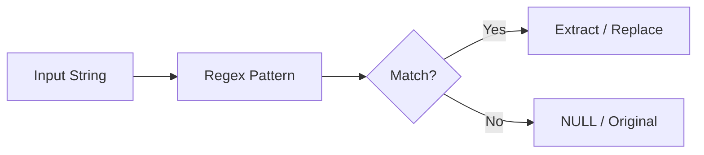

# :material-regex: regexp operator

    str [NOT] regexp regex

### :material-sitemap: Overview

## :material-regex: Arguments

str: A STRING expression to be matched.

regex: A STRING expression with a matching pattern.

    SELECT r'%SystemDrive%\Users\John' rlike r'%SystemDrive%\\Users.*';
    SELECT r'%SystemDrive%\Users\John' rlike r'%SystemDrive%\Users.*';
    SELECT r'%SystemDrive%\Users\John' rlike '%SystemDrive%\\\\Users.*';

## :material-regex: ilike operator

    str [ NOT ] ilike ( pattern [ ESCAPE escape ] )
    str [ NOT ] ilike { ANY | SOME | ALL } ( [ pattern [, ...] ] )

    SELECT ilike('Spark', '_PARK');
    SELECT r'%SystemDrive%\users\John' ilike r'\%SystemDrive\%\\Users%';
    SELECT r'%SystemDrive%\users\John' ilike '\%SystemDrive\%\\\\Users%';
    SELECT '%SystemDrive%/Users/John' ilike '/%SystemDrive/%//users%' ESCAPE '/';
    SELECT like('Spock', '_pArk');
    SELECT 'Spark' like SOME ('_ParK', '_Ock')
    SELECT 'Spark' like ALL ('_ParK', '_Ock')
