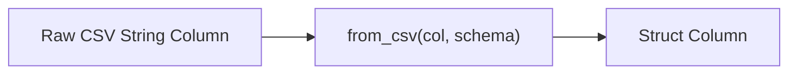

# :material-file-code: CSV Functions

Spark SQL provides functions to **parse CSV strings into structs** and **serialize structs back
to CSV** — enabling inline CSV processing without file I/O.

### :material-sitemap: Overview



## 📌 FROM_CSV — Parse CSV String

### Syntax

```sql
FROM_CSV(csv_string, schema [, options])
```

| Parameter | Description |
|-----------|-------------|
| `csv_string` | Column or literal containing CSV text |
| `schema` | DDL schema string defining field names and types |
| `options` | *(Optional)* Map of parsing options |

### 🔍 Behavior

1. Returns a `STRUCT` with fields matching the schema.
2. Fields are matched by **position** (first CSV field → first schema field).
3. Returns `NULL` for the entire struct if parsing fails (in PERMISSIVE mode).
4. Use `options` map to customize delimiter, quote character, etc.

### 🧪 Practical Examples

#### 🧱 1. Basic Parsing

```sql
SELECT FROM_CSV('Alice,30,NYC', 'name STRING, age INT, city STRING') AS parsed;
-- Result: {name: Alice, age: 30, city: NYC}
```

#### 🧱 2. Access Struct Fields

```sql
SELECT parsed.name, parsed.age, parsed.city
FROM (
  SELECT FROM_CSV('Alice,30,NYC', 'name STRING, age INT, city STRING') AS parsed
);
-- Result: Alice, 30, NYC
```

#### 🧱 3. Timestamp Parsing with Format

```sql
SELECT FROM_CSV('26/08/2015', 'time TIMESTAMP', MAP('timestampFormat', 'dd/MM/yyyy')) AS parsed;
-- Result: {time: 2015-08-26 00:00:00}
```

#### 🧱 4. Custom Delimiter

```sql
SELECT FROM_CSV('Tom|25|LA', 'name STRING, age INT, city STRING', MAP('delimiter', '|')) AS parsed;
-- Result: {name: Tom, age: 25, city: LA}
```

#### 🧱 5. Parse a CSV Column

```sql
CREATE OR REPLACE TEMP VIEW raw_data AS
SELECT * FROM VALUES
  ('Alice,30,New York'),
  ('Bob,45,San Francisco')
AS raw_data(csv_col);

SELECT FROM_CSV(csv_col, 'name STRING, age INT, city STRING') AS parsed
FROM raw_data;
-- {Alice, 30, New York}, {Bob, 45, San Francisco}
```

### Common Options

| Option | Description | Default |
|--------|-------------|---------|
| `delimiter` | Field delimiter | `,` |
| `quote` | Quote character | `"` |
| `escape` | Escape character | `\` |
| `multiLine` | Fields spanning multiple lines | `false` |
| `mode` | `PERMISSIVE`, `DROPMALFORMED`, `FAILFAST` | `PERMISSIVE` |
| `columnNameOfCorruptRecord` | Capture corrupt record column | — |

---

## 📌 TO_CSV — Serialize Struct to CSV

### Syntax

```sql
TO_CSV(struct_expr [, options])
```

### 🧪 Examples

```sql
SELECT TO_CSV(NAMED_STRUCT('name', 'Alice', 'age', 30, 'city', 'NYC')) AS csv;
-- Result: 'Alice,30,NYC'

-- Custom delimiter
SELECT TO_CSV(NAMED_STRUCT('a', 1, 'b', 2), MAP('delimiter', '|')) AS csv;
-- Result: '1|2'
```

---

## 📌 SCHEMA_OF_CSV — Infer Schema

### Syntax

```sql
SCHEMA_OF_CSV(csv_string)
```

Returns the inferred schema in DDL format — useful for exploring unfamiliar CSV data.

```sql
SELECT SCHEMA_OF_CSV('Alice,30,NYC');
-- Result: 'STRUCT<_c0: STRING, _c1: INT, _c2: STRING>'
```

---

## 🆚 FROM_CSV vs File-Based CSV Reading

| Feature | `read.csv()` / `USING csv` | `FROM_CSV()` |
|---------|---------------------------|-------------|
| Reads CSV files | ✅ Yes | ❌ No |
| Parses CSV strings | ❌ No | ✅ Yes |
| Used in SQL expressions | ✅ (USING csv) | ✅ (function) |
| Returns | DataFrame | STRUCT column |
| Use case | Batch file ingestion | Inline string parsing |

## 🧠 When to Use

| Scenario | Function |
|----------|----------|
| CSV data embedded in a column | `FROM_CSV` |
| Export structs as CSV strings | `TO_CSV` |
| Explore unknown CSV structure | `SCHEMA_OF_CSV` |
| Custom delimiters / quoting | `FROM_CSV` with options map |
| File-based CSV ingestion | Use `USING csv` reader instead |
