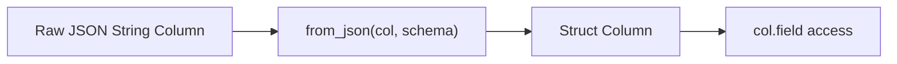

# :material-file-code: JSON Functions

Spark SQL provides functions to **parse**, **generate**, **extract from**, and **inspect**
JSON data — enabling full JSON processing within SQL expressions.

### :material-sitemap: Overview



## 📌 FROM_JSON — Parse JSON String

### Syntax

```sql
FROM_JSON(json_string, schema [, options])
```

| Parameter | Description |
|-----------|-------------|
| `json_string` | Column or literal containing JSON text |
| `schema` | DDL schema string or `STRUCT` type |
| `options` | *(Optional)* Map of parsing options |

### 🧪 Examples

#### Basic Struct

```sql
SELECT FROM_JSON('{"a":1, "b":0.8}', 'a INT, b DOUBLE') AS parsed;
-- Result: {a: 1, b: 0.8}
```

#### Timestamp with Custom Format

```sql
SELECT FROM_JSON('{"time":"26/08/2015"}', 'time TIMESTAMP',
  MAP('timestampFormat', 'dd/MM/yyyy')) AS parsed;
-- Result: {time: 2015-08-26 00:00:00}
```

#### Nested Struct with Array

```sql
SELECT FROM_JSON(
  '{"teacher":"Alice","student":[{"name":"Bob","rank":1},{"name":"Charlie","rank":2}]}',
  'STRUCT<teacher: STRING, student: ARRAY<STRUCT<name: STRING, rank: INT>>>'
) AS parsed;
-- Result: {teacher: Alice, student: [{Bob, 1}, {Charlie, 2}]}
```

#### Access Fields After Parsing

```sql
SELECT parsed.teacher, parsed.student[0].name AS top_student
FROM (
  SELECT FROM_JSON(
    '{"teacher":"Alice","student":[{"name":"Bob","rank":1}]}',
    'STRUCT<teacher: STRING, student: ARRAY<STRUCT<name: STRING, rank: INT>>>'
  ) AS parsed
);
-- Result: Alice, Bob
```

---

## 📌 TO_JSON — Serialize to JSON String

### Syntax

```sql
TO_JSON(expr [, options])
```

Converts a struct, map, or array to a JSON string.

```sql
SELECT TO_JSON(NAMED_STRUCT('name', 'Alice', 'age', 30)) AS json;
-- Result: '{"name":"Alice","age":30}'

SELECT TO_JSON(MAP('key', 'value')) AS json;
-- Result: '{"key":"value"}'

SELECT TO_JSON(ARRAY(1, 2, 3)) AS json;
-- Result: '[1,2,3]'
```

---

## 📌 GET_JSON_OBJECT — Extract by JSONPath

### Syntax

```sql
GET_JSON_OBJECT(json_string, path)
```

Extracts a single value from a JSON string using JSONPath syntax (`$.field`).

```sql
SELECT GET_JSON_OBJECT('{"a":"b"}', '$.a') AS val;
-- Result: b

SELECT GET_JSON_OBJECT('{"store":{"book":"Spark","price":29.99}}', '$.store.book') AS title;
-- Result: Spark

-- Nested array access
SELECT GET_JSON_OBJECT('{"items":[{"name":"pen"},{"name":"book"}]}', '$.items[1].name') AS item;
-- Result: book
```

> Returns `NULL` if the path does not match. Always returns a STRING.

---

## 📌 JSON_TUPLE — Extract Multiple Keys

### Syntax

```sql
JSON_TUPLE(json_string, key1, key2, …)
```

Extracts multiple top-level keys at once — more efficient than multiple `GET_JSON_OBJECT` calls.

```sql
SELECT JSON_TUPLE('{"a":1, "b":2, "c":3}', 'a', 'b') AS (val_a, val_b);
-- Result: 1, 2
```

> Used as a generator function — works with `LATERAL VIEW` or in SELECT.

---

## 📌 JSON_ARRAY_LENGTH — Count Array Elements

### Syntax

```sql
JSON_ARRAY_LENGTH(json_array)
```

Returns the number of elements in the outermost JSON array.

```sql
SELECT JSON_ARRAY_LENGTH('[1,2,3,4]');
-- Result: 4

SELECT JSON_ARRAY_LENGTH('[1,2,3,{"f1":1,"f2":[5,6]},4]');
-- Result: 5

-- Non-array JSON returns NULL
SELECT JSON_ARRAY_LENGTH('{"a":1}');
-- Result: NULL
```

---

## 📌 JSON_OBJECT_KEYS — List Object Keys

### Syntax

```sql
JSON_OBJECT_KEYS(json_object)
```

Returns all top-level keys of a JSON object as an array of strings.

```sql
SELECT JSON_OBJECT_KEYS('{"key":"value"}');
-- Result: ['key']

SELECT JSON_OBJECT_KEYS('{"f1":"abc","f2":{"f3":"a","f4":"b"}}');
-- Result: ['f1', 'f2']

-- Empty object
SELECT JSON_OBJECT_KEYS('{}');
-- Result: []

-- Non-object returns NULL
SELECT JSON_OBJECT_KEYS('[1,2]');
-- Result: NULL
```

---

## 📌 SCHEMA_OF_JSON — Infer Schema

### Syntax

```sql
SCHEMA_OF_JSON(json_string [, options])
```

Returns the inferred schema in DDL format — useful for exploring unfamiliar JSON data.

```sql
SELECT SCHEMA_OF_JSON('[{"col":0}]');
-- Result: 'ARRAY<STRUCT<col: BIGINT>>'

SELECT SCHEMA_OF_JSON('[{"col":01}]', MAP('allowNumericLeadingZeros', 'true'));
-- Result: 'ARRAY<STRUCT<col: BIGINT>>'
```

---

## 🔍 Behavior Summary

| Function | Input | Output | NULL Handling |
|----------|-------|--------|--------------|
| `FROM_JSON` | JSON string | STRUCT / ARRAY | NULL if parse fails |
| `TO_JSON` | STRUCT / MAP / ARRAY | JSON string | NULL if input is NULL |
| `GET_JSON_OBJECT` | JSON string + path | STRING | NULL if path not found |
| `JSON_TUPLE` | JSON string + keys | Multiple STRING cols | NULL per missing key |
| `JSON_ARRAY_LENGTH` | JSON array string | INT | NULL if not an array |
| `JSON_OBJECT_KEYS` | JSON object string | ARRAY\<STRING\> | NULL if not an object |
| `SCHEMA_OF_JSON` | JSON string | DDL STRING | — |

## 🧠 When to Use

| Scenario | Function |
|----------|----------|
| Parse JSON column into typed struct | `FROM_JSON` |
| Serialize structs/maps for export | `TO_JSON` |
| Extract one field by path | `GET_JSON_OBJECT` |
| Extract multiple fields efficiently | `JSON_TUPLE` |
| Count elements in JSON array | `JSON_ARRAY_LENGTH` |
| Discover keys in JSON object | `JSON_OBJECT_KEYS` |
| Infer schema for unknown JSON | `SCHEMA_OF_JSON` |

> **Tip:** For repeated access to multiple JSON fields, parse once with `FROM_JSON` and use
> struct dot notation — it's far more efficient than calling `GET_JSON_OBJECT` multiple times.
