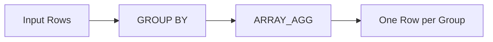

# :material-sigma: array_agg

`array_agg` collects values from a group into an array, including duplicates and NULLs.

## :material-sitemap: Overview



### :material-animation-play: Interactive Visualization — Standard `ORDER BY` vs Spark's Workarounds

<div id="viz-array-agg-orderby" class="ts-viz"></div>

Compare the standard-SQL `ARRAY_AGG(expr ORDER BY ...)` syntax (unsupported
in Spark) against the two working alternatives: sort-after-aggregate, or an
ordered window frame.

## :material-pin: Syntax

```sql
array_agg(expr)
```

- Returns: `ARRAY<T>` where `T` is the type of `expr`
- Includes duplicates and NULL values
- Order of elements is non-deterministic after a shuffle

## :material-magnify: Behavior

1. Collects all values (including NULLs) from the group into an array.
2. Equivalent to `COLLECT_LIST` but follows SQL standard naming.
3. The result order is **non-deterministic** unless combined with `ORDER BY` in a window function.

## :material-flask-outline: Practical Examples

### Basic Aggregation

```sql
SELECT array_agg(col) FROM VALUES (1), (2), (1) AS tab(col);
-- Result: [1, 2, 1]
```

### Grouped Aggregation

```sql
CREATE OR REPLACE TEMP VIEW sales AS
SELECT * FROM VALUES
  ('East', 100), ('East', 200), ('West', 300),
  ('West', 100), ('East', 100)
AS sales(region, amount);

SELECT region, array_agg(amount) AS amounts
FROM sales
GROUP BY region;
```

| region | amounts         |
| ------ | --------------- |
| East   | [100, 200, 100] |
| West   | [300, 100]      |

### With NULL Values

```sql
SELECT array_agg(col) FROM VALUES (1), (NULL), (3) AS tab(col);
-- Result: [1, null, 3]
```

### Distinct Values (Use collect_set Instead)

```sql
-- array_agg keeps duplicates; for distinct, use collect_set
SELECT collect_set(col) FROM VALUES (1), (2), (1) AS tab(col);
-- Result: [1, 2]
```

## :material-brain: array_agg vs collect_list vs collect_set

| Function       | Duplicates | NULLs    | Standard       |
| -------------- | ---------- | -------- | -------------- |
| `array_agg`    | Kept       | Included | SQL standard   |
| `collect_list` | Kept       | Included | Spark-specific |
| `collect_set`  | Removed    | Excluded | Spark-specific |

## :material-alert-outline: No `ORDER BY` Inside the Aggregate Call

Standard SQL allows `ARRAY_AGG(expr ORDER BY sort_expr)` to request a
deterministic element order directly in the aggregate call. **Spark SQL does
not support this syntax** — it's a parse error, verified on Spark 4.2:

```sql
SELECT array_agg(col ORDER BY col DESC) FROM VALUES (1), (3), (2) AS tab(col);
-- Error: [PARSE_SYNTAX_ERROR] Syntax error at or near 'ORDER': missing ')'.
```

Use one of these instead:

```sql
-- 1. Sort after aggregation
SELECT SORT_ARRAY(ARRAY_AGG(col), false) AS desc_sorted
FROM VALUES (1), (3), (2) AS tab(col);
-- Result: [3, 2, 1]

-- 2. Drive the order through a window frame (needed when the sort key
--    differs from the collected column)
SELECT ARRAY_AGG(col) OVER (ORDER BY sort_col
  ROWS BETWEEN UNBOUNDED PRECEDING AND UNBOUNDED FOLLOWING) AS ordered
FROM VALUES (1, 3), (2, 1), (3, 2) AS tab(col, sort_col)
LIMIT 1;
```
