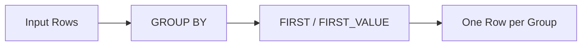

# :material-sigma: first / first_value

`first` returns the first value encountered in a group. When used with `ORDER BY`
in window functions, it returns the first value in the ordered frame.

## :material-sitemap: Overview



### :material-animation-play: Interactive Visualization — Window Frame Boundaries

<div id="viz-first-last-frame" class="ts-viz"></div>

Compare the `UNBOUNDED PRECEDING AND UNBOUNDED FOLLOWING` frame (sees the
whole partition, used for "first/last known value") against
`UNBOUNDED PRECEDING AND CURRENT ROW` (a running frame, used for
"most-recent-so-far" style lookups).

## :material-pin: Syntax

```sql
first(expr[, ignoreNulls])
first_value(expr[, ignoreNulls])
```

- `expr`: The column or expression to evaluate
- `ignoreNulls`: When `true`, skips NULL values (default: `false`)
- Returns: Same type as `expr`

## :material-magnify: Behavior

1. Returns the first value encountered in the group.
2. Result is **non-deterministic** without an explicit `ORDER BY` (row order depends on shuffle).
3. When `ignoreNulls = true`, the first non-NULL value is returned.
4. `first` and `first_value` are aliases.

## :material-flask-outline: Practical Examples

### Basic Usage

```sql
SELECT first(col) FROM VALUES (10), (5), (20) AS tab(col);
-- Result: 10
```

### NULL Handling

```sql
-- Default: returns NULL if first value is NULL
SELECT first(col) FROM VALUES (NULL), (5), (20) AS tab(col);
-- Result: null

-- ignoreNulls = true: skips NULLs
SELECT first(col, true) FROM VALUES (NULL), (5), (20) AS tab(col);
-- Result: 5
```

### first_value (Alias)

```sql
SELECT first_value(col) FROM VALUES (10), (5), (20) AS tab(col);
-- Result: 10

SELECT first_value(col, true) FROM VALUES (NULL), (5), (20) AS tab(col);
-- Result: 5
```

### Window Function Usage

```sql
CREATE OR REPLACE TEMP VIEW events AS
SELECT * FROM VALUES
  ('Alice', '2024-01-01', NULL),
  ('Alice', '2024-01-02', 100),
  ('Alice', '2024-01-03', 300),
  ('Bob',   '2024-01-01', 200)
AS events(user_name, event_date, amount);

-- First non-null amount per user (ordered by date)
SELECT
  user_name,
  event_date,
  amount,
  FIRST_VALUE(amount, true) OVER (
    PARTITION BY user_name ORDER BY event_date
    ROWS BETWEEN UNBOUNDED PRECEDING AND UNBOUNDED FOLLOWING
  ) AS first_known_amount
FROM events;
```

## :material-brain: first vs last

| Function           | Returns              | ignoreNulls |
| ------------------ | -------------------- | ----------- |
| `first(col)`       | First value in group | Optional    |
| `last(col)`        | Last value in group  | Optional    |
| `first(col, true)` | First non-NULL value | Yes         |
| `last(col, true)`  | Last non-NULL value  | Yes         |

______________________________________________________________________

## :material-lightbulb-outline: Real-World Pattern: First Event After Another Event

A common business question — "what's each user's **first purchase after signup**?" —
looks like a job for `FIRST_VALUE`, but a plain `FIRST_VALUE(...) OVER (PARTITION BY user_id ORDER BY event_ts)` across *all* event types just returns the earliest event
overall (usually the signup itself), not the first event of a *different* type that
happened afterward. Verified on Spark 4.2:

```sql
CREATE OR REPLACE TEMP VIEW user_events AS
SELECT * FROM VALUES
  ('u1', 'signup',   TIMESTAMP '2024-01-01 09:00:00'),
  ('u1', 'purchase', TIMESTAMP '2024-01-01 09:30:00'),
  ('u1', 'purchase', TIMESTAMP '2024-01-02 10:00:00'),
  ('u2', 'signup',   TIMESTAMP '2024-01-03 12:00:00'),
  ('u2', 'purchase', TIMESTAMP '2024-01-05 08:00:00'),
  ('u3', 'signup',   TIMESTAMP '2024-01-04 14:00:00')   -- never purchased
AS t(user_id, event_type, event_ts);

-- WRONG: FIRST_VALUE over all events just re-surfaces the signup row itself
SELECT user_id, event_type, event_ts,
    FIRST_VALUE(event_ts) OVER (PARTITION BY user_id ORDER BY event_ts) AS first_event_ts
FROM user_events;
-- every row's first_event_ts is the signup timestamp -- not what we wanted
```

`first`/`first_value` only rank rows *within one partition's existing order* — they
have no way to express "the first row of type B that comes after a row of type A".
That relationship has to be built explicitly, by joining the two event types on the
user key with a timestamp inequality, **then** applying `MIN`/`FIRST_VALUE` to the
narrowed candidate set:

```sql
-- CORRECT: join signup -> purchase with a timestamp inequality, then MIN() the match
WITH signups AS (
    SELECT user_id, event_ts AS signup_ts FROM user_events WHERE event_type = 'signup'
),
purchases AS (
    SELECT user_id, event_ts AS purchase_ts FROM user_events WHERE event_type = 'purchase'
)
SELECT
    s.user_id,
    s.signup_ts,
    MIN(p.purchase_ts) AS first_purchase_after_signup
FROM signups s
LEFT JOIN purchases p
    ON s.user_id = p.user_id AND p.purchase_ts > s.signup_ts   -- inequality, not equi-join
GROUP BY s.user_id, s.signup_ts;
-- u1 -> 2024-01-01 09:30:00, u2 -> 2024-01-05 08:00:00, u3 -> NULL (never converted)
```

`LEFT JOIN` is deliberate here: it keeps `u3` (signed up, never purchased) in the
result with a `NULL` conversion time, instead of silently dropping non-converters the
way an `INNER JOIN` would. If you need the full matched row (not just the timestamp —
e.g. the purchase amount too), rank the joined candidates with `ROW_NUMBER()` and
filter to `rn = 1` instead of `MIN`, but keep the `LEFT JOIN` (an `INNER JOIN` +
`ROW_NUMBER()` drops non-converters entirely, same as `INNER JOIN` + `MIN`):

```sql
WITH signups AS (
    SELECT user_id, event_ts AS signup_ts FROM user_events WHERE event_type = 'signup'
),
purchases AS (
    SELECT user_id, event_ts AS purchase_ts FROM user_events WHERE event_type = 'purchase'
),
candidates AS (
    SELECT s.user_id, s.signup_ts, p.purchase_ts,
           ROW_NUMBER() OVER (PARTITION BY s.user_id ORDER BY p.purchase_ts) AS rn
    FROM signups s
    LEFT JOIN purchases p ON s.user_id = p.user_id AND p.purchase_ts > s.signup_ts
)
SELECT user_id, signup_ts, purchase_ts AS first_purchase_after_signup
FROM candidates
WHERE rn = 1 OR purchase_ts IS NULL;
```

!!! tip "This is a join-then-first problem, not a first-only problem"

    Whenever the business question is "first/last event of type B *relative to* an
    event of type A" (first purchase after signup, first login after password reset,
    last click before checkout), reach for a join with a timestamp inequality first —
    `first`/`first_value`/window frames only operate on rows that are already in one
    partition's order, they can't express the cross-event-type relationship on their
    own. See [Funnel Analysis](../../patterns/customer_analytics/funnel-analysis.md)
    for the same join-then-rank pattern applied to multi-step conversion funnels.
