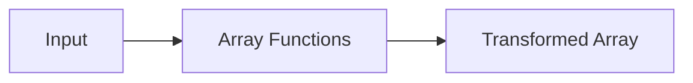

# :material-format-list-bulleted: Array Functions

Comprehensive reference for Spark SQL functions that **create, query, and transform arrays**.

## :material-sitemap: Overview



### :material-animation-play: Interactive Visualization — NULL Placement: ARRAY_SORT vs SORT_ARRAY

<div id="viz-array-sort-nulls" class="ts-viz"></div>

Toggle ascending/descending to see that `SORT_ARRAY`'s NULL placement
flips with direction, while `ARRAY_SORT`'s default comparator always
pushes NULLs to the end.

## :material-pin: Creating Arrays

### ARRAY — Build from Expressions

```sql
SELECT ARRAY(1, 2, 3);
-- Result: [1, 2, 3]
```

### ARRAY_AGG / COLLECT_LIST — Aggregate Rows into an Array

```sql
SELECT ARRAY_AGG(col) FROM VALUES (1), (2), (1) AS tab(col);
-- Result: [1, 2, 1]
```

### ARRAY_REPEAT — Repeat an Element

```sql
SELECT ARRAY_REPEAT('x', 3);
-- Result: [x, x, x]
```

### SEQUENCE — Generate a Range

```sql
SELECT SEQUENCE(1, 5);
-- Result: [1, 2, 3, 4, 5]

SELECT SEQUENCE(DATE '2024-01-01', DATE '2024-01-03');
-- Result: [2024-01-01, 2024-01-02, 2024-01-03]
```

______________________________________________________________________

## :material-pin: Adding & Removing Elements

### ARRAY_APPEND — Add to End

```sql
SELECT ARRAY_APPEND(ARRAY(1, 2, 3), 4);
-- Result: [1, 2, 3, 4]
```

### ARRAY_PREPEND — Add to Beginning

```sql
SELECT ARRAY_PREPEND(ARRAY(2, 3, 4), 1);
-- Result: [1, 2, 3, 4]
```

### ARRAY_INSERT — Insert at Position (1-based)

```sql
SELECT ARRAY_INSERT(ARRAY(1, 2, 3, 4), 2, 99);
-- Result: [1, 99, 2, 3, 4]

-- Negative index: insert relative to end
SELECT ARRAY_INSERT(ARRAY(1, 2, 3), -1, 99);
-- Result: [1, 2, 3, 99]
```

### ARRAY_REMOVE — Remove All Matching Elements

```sql
SELECT ARRAY_REMOVE(ARRAY(1, 2, 3, 2), 2);
-- Result: [1, 3]
```

### ARRAY_INSERT — Out-of-Bounds Positions Pad with NULL

An `ARRAY_INSERT` position beyond the array's current length doesn't error —
it **pads the gap with `NULL`** and inserts the value at the end (verified
on Spark 4.2):

```sql
SELECT ARRAY_INSERT(ARRAY(1, 2, 3), 6, 99);
-- Result: [1, 2, 3, NULL, NULL, 99]

-- Same padding behavior for a large negative (relative-to-end) position
SELECT ARRAY_INSERT(ARRAY(1, 2, 3), -6, 99);
-- Result: [99, NULL, NULL, 1, 2, 3]
```

### ARRAY_REPEAT — Negative or Zero Count Returns an Empty Array

```sql
SELECT ARRAY_REPEAT('x', 0) AS zero, ARRAY_REPEAT('x', -1) AS negative;
-- Result: zero=[], negative=[]  (verified — no error, not NULL)
```

### ARRAY_COMPACT — Remove NULLs

```sql
SELECT ARRAY_COMPACT(ARRAY(1, NULL, 2, NULL, 3));
-- Result: [1, 2, 3]
```

______________________________________________________________________

## :material-pin: Querying & Searching

### ARRAY_CONTAINS — Check Membership

```sql
SELECT ARRAY_CONTAINS(ARRAY(1, 2, 3), 2);
-- Result: true
```

### ARRAY_POSITION — Find Index (1-based)

```sql
SELECT ARRAY_POSITION(ARRAY(10, 20, 30, 20), 20);
-- Result: 2  (first occurrence)
```

### ELEMENT_AT — Get by Index (1-based)

```sql
SELECT ELEMENT_AT(ARRAY(10, 20, 30), 2);
-- Result: 20
```

### GET — Get by Index (0-based, NULL-safe)

```sql
SELECT GET(ARRAY(10, 20, 30), 0);
-- Result: 10

SELECT GET(ARRAY(10, 20, 30), 5);
-- Result: NULL  (out of bounds)
```

### ELT — Get N-th Argument

```sql
SELECT ELT(2, 'scala', 'java', 'python');
-- Result: java
```

### ARRAY_SIZE / SIZE — Count Elements

```sql
SELECT ARRAY_SIZE(ARRAY('a', 'b', 'c'));
-- Result: 3

-- ARRAY_SIZE returns NULL for NULL input; SIZE returns -1
SELECT ARRAY_SIZE(NULL), SIZE(NULL);
-- Result: NULL, -1
```

### ARRAY_MAX / ARRAY_MIN — Extremes

```sql
SELECT ARRAY_MAX(ARRAY(1, 20, NULL, 3));
-- Result: 20  (NULLs skipped)

SELECT ARRAY_MIN(ARRAY(1, 20, NULL, 3));
-- Result: 1
```

______________________________________________________________________

## :material-pin: Set Operations

### ARRAY_DISTINCT — Remove Duplicates

```sql
SELECT ARRAY_DISTINCT(ARRAY(1, 2, 3, NULL, 3));
-- Result: [1, 2, 3, NULL]
```

### ARRAY_UNION — Union (no duplicates)

```sql
SELECT ARRAY_UNION(ARRAY(1, 2, 3), ARRAY(2, 3, 4));
-- Result: [1, 2, 3, 4]
```

### ARRAY_INTERSECT — Intersection

```sql
SELECT ARRAY_INTERSECT(ARRAY(1, 2, 3), ARRAY(2, 3, 5));
-- Result: [2, 3]
```

### ARRAY_EXCEPT — Difference

```sql
SELECT ARRAY_EXCEPT(ARRAY(1, 2, 3), ARRAY(1, 3, 5));
-- Result: [2]
```

### ARRAYS_OVERLAP — Check for Common Elements

```sql
SELECT ARRAYS_OVERLAP(ARRAY(1, 2, 3), ARRAY(3, 4, 5));
-- Result: true
```

______________________________________________________________________

## :material-pin: Sorting & Transforming

### SORT_ARRAY / ARRAY_SORT — Sort Elements

```sql
-- Default ascending
SELECT SORT_ARRAY(ARRAY(5, 3, 1, 4, 2));
-- Result: [1, 2, 3, 4, 5]

-- Descending
SELECT SORT_ARRAY(ARRAY(5, 3, 1), FALSE);
-- Result: [5, 3, 1]

-- Custom comparator
SELECT ARRAY_SORT(ARRAY(5, 1, 3), (l, r) ->
  CASE WHEN l < r THEN -1 WHEN l > r THEN 1 ELSE 0 END
);
-- Result: [1, 3, 5]
```

#### :material-alert-outline: NULL Placement: `ARRAY_SORT` vs `SORT_ARRAY`

The two functions handle NULLs **differently** in their default comparator —
this is easy to miss since they look interchangeable. Verified on Spark 4.2:

| Function                               | NULL position                            | Result on `[3, NULL, 1, NULL, 2]` |
| -------------------------------------- | ---------------------------------------- | --------------------------------- |
| `SORT_ARRAY(arr, true)` (asc, default) | **First**                                | `[NULL, NULL, 1, 2, 3]`           |
| `SORT_ARRAY(arr, false)` (desc)        | **Last**                                 | `[3, 2, 1, NULL, NULL]`           |
| `ARRAY_SORT(arr)` (default comparator) | **Always last**, regardless of direction | `[1, 2, 3, NULL, NULL]`           |

```sql
SELECT SORT_ARRAY(ARRAY(3, NULL, 1, NULL, 2), true) AS asc;
-- Result: [NULL, NULL, 1, 2, 3]

SELECT ARRAY_SORT(ARRAY(3, NULL, 1, NULL, 2)) AS sorted;
-- Result: [1, 2, 3, NULL, NULL]   ← NULLs at the end, not the start
```

To force `ARRAY_SORT` to put NULLs first (matching `SORT_ARRAY`'s ascending
default), write an explicit comparator:

```sql
SELECT ARRAY_SORT(ARRAY(3, NULL, 1), (l, r) ->
  CASE WHEN l IS NULL AND r IS NULL THEN 0
       WHEN l IS NULL THEN -1
       WHEN r IS NULL THEN 1
       WHEN l < r THEN -1 WHEN l > r THEN 1 ELSE 0 END
) AS sorted;
-- Result: [NULL, 1, 3]
```

### FLATTEN — Collapse Nested Arrays

```sql
SELECT FLATTEN(ARRAY(ARRAY(1, 2), ARRAY(3, 4)));
-- Result: [1, 2, 3, 4]
```

> **NULL-poisoning (verified):** if **any** inner array is `NULL`, `FLATTEN`
> returns `NULL` for the whole result — it does not skip the NULL entry.
>
> ```sql
> SELECT FLATTEN(ARRAY(ARRAY(1, 2), NULL, ARRAY(3)));
> -- Result: NULL   (not [1, 2, 3])
> ```
>
> Filter out NULL sub-arrays first if that's not the behavior you want:
> `FLATTEN(ARRAY_COMPACT(ARRAY(ARRAY(1,2), NULL, ARRAY(3))))`.

### ARRAYS_ZIP — Merge Arrays into Structs

```sql
SELECT ARRAYS_ZIP(ARRAY(1, 2, 3), ARRAY('a', 'b', 'c'));
-- Result: [{1, a}, {2, b}, {3, c}]

SELECT ARRAYS_ZIP(ARRAY(1, 2), ARRAY('a', 'b'), ARRAY(true, false));
-- Result: [{1, a, true}, {2, b, false}]
```

### ARRAY_JOIN — Concatenate as String

```sql
SELECT ARRAY_JOIN(ARRAY('hello', 'world'), ' ');
-- Result: 'hello world'

-- With NULL replacement
SELECT ARRAY_JOIN(ARRAY('hello', NULL, 'world'), ' ', '?');
-- Result: 'hello ? world'

-- Without NULL replacement (NULLs filtered)
SELECT ARRAY_JOIN(ARRAY('hello', NULL, 'world'), ' ');
-- Result: 'hello world'
```

______________________________________________________________________

## :material-pin: Higher-Order Array Functions

### FILTER — Keep Matching Elements

```sql
SELECT FILTER(ARRAY(1, 2, 3, 4, 5), x -> x % 2 = 0);
-- Result: [2, 4]

-- With index
SELECT FILTER(ARRAY(0, 2, 3), (x, i) -> x > i);
-- Result: [2, 3]
```

### FORALL — Check All Elements

```sql
SELECT FORALL(ARRAY(2, 4, 8), x -> x % 2 = 0);
-- Result: true
```

> See [Lambda Expressions](../lambda/index.md) for full coverage of `TRANSFORM`, `FILTER`,
> `EXISTS`, `AGGREGATE`, `FORALL`, and `ZIP_WITH`.

______________________________________________________________________

## :material-pin: Joining on Array Contents

Matching rows by array membership — "does this row's array contain that row's value"
or "do these two rows' arrays share anything" — is a **non-equi join**, since it isn't
a plain `=` comparison. Three techniques, each with a different cost profile:

### `ARRAY_CONTAINS` — Join a Scalar Column Against an Array Column

```sql
-- users.interest is a scalar STRING; articles.tags is ARRAY<STRING>
SELECT u.user_id, u.interest, a.article_id, a.title
FROM users u
JOIN articles a ON ARRAY_CONTAINS(a.tags, u.interest)
ORDER BY u.user_id;
```

??? success "Expected output"

    | user_id | interest | article_id | title          |
    | ------- | -------- | ---------- | -------------- |
    | alice   | spark    | 1          | Intro to Spark |
    | alice   | spark    | 3          | Spark + Delta  |
    | bob     | kafka    | 2          | Kafka Basics   |
    | carol   | python   | 4          | ML Overview    |

### `ARRAYS_OVERLAP` — Join Two Array Columns on Any Shared Element

```sql
-- subscriptions.followed_tags and articles.tags are both ARRAY<STRING>
SELECT s.user_id, a.article_id, a.title
FROM subscriptions s
JOIN articles a ON ARRAYS_OVERLAP(s.followed_tags, a.tags)
ORDER BY s.user_id, a.article_id;
```

??? success "Expected output"

    | user_id | article_id | title          |
    | ------- | ---------- | -------------- |
    | alice   | 1          | Intro to Spark |
    | alice   | 3          | Spark + Delta  |
    | bob     | 2          | Kafka Basics   |
    | carol   | 4          | ML Overview    |

```text
EXPLAIN shows:
+- BroadcastNestedLoopJoin BuildRight, Inner, arrays_overlap(followed_tags#.., tags#..)
```

Both `ARRAY_CONTAINS` and `ARRAYS_OVERLAP` in a join `ON` clause force a
`BroadcastNestedLoopJoin` (or `CartesianProduct` if neither side broadcasts) — the same
cost profile as any other [non-equi join](../../querying/joins/issues/range-join-pitfalls.md),
since Spark can't hash-partition on "array contains" or "arrays overlap".

### `EXPLODE` — Normalize to Rows First, Then Equi-Join

```sql
WITH article_tags AS (
    SELECT article_id, title, EXPLODE(tags) AS tag FROM articles
),
sub_tags AS (
    SELECT user_id, EXPLODE(followed_tags) AS tag FROM subscriptions
)
SELECT DISTINCT s.user_id, t.article_id, t.title
FROM sub_tags s
JOIN article_tags t ON s.tag = t.tag
ORDER BY s.user_id, t.article_id;
```

Same result as the `ARRAYS_OVERLAP` join above, but the plan changes completely:

```text
EXPLAIN shows:
+- BroadcastHashJoin [tag#..], [tag#..], Inner, BuildRight, false, false
   :- Generate explode(followed_tags#..), [user_id#..], false, [tag#..]
   +- Generate explode(tags#..), [article_id#..], false, [tag#..]
```

Exploding both arrays into one-row-per-element first turns the match into a plain `=`
on `tag`, so Spark can hash-partition/broadcast it like any other equi-join —
`BroadcastHashJoin` instead of `BroadcastNestedLoopJoin`. The trade-off is the
`DISTINCT` needed afterward, since a row can now match on more than one shared tag and
would otherwise be double-counted.

!!! tip "Prefer EXPLODE for large tables, ARRAY_CONTAINS/ARRAYS_OVERLAP for small ones"

    If either side is small enough to broadcast, `ARRAY_CONTAINS`/`ARRAYS_OVERLAP` reads
    more clearly and the nested-loop cost is negligible. Once both sides are large, the
    `O(N x M)` nested loop becomes the bottleneck — exploding both sides into rows and
    using a normal equi-join (with `DISTINCT` to undo the multi-tag fan-out) scales far
    better. See [Range / Non-Equality Join Pitfalls](../../querying/joins/issues/range-join-pitfalls.md)
    for the general pattern.

______________________________________________________________________

## :material-brain: When to Use

| Scenario                                     | Function(s)                                                     |
| -------------------------------------------- | --------------------------------------------------------------- |
| Build arrays from expressions or rows        | `ARRAY`, `COLLECT_LIST`, `ARRAY_REPEAT`                         |
| Add / remove elements                        | `ARRAY_APPEND`, `ARRAY_PREPEND`, `ARRAY_INSERT`, `ARRAY_REMOVE` |
| Search / check membership                    | `ARRAY_CONTAINS`, `ARRAY_POSITION`, `ELEMENT_AT`, `GET`         |
| Set operations across two arrays             | `ARRAY_UNION`, `ARRAY_INTERSECT`, `ARRAY_EXCEPT`                |
| Sort, flatten, or join elements              | `SORT_ARRAY`, `FLATTEN`, `ARRAY_JOIN`                           |
| Transform elements with lambdas              | `FILTER`, `TRANSFORM`, `AGGREGATE` (see HOF section)            |
| Join rows by array membership (small tables) | `ARRAY_CONTAINS` / `ARRAYS_OVERLAP` in the `ON` clause          |
| Join rows by array membership (large tables) | `EXPLODE` both sides to rows, then equi-join + `DISTINCT`       |
