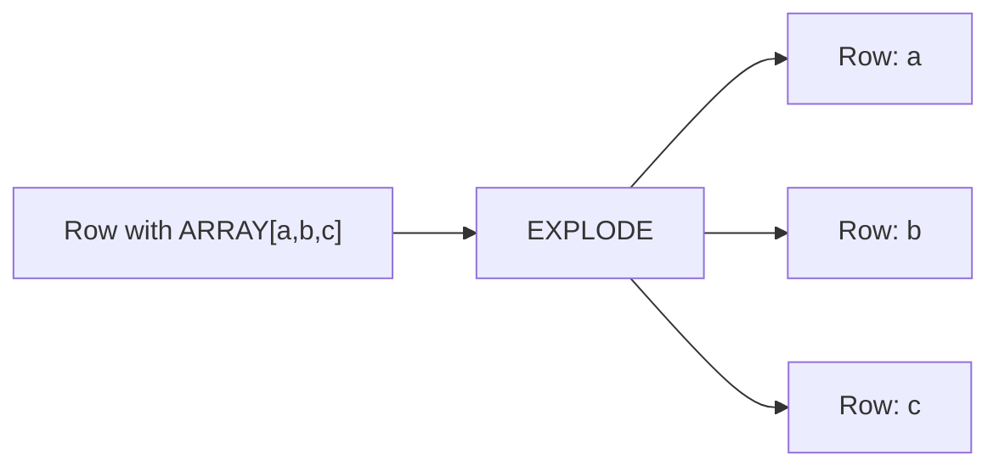

# :material-expand-all: Explode

`EXPLODE()` transforms a single row containing an array or map into **multiple rows** — one per
element. It is the most commonly used generator function in Spark SQL.

## :material-sitemap: Overview



### :material-animation-play: Interactive Visualization

<div id="viz-explode" class="ts-viz"></div>

Click an input row to highlight the output rows it fans out into. The row with a `NULL`/empty
array produces **no output rows** — `EXPLODE` drops it entirely (see `EXPLODE_OUTER` to keep it).

## :material-pin: Syntax

### Direct

```sql
SELECT EXPLODE(array_or_map);
```

### With LATERAL VIEW

```sql
SELECT t.*, element
FROM your_table t
LATERAL VIEW EXPLODE(array_column) AS element;
```

### For Maps

```sql
SELECT t.*, key, value
FROM your_table t
LATERAL VIEW EXPLODE(map_column) AS key, value;
```

### Input Types

| Input Type | Output Columns        |
| ---------- | --------------------- |
| `array<T>` | `col` (element value) |
| `map<K,V>` | `key`, `value`        |

## :material-magnify: Behavior

1. Produces one output row per array element or map entry.
2. Duplicates all other column values for each generated row.
3. For maps, each entry becomes a `(key, value)` row.
4. **Drops rows** where the array/map is `NULL` or empty — use `EXPLODE_OUTER` to retain them.
5. Default output column names are `col` (array) or `key`/`value` (map); override with `AS`.
6. **NULL *element* vs. NULL *array*** — a `NULL` value *inside* an array produces a row with `col = NULL` (kept); the array/map itself being `NULL` drops the row entirely. These are different cases — see Example 7.
7. **One generator per SELECT** — a `SELECT` list may contain at most one generator function (`EXPLODE`, `POSEXPLODE`, `INLINE`, `STACK`, …). Calling two directly (e.g. `SELECT EXPLODE(a), EXPLODE(b)`) raises an analysis error; use chained `LATERAL VIEW` clauses instead (see Example 6).

## :material-flask-outline: Practical Examples

### :material-toy-brick: 1. Explode an Array of Primitives

```sql
CREATE OR REPLACE TEMP VIEW people AS
SELECT * FROM VALUES
  (1, ARRAY('Alice', 'Bob')),
  (2, ARRAY('Charlie', 'Diana'))
AS people(id, names);

SELECT id, name
FROM people
LATERAL VIEW EXPLODE(names) AS name;
-- (1, Alice), (1, Bob), (2, Charlie), (2, Diana)
```

### :material-map:️ 2. Explode a Map

```sql
CREATE OR REPLACE TEMP VIEW sales AS
SELECT * FROM VALUES
  (1, MAP('apple', 2, 'banana', 3)),
  (2, MAP('orange', 1, 'grape', 5))
AS sales(id, items);

SELECT id, fruit, quantity
FROM sales
LATERAL VIEW EXPLODE(items) AS fruit, quantity;
-- (1, apple, 2), (1, banana, 3), (2, orange, 1), (2, grape, 5)
```

### :material-toy-brick: 3. Explode an Array of Structs

```sql
CREATE OR REPLACE TEMP VIEW orders AS
SELECT * FROM VALUES
  (1001, ARRAY(NAMED_STRUCT('product', 'book', 'qty', 2),
               NAMED_STRUCT('product', 'pen', 'qty', 5))),
  (1002, ARRAY(NAMED_STRUCT('product', 'notebook', 'qty', 1),
               NAMED_STRUCT('product', 'eraser', 'qty', 3)))
AS orders(order_id, products);

SELECT order_id, item.product, item.qty
FROM orders
LATERAL VIEW EXPLODE(products) AS item;
-- (1001, book, 2), (1001, pen, 5), (1002, notebook, 1), (1002, eraser, 3)
```

### :material-repeat: 4. Generate Date Ranges with SEQUENCE

```sql
SELECT EXPLODE(SEQUENCE(DATE '2024-01-01', DATE '2024-01-05')) AS day;
-- 2024-01-01, 2024-01-02, …, 2024-01-05
```

### :material-link: 5. Chain with Higher-Order Functions

```sql
-- Filter first, then explode
SELECT EXPLODE(
  FILTER(ARRAY(1, 2, 3, 4, 5), x -> x % 2 = 0)
) AS even;
-- 2, 4
```

### :material-toy-brick: 6. Multiple LATERAL VIEWs

```sql
CREATE OR REPLACE TEMP VIEW multi AS
SELECT * FROM VALUES
  (1, ARRAY('a', 'b'), ARRAY(10, 20))
AS multi(id, letters, numbers);

SELECT id, letter, num
FROM multi
LATERAL VIEW EXPLODE(letters) AS letter
LATERAL VIEW EXPLODE(numbers) AS num;
-- Cross-product: (1,a,10), (1,a,20), (1,b,10), (1,b,20)
```

### :material-alert-circle-outline: 7. NULL Element vs. NULL Array

```sql
CREATE OR REPLACE TEMP VIEW nulls_demo AS
SELECT * FROM VALUES
  (1, ARRAY('a', NULL, 'c')),  -- array contains a NULL element
  (2, NULL),                   -- the array itself is NULL
  (3, ARRAY())                 -- the array is empty
AS nulls_demo(id, arr);

SELECT id, val FROM nulls_demo LATERAL VIEW EXPLODE(arr) AS val;
-- (1, a), (1, NULL), (1, c)   -- NULL *element* is kept as its own row
-- id 2 and 3 produce NO rows  -- NULL/empty *array* drops the row entirely
```

> **Restriction:** only one generator function is allowed per `SELECT` list.
> `SELECT EXPLODE(a), EXPLODE(b) FROM t` fails with an analysis error
> (`only one generator allowed per select clause`). Use two `LATERAL VIEW`
> clauses instead (see Example 6) to get their Cartesian product.

## :material-brain: When to Use

| Scenario                              | Why `EXPLODE`?                                      |
| ------------------------------------- | --------------------------------------------------- |
| Flatten nested arrays into rows       | Turn 1 row with N elements into N rows              |
| Normalize JSON / semi-structured data | Unpack nested structures for analysis               |
| Count or aggregate array elements     | Explode first, then `GROUP BY` / `COUNT`            |
| Generate date/number sequences        | Combine with `SEQUENCE()` for calendar logic        |
| Chain with HOFs                       | `EXPLODE(FILTER(...))` or `EXPLODE(TRANSFORM(...))` |

> **Tip:** If you need to preserve rows where the array is `NULL` or empty,
> use `EXPLODE_OUTER` instead.
