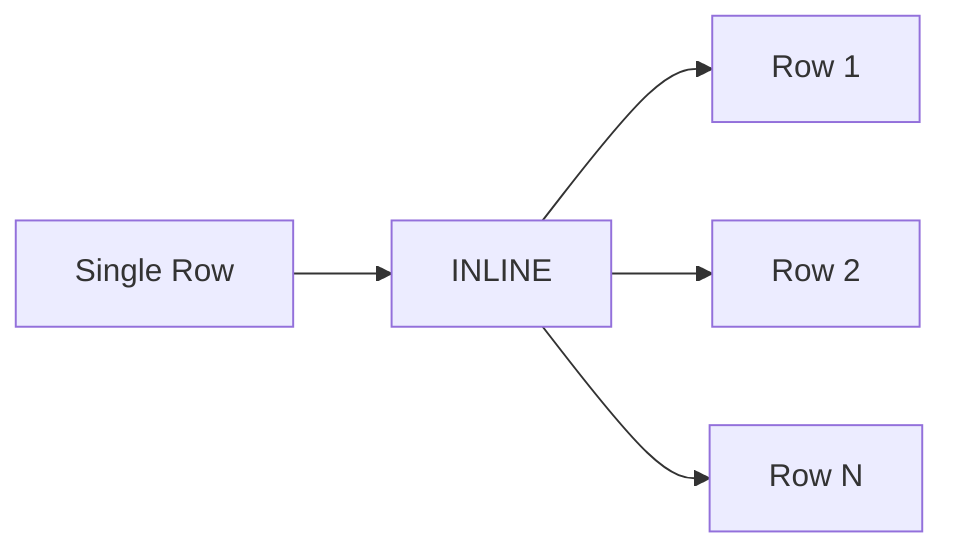

# :material-expand-all: Inline

`INLINE()` flattens an **array of structs** into multiple rows **and** multiple columns —
each struct field becomes a separate output column. It is the struct-aware alternative to `EXPLODE`.

## :material-sitemap: Overview



### :material-animation-play: Interactive Visualization

<div id="viz-inline" class="ts-viz"></div>

Click an input row to trace it. Unlike `EXPLODE` (one struct-shaped output column), `INLINE`
spreads each struct **field** into its own output column — `product` and `qty` become
top-level columns instead of `item.product` / `item.qty`.

## :material-pin: Syntax

### Direct

```sql
SELECT INLINE(array_of_structs);
```

### With LATERAL VIEW

```sql
SELECT t.*, col1, col2
FROM your_table t
LATERAL VIEW INLINE(struct_array_column) AS col1, col2;
```

### INLINE_OUTER (preserve NULL/empty)

```sql
SELECT t.*, col1, col2
FROM your_table t
LATERAL VIEW INLINE_OUTER(struct_array_column) AS col1, col2;
```

### :material-animation-play: Interactive Visualization — INLINE_OUTER

<div id="viz-inline-outer" class="ts-viz"></div>

Same input rows as above, but the empty-array row is **not** dropped — it produces one output
row with `product = NULL` and `qty = NULL`, keeping the row count aligned with the source table.

## :material-magnify: Behavior

1. Each struct in the array produces one output row.
2. Each field of the struct becomes a separate column (named `col1`, `col2`, … by default).
3. Override column names with `AS name1, name2, …` in the LATERAL VIEW clause.
4. `INLINE` **drops rows** where the array is `NULL` or empty.
5. `INLINE_OUTER` **preserves rows** with `NULL`s in generated columns for empty/NULL arrays.
6. **All structs in the array must share the same schema** (same field names/types); `INLINE` cannot flatten an array containing heterogeneous struct shapes.
7. **Nested arrays of struct-arrays** need a two-step flatten: `EXPLODE` the outer array first, then `INLINE` the resulting inner struct array (see Example 7).

### INLINE vs EXPLODE for Structs

| Approach                    | Result                                                                  |
| --------------------------- | ----------------------------------------------------------------------- |
| `EXPLODE(array_of_structs)` | One column containing the whole struct → access fields via `item.field` |
| `INLINE(array_of_structs)`  | Multiple columns, one per struct field → fields are top-level columns   |

## :material-flask-outline: Practical Examples

### :material-toy-brick: 1. Flatten Order Line Items

```sql
CREATE OR REPLACE TEMP VIEW orders AS
SELECT * FROM VALUES
  (1001, ARRAY(NAMED_STRUCT('product', 'book', 'qty', 2),
               NAMED_STRUCT('product', 'pen', 'qty', 5))),
  (1002, ARRAY(NAMED_STRUCT('product', 'notebook', 'qty', 1)))
AS orders(order_id, items);

SELECT order_id, product, qty
FROM orders
LATERAL VIEW INLINE(items) AS product, qty;
-- (1001, book, 2), (1001, pen, 5), (1002, notebook, 1)
```

### :material-toy-brick: 2. INLINE_OUTER — Keep Rows with Empty Arrays

```sql
CREATE OR REPLACE TEMP VIEW orders_sparse AS
SELECT * FROM VALUES
  (1, ARRAY(NAMED_STRUCT('product', 'pen', 'qty', 3))),
  (2, ARRAY()),
  (3, NULL)
AS orders_sparse(order_id, items);

SELECT order_id, product, qty
FROM orders_sparse
LATERAL VIEW INLINE_OUTER(items) AS product, qty;
-- (1, pen, 3), (2, NULL, NULL), (3, NULL, NULL)
```

### :material-toy-brick: 3. Direct SELECT (No Table)

```sql
SELECT INLINE(ARRAY(STRUCT(1, 'a'), STRUCT(2, 'b')));
-- (1, a), (2, b)
```

### :material-toy-brick: 4. Flatten Employee Skills

```sql
CREATE OR REPLACE TEMP VIEW employees AS
SELECT * FROM VALUES
  ('Alice', ARRAY(
    NAMED_STRUCT('skill', 'Python', 'level', 'expert'),
    NAMED_STRUCT('skill', 'SQL', 'level', 'advanced')
  )),
  ('Bob', ARRAY(
    NAMED_STRUCT('skill', 'Java', 'level', 'intermediate')
  ))
AS employees(name, skills);

SELECT name, skill, level
FROM employees
LATERAL VIEW INLINE(skills) AS skill, level;
-- (Alice, Python, expert), (Alice, SQL, advanced), (Bob, Java, intermediate)
```

### :material-toy-brick: 5. Aggregate After Inline

```sql
-- Count total items per order
SELECT order_id, SUM(qty) AS total_qty
FROM orders
LATERAL VIEW INLINE(items) AS product, qty
GROUP BY order_id;
-- (1001, 7), (1002, 1)
```

### :material-toy-brick: 6. Combine with FILTER HOF

```sql
-- Inline only high-quantity items
SELECT order_id, product, qty
FROM orders
LATERAL VIEW INLINE(
  FILTER(items, x -> x.qty >= 3)
) AS product, qty;
-- (1001, pen, 5)
```

### :material-toy-brick: 7. Two-Step Flatten: Array of Arrays of Structs

```sql
CREATE OR REPLACE TEMP VIEW invoices AS
SELECT * FROM VALUES
  (1, ARRAY(
        ARRAY(NAMED_STRUCT('product', 'pen', 'qty', 3)),
        ARRAY(NAMED_STRUCT('product', 'book', 'qty', 1),
              NAMED_STRUCT('product', 'ruler', 'qty', 2))
     ))
AS invoices(invoice_id, line_groups);

-- Step 1: EXPLODE the outer array → one row per inner struct-array
-- Step 2: INLINE the inner struct-array → one row per struct field set
SELECT invoice_id, product, qty
FROM invoices
LATERAL VIEW EXPLODE(line_groups) AS line_group
LATERAL VIEW INLINE(line_group) AS product, qty;
-- (1, pen, 3), (1, book, 1), (1, ruler, 2)
```

### :material-toy-brick: 8. Side-by-Side: INLINE vs INLINE_OUTER

```sql
CREATE OR REPLACE TEMP VIEW carts AS
SELECT * FROM VALUES
  (1, ARRAY(NAMED_STRUCT('product', 'pen', 'qty', 3))),
  (2, ARRAY()),
  (3, NULL)
AS carts(cart_id, items);

-- INLINE: drops carts 2 and 3 entirely
SELECT cart_id, product, qty FROM carts LATERAL VIEW INLINE(items) AS product, qty;
-- (1, pen, 3)

-- INLINE_OUTER: keeps all carts, empty/NULL become one NULL-filled row
SELECT cart_id, product, qty FROM carts LATERAL VIEW INLINE_OUTER(items) AS product, qty;
-- (1, pen, 3), (2, NULL, NULL), (3, NULL, NULL)
```

### :material-toy-brick: 9. Audit Missing Line Items with INLINE_OUTER

```sql
-- Flag which carts have no items, while still reporting product/qty defaults
SELECT cart_id,
       product IS NULL AS is_empty_cart,
       COALESCE(product, 'none') AS product,
       COALESCE(qty, 0)          AS qty
FROM carts
LATERAL VIEW INLINE_OUTER(items) AS product, qty
ORDER BY cart_id;
-- (1, false, pen, 3), (2, true, none, 0), (3, true, none, 0)
```

## :material-brain: When to Use

| Scenario                                    | Why `INLINE`?                                          |
| ------------------------------------------- | ------------------------------------------------------ |
| Flatten array of structs into columns       | Each struct field becomes a top-level column           |
| Cleaner than `EXPLODE` for structs          | No `item.field` dot notation needed                    |
| Preserve empty/NULL rows                    | Use `INLINE_OUTER` variant                             |
| Aggregate struct field values               | `SUM`, `COUNT`, `AVG` directly on inlined columns      |
| Chain with HOFs                             | `INLINE(FILTER(array, ...))` for selective flattening  |
| Audit rows with missing/empty struct arrays | `INLINE_OUTER` + `IS NULL` check + `COALESCE` defaults |

> **Tip:** Use `INLINE` when your struct has multiple fields you need as separate columns.
> Use `EXPLODE` when you want the struct as a single nested column.
