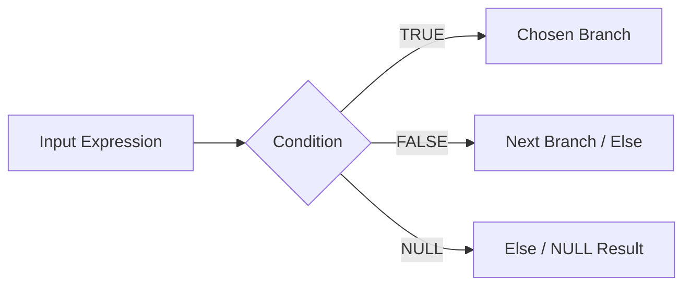

# :material-source-branch: Control Functions

Spark SQL control-flow expressions let you branch on conditions, define defaults, and keep business rules
inside a single query.

______________________________________________________________________

## :material-sitemap: Overview



### :material-animation-play: Interactive Visualization — CASE Fallthrough

This example walks through a salary-banding `CASE` expression and shows what changes when the `ELSE`
branch is omitted.

<div id="viz-control-case-flow" class="ts-viz"></div>

Toggle the `ELSE` branch and click different salaries to see unmatched rows fall through to `NULL`.

______________________________________________________________________

## :material-code-tags: Syntax

```sql
CASE
  WHEN condition1 THEN result1
  WHEN condition2 THEN result2
  ELSE default_result
END

IF(condition, true_value, false_value)
COALESCE(expr1, expr2, ..., exprN)
NULLIF(expr1, expr2)
NVL(expr1, expr2)
```

| Function or expression | Purpose                           |
| ---------------------- | --------------------------------- |
| `CASE WHEN`            | Multi-branch conditional logic    |
| `IF`                   | Compact true/false branching      |
| `COALESCE`             | First non-`NULL` fallback         |
| `NULLIF`               | Turn a sentinel value into `NULL` |
| `NVL`                  | Two-argument null fallback        |

______________________________________________________________________

## :material-information-outline: Behavior

1. `CASE` evaluates `WHEN` clauses in order and returns the first matching branch.
2. `IF(condition, a, b)` returns `a` only when the condition is `TRUE`.
3. **If a `CASE` expression has no matching branch and no `ELSE`, the result is `NULL`.**
4. A `NULL` condition in `IF` behaves like the false branch.
5. `NULLIF(expr1, expr2)` is handy for turning sentinel values such as `0` or `''` into real `NULL`s.

______________________________________________________________________

## :material-flask-outline: Practical Examples

### :material-toy-brick: 1. Multi-Branch Salary Banding

```sql
SELECT
  id,
  name,
  salary,
  CASE
    WHEN salary IS NULL THEN 'Unknown'
    WHEN salary >= 50000 THEN 'High'
    WHEN salary >= 20000 THEN 'Medium'
    ELSE 'Low'
  END AS salary_band
FROM VALUES
  (1, 'Alice', 55000),
  (2, 'Bob', NULL),
  (3, 'Charlie', 25000),
  (4, 'Diana', 75000),
  (5, 'Eve', 0)
AS employees(id, name, salary);
```

### :material-toy-brick: 2. Compact IF Logic

```sql
SELECT if(1 < 2, 'a', 'b') AS simple_if;
-- Result: a
```

### :material-toy-brick: 3. Replace a Sentinel with NULL

```sql
SELECT nullif(0, 0) AS cleaned_zero, nullif(10, 0) AS kept_value;
-- Result: NULL, 10
```

### :material-alert-circle-outline: 4. CASE Without ELSE Falls Through to NULL

```sql
SELECT CASE WHEN 1 = 0 THEN 'hit' END AS case_result;
-- Result: NULL
```

### :material-alert-circle-outline: 5. IF Treats a NULL Condition as False

```sql
SELECT if(NULL, 'yes', 'no') AS if_result;
-- Result: no
```

______________________________________________________________________

## :material-lightbulb-outline: When to Use

| Scenario                                  | Best choice            |
| ----------------------------------------- | ---------------------- |
| Several ordered business rules            | `CASE WHEN`            |
| Simple binary branching                   | `IF`                   |
| Defaulting missing values                 | `COALESCE` or `NVL`    |
| Converting placeholders to missing values | `NULLIF`               |
| Making unmatched conditions obvious       | Add an explicit `ELSE` |
