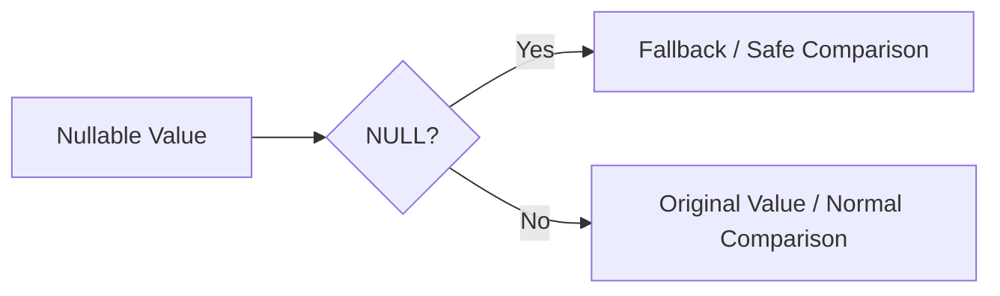

# :material-null: Null Functions

Spark SQL null-handling functions let you replace missing values, compare nullable fields safely, and
express three-valued logic explicitly.

______________________________________________________________________

## :material-sitemap: Overview



### :material-animation-play: Interactive Visualization — `=` vs `<=>`

Standard equality returns `NULL` for unknown comparisons, while null-safe equality collapses that
uncertainty into a definite `TRUE` or `FALSE`.

<div id="viz-null-safe-eq" class="ts-viz"></div>

Click the comparison pairs to see when `=` yields `NULL` and why `<=>` is safer for nullable joins.

______________________________________________________________________

## :material-code-tags: Syntax

```sql
coalesce(expr1, expr2, ...)
ifnull(expr1, expr2)
nvl(expr1, expr2)
equal_null(expr1, expr2)
expr1 <=> expr2
isnull(expr)
isnotnull(expr)
isnan(expr)
```

| Function or operator  | Purpose                                |
| --------------------- | -------------------------------------- |
| `coalesce`            | Return the first non-`NULL` expression |
| `ifnull`, `nvl`       | Two-argument fallback helpers          |
| `equal_null`, `<=>`   | Null-safe equality                     |
| `isnull`, `isnotnull` | Test missingness directly              |
| `isnan`               | Detect IEEE NaN, not SQL `NULL`        |

______________________________________________________________________

## :material-information-outline: Behavior

1. `coalesce` returns the first non-`NULL` argument from left to right.
2. `ifnull(expr1, expr2)` and `nvl(expr1, expr2)` are concise two-argument fallback forms.
3. **`=` and `<=>` are not interchangeable**: `NULL = NULL` returns `NULL`, while `NULL <=> NULL`
    returns `TRUE`.
4. `equal_null(expr1, expr2)` is the function form of null-safe equality.
5. `isnan(NULL)` returns `FALSE`; it only detects numeric `NaN` values.

______________________________________________________________________

## :material-flask-outline: Practical Examples

### :material-toy-brick: 1. Pick the First Available Value

```sql
SELECT coalesce(NULL, NULL, 'fallback', 'unused') AS chosen_value;
-- Result: fallback
```

### :material-toy-brick: 2. Use a Two-Argument Fallback

```sql
SELECT nvl(NULL, 40000) AS safe_salary;
-- Result: 40000
```

### :material-toy-brick: 3. Detect NaN Separately from NULL

```sql
SELECT
  isnan(NULL) AS null_is_nan,
  isnan(CAST('NaN' AS DOUBLE)) AS actual_nan;
-- Result: false, true
```

### :material-alert-circle-outline: 4. Null-Safe Equality for Nullable Keys

```sql
SELECT
  NULL = NULL AS regular_eq,
  NULL <=> NULL AS null_safe_eq,
  5 <=> NULL AS value_vs_null;
-- Result: NULL, true, false
```

### :material-toy-brick: 5. Null-Safe Join Condition

```sql
SELECT l.id, r.id
FROM VALUES (1), (NULL) AS l(id)
JOIN VALUES (1), (NULL) AS r(id)
  ON l.id <=> r.id;
-- Matches both the non-null key and the NULL key pair
```

______________________________________________________________________

## :material-lightbulb-outline: When to Use

| Scenario                                              | Best choice           |
| ----------------------------------------------------- | --------------------- |
| Fill optional values from multiple columns            | `coalesce`            |
| Replace a single missing value                        | `nvl` or `ifnull`     |
| Join or compare nullable keys                         | `<=>` or `equal_null` |
| Distinguish bad floating-point data from missing data | `isnan` plus `isnull` |
| Make three-valued logic explicit in filters           | `isnull`, `isnotnull` |
