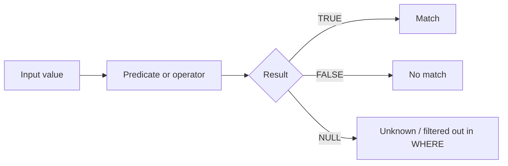

# :material-check-circle: Predicate Functions

Predicate functions and operators return `TRUE`, `FALSE`, or sometimes `NULL`.
That third outcome matters: Spark SQL uses three-valued logic, so an "unknown"
result can silently filter rows out of `WHERE` clauses.

______________________________________________________________________

## :material-sitemap: Overview



### :material-animation-play: Interactive Visualization — Three-Valued Predicate Logic

<div id="viz-predicate-logic" class="ts-viz"></div>

Toggle the left-hand value and whether the `IN` list contains `NULL` to see why `IN` and `NOT IN` can return `NULL` instead of a clean boolean. The second panel contrasts `ISNULL` with `ISNAN` for floating-point edge cases.

______________________________________________________________________

## :material-code-tags: Common Predicates

| Predicate                   | Purpose                                     |
| --------------------------- | ------------------------------------------- |
| `ISNULL(expr)`              | Check whether `expr` is `NULL`              |
| `ISNOTNULL(expr)`           | Check whether `expr` is not `NULL`          |
| `ISNAN(expr)`               | Check whether a floating-point value is NaN |
| `expr IN (v1, v2, ...)`     | Membership test                             |
| `expr NOT IN (v1, v2, ...)` | Non-membership test                         |
| `expr BETWEEN low AND high` | Inclusive range check                       |

!!! note

    `INSTR` is often used inside filters, but it is **not** a predicate function.
    It returns a position (`INT`), not a boolean.

______________________________________________________________________

## :material-information-outline: Behavior

1. `ISNULL(expr)` and `ISNOTNULL(expr)` test only for SQL `NULL`.
2. `ISNAN(expr)` checks a different condition: NaN is a valid floating-point value, not `NULL`.
3. `BETWEEN low AND high` is inclusive on both ends.
4. `expr IN (...)` returns `TRUE` as soon as it finds a match.
5. If `expr IN (...)` finds no match **and** at least one list item is `NULL`, the result is `NULL`, not `FALSE`.
6. The same trap makes `NOT IN` dangerous with nullable lists: a non-match can become `NULL` instead of `TRUE`.
7. `WHERE` keeps only `TRUE`, so predicate results of `NULL` behave like silent non-matches unless you guard them explicitly.

______________________________________________________________________

## :material-flask-outline: Practical Examples

### :material-toy-brick: 1. Null Checks

```sql
SELECT
  ISNULL(CAST(NULL AS STRING)) AS null_check,
  ISNOTNULL('spark') AS not_null_check;
-- Result: true, true
```

### :material-toy-brick: 2. `ISNAN` Is Not the Same as `ISNULL`

```sql
SELECT
  ISNAN(CAST('NaN' AS DOUBLE)) AS nan_isnan,
  ISNULL(CAST('NaN' AS DOUBLE)) AS nan_isnull,
  ISNULL(CAST(NULL AS DOUBLE)) AS null_isnull,
  ISNAN(CAST(NULL AS DOUBLE)) AS null_isnan;
-- Result: true, false, true, false
```

### :material-toy-brick: 3. Inclusive `BETWEEN`

```sql
SELECT
  5 BETWEEN 5 AND 10 AS lower_bound_included,
  10 BETWEEN 5 AND 10 AS upper_bound_included,
  11 BETWEEN 5 AND 10 AS outside_range;
-- Result: true, true, false
```

### :material-toy-brick: 4. Simple `IN` Membership

```sql
SELECT
  'HR' IN ('Sales', 'HR', 'Finance') AS is_known_department,
  'Legal' IN ('Sales', 'HR', 'Finance') AS is_known_department_2;
-- Result: true, false
```

### :material-toy-brick: 5. `NOT IN` Without NULLs

```sql
SELECT
  2 NOT IN (1, 3, 5) AS clean_non_match,
  3 NOT IN (1, 3, 5) AS direct_match;
-- Result: true, false
```

### :material-alert-circle-outline: 6. `IN` with a `NULL` List Item Uses Three-Valued Logic

```sql
SELECT
  2 IN (1, NULL, 3) AS miss_with_null,
  1 IN (1, NULL, 3) AS hit_with_null,
  NULL IN (1, NULL, 3) AS null_left_side;
-- Result: NULL, true, NULL

-- Fix: if you need a definite boolean in filtering logic, guard the result explicitly.
SELECT COALESCE(2 IN (1, NULL, 3), FALSE) AS miss_with_null_safe;
-- Result: false
```

### :material-alert-circle-outline: 7. `NOT IN` Has the Same NULL Trap

```sql
SELECT
  2 NOT IN (1, NULL, 3) AS miss_not_in_with_null,
  1 NOT IN (1, NULL, 3) AS hit_not_in_with_null;
-- Result: NULL, false

-- Safer pattern when the right-hand side may contain NULLs: remove NULLs before comparing.
SELECT 2 NOT IN (1, 3) AS miss_not_in_after_cleaning;
-- Result: true
```

______________________________________________________________________

## :material-lightbulb-outline: When to Use

| Scenario                             | Recommended predicate                                   |
| ------------------------------------ | ------------------------------------------------------- |
| Detect real SQL nulls                | `ISNULL` / `ISNOTNULL`                                  |
| Detect bad floating-point values     | `ISNAN`                                                 |
| Validate category membership         | `IN`                                                    |
| Validate value ranges                | `BETWEEN`                                               |
| Filter against nullable lookup lists | `COALESCE(expr IN (...), FALSE)` or remove `NULL` first |
