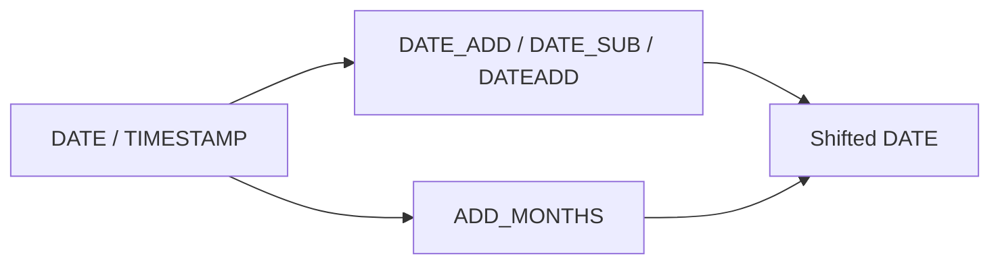

# :material-calendar-plus: Date Addition and Subtraction

Spark SQL provides lightweight day arithmetic with `DATE_ADD`, `DATE_SUB`, and `DATEADD`, plus
calendar-aware month arithmetic with `ADD_MONTHS`.

______________________________________________________________________

## :material-sitemap: Overview



### :material-animation-play: Interactive Visualization — Day Shifts vs Month Shifts

<div id="viz-date-add-subtract" class="ts-viz"></div>

Use the controls to compare simple day offsets with calendar-month offsets. Month shifts respect the
shape of the target month instead of adding a fixed number of days.

## :material-pin: Syntax

```sql
DATE_ADD(start_date, num_days)
DATE_SUB(start_date, num_days)
DATEADD(start_date, num_days)
ADD_MONTHS(start_date, num_months)
```

## :material-information-outline: Behavior

1. `DATE_ADD` adds days and accepts negative values.
2. `DATE_SUB` subtracts days and also accepts negative values.
3. `DATEADD` is an alias for `DATE_ADD`.
4. When you pass a timestamp to `DATE_ADD` or `DATE_SUB`, Spark returns a `DATE`.
5. `ADD_MONTHS` performs calendar-month arithmetic instead of elapsed-day arithmetic.
6. **End-of-month inputs stay end-of-month when necessary** — `ADD_MONTHS` clamps to the last valid day in the target month, which differs from adding a fixed 30 or 31 days.

______________________________________________________________________

## :material-flask-outline: Practical Examples

### :material-toy-brick: 1. Add Days

```sql
SELECT DATE_ADD(DATE '2016-07-30', 1) AS next_day;
-- 2016-07-31
```

### :material-toy-brick: 2. Subtract Days

```sql
SELECT DATE_SUB(DATE '2016-07-30', 1) AS previous_day;
-- 2016-07-29
```

### :material-toy-brick: 3. `DATEADD` Alias

```sql
SELECT DATEADD(DATE '2016-07-30', 1) AS alias_result;
-- 2016-07-31
```

### :material-toy-brick: 4. Timestamp Input is Truncated to a Date Result

```sql
SELECT DATE_ADD(TIMESTAMP '2024-07-19 23:15:00', 1) AS next_calendar_day;
-- 2024-07-20
```

### :material-alert-circle-outline: 5. `ADD_MONTHS` Handles Month Ends Safely

```sql
SELECT
  ADD_MONTHS(DATE '2024-01-31', 1) AS leap_year_february,
  ADD_MONTHS(DATE '2023-01-31', 1) AS non_leap_year_february;
-- leap_year_february      = 2024-02-29
-- non_leap_year_february  = 2023-02-28
```

### :material-toy-brick: 6. Negative Values Reverse the Direction

```sql
SELECT DATE_ADD(DATE '2024-07-19', -7) AS seven_days_earlier;
-- 2024-07-12
```

______________________________________________________________________

## :material-lightbulb-outline: When to Use

| Scenario                               | Best function                                             |
| -------------------------------------- | --------------------------------------------------------- |
| Add or subtract a known number of days | `DATE_ADD`, `DATE_SUB`, `DATEADD`                         |
| Move invoice dates month-to-month      | `ADD_MONTHS`                                              |
| Convert timestamps into daily buckets  | `DATE_ADD` after `DATE(...)` or directly on the timestamp |
