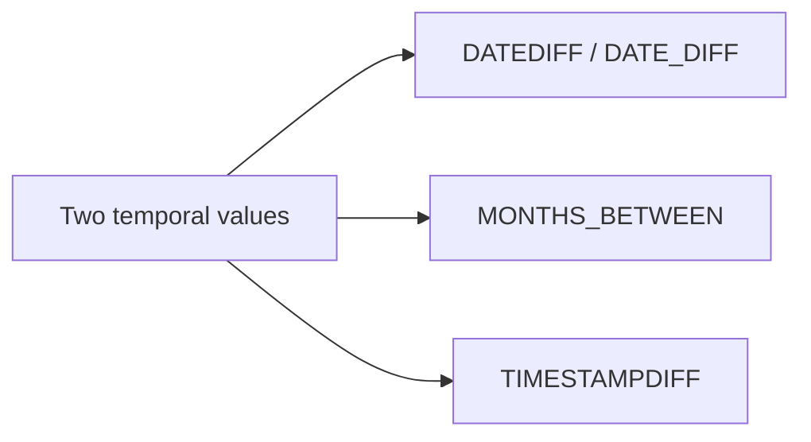

# :material-calendar-range: Date and Timestamp Differences

Difference functions answer subtly different questions: calendar-day distance, fractional months,
and elapsed complete units between timestamps.

______________________________________________________________________

## :material-sitemap: Overview



### :material-animation-play: Interactive Visualization — Calendar vs Elapsed Difference

<div id="viz-date-difference" class="ts-viz"></div>

Compare the same pair of timestamps with `DATEDIFF` and `TIMESTAMPDIFF`. Crossing midnight can be a
calendar-day change even when only a couple of hours have passed.

## :material-pin: Syntax

```sql
DATEDIFF(end_date, start_date)
DATE_DIFF(end_date, start_date)
MONTHS_BETWEEN(end_date, start_date [, roundOff])
TIMESTAMPDIFF(unit, start_timestamp, end_timestamp)
```

## :material-information-outline: Behavior

1. `DATEDIFF` and `DATE_DIFF` return the number of calendar days from start to end.
2. `MONTHS_BETWEEN` can return fractional months.
3. `TIMESTAMPDIFF` returns elapsed complete units such as hours, days, months, or years.
4. `DATEDIFF` works on timestamps by casting them to dates first.
5. `MONTHS_BETWEEN` returns exact integers for aligned day-of-month and month-end pairs.
6. **`DATEDIFF` and `TIMESTAMPDIFF` can disagree on the same inputs** — if two timestamps cross midnight but only differ by two hours, `DATEDIFF` returns `1` day while `TIMESTAMPDIFF(DAY, ...)` returns `0` because no full 24-hour day elapsed.

______________________________________________________________________

## :material-flask-outline: Practical Examples

### :material-toy-brick: 1. Calendar-Day Difference

```sql
SELECT DATEDIFF(DATE '2009-07-31', DATE '2009-07-30') AS diff_days;
-- 1
```

### :material-toy-brick: 2. `DATE_DIFF` Alias-Style Equivalent

```sql
SELECT DATE_DIFF(DATE '2009-07-31', DATE '2009-07-30') AS diff_days;
-- 1
```

### :material-toy-brick: 3. Fractional Months

```sql
SELECT MONTHS_BETWEEN(DATE '2025-07-21', DATE '2025-01-15', false) AS diff_months;
-- 6.193548387096774
```

### :material-toy-brick: 4. Elapsed Hours Between Timestamps

```sql
SELECT TIMESTAMPDIFF(HOUR,
  TIMESTAMP '2025-07-20 12:00:00',
  TIMESTAMP '2025-07-21 15:30:00'
) AS diff_hours;
-- 27
```

### :material-toy-brick: 5. Month-End Pairs Return Exact Whole Months

```sql
SELECT MONTHS_BETWEEN(DATE '2024-02-29', DATE '2024-01-31') AS month_end_gap;
-- 1.0
```

### :material-alert-circle-outline: 6. Midnight Crossing: `DATEDIFF` vs `TIMESTAMPDIFF`

```sql
SELECT
  DATEDIFF(
    TIMESTAMP '2024-07-20 01:00:00',
    TIMESTAMP '2024-07-19 23:00:00'
  ) AS calendar_days,
  TIMESTAMPDIFF(
    DAY,
    TIMESTAMP '2024-07-19 23:00:00',
    TIMESTAMP '2024-07-20 01:00:00'
  ) AS elapsed_full_days,
  TIMESTAMPDIFF(
    HOUR,
    TIMESTAMP '2024-07-19 23:00:00',
    TIMESTAMP '2024-07-20 01:00:00'
  ) AS elapsed_hours;
-- calendar_days     = 1
-- elapsed_full_days = 0
-- elapsed_hours     = 2
```

______________________________________________________________________

## :material-lightbulb-outline: When to Use

| Scenario                                         | Best function            |
| ------------------------------------------------ | ------------------------ |
| SLA measured in calendar days                    | `DATEDIFF` / `DATE_DIFF` |
| Tenure or billing month fractions                | `MONTHS_BETWEEN`         |
| Exact elapsed duration in hours, days, or months | `TIMESTAMPDIFF`          |
