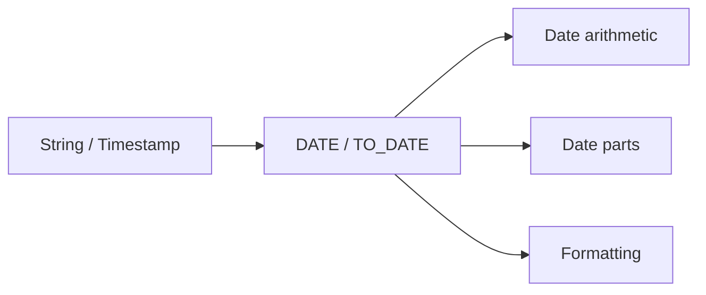

# :material-calendar: Date Functions

Date functions focus on calendar-day logic: extracting the date portion from larger values,
computing current dates, formatting, and reading individual parts such as year or week.

______________________________________________________________________

## :material-sitemap: Overview



### :material-animation-play: Interactive Visualization — Timestamp to Date

<div id="viz-date-cast" class="ts-viz"></div>

Click through common inputs to see what `DATE(expr)` keeps and what it drops. The important mental
model is that dates keep the calendar day only, not the time-of-day.

## :material-pin: Common Functions

```sql
CURDATE()
CURRENT_DATE()
DATE(expr)
DATE_FORMAT(timestamp, fmt)
DATE_PART(field, source)
DATE_FROM_UNIX_DATE(days)
```

## :material-information-outline: Behavior

1. `CURDATE()` and `CURRENT_DATE()` return the current date at the start of query evaluation.
2. `DATE(expr)` extracts or casts to a calendar day.
3. `DATE_FORMAT` returns a string representation, not a `DATE`.
4. `DATE_PART` works on dates, timestamps, and intervals.
5. `DATE_FROM_UNIX_DATE` builds a date from a day offset since `1970-01-01`.
6. **`DATE(expr)` truncates time-of-day silently** — when you cast a timestamp to a date, hours/minutes/seconds are discarded, which is often desirable for partitioning but dangerous if you still need intraday ordering.

______________________________________________________________________

## :material-flask-outline: Practical Examples

### :material-toy-brick: 1. Current Date is Stable Within a Query

```sql
SELECT CURRENT_DATE() = CURRENT_DATE() AS same_value_within_query;
-- true
```

### :material-toy-brick: 2. Extract a Date from a Timestamp

```sql
SELECT DATE(TIMESTAMP '2024-07-19 23:15:00') AS event_day;
-- 2024-07-19
```

### :material-toy-brick: 3. Format a Date for Display

```sql
SELECT DATE_FORMAT(DATE '2016-04-08', 'y-MM-dd') AS formatted_date;
-- 2016-04-08
```

### :material-toy-brick: 4. Build a Date from Unix Days

```sql
SELECT DATE_FROM_UNIX_DATE(1) AS day_one;
-- 1970-01-02
```

### :material-toy-brick: 5. Extract Different Parts from Different Temporal Types

```sql
SELECT
  DATE_PART('YEAR', TIMESTAMP '2019-08-12 01:00:00.123456') AS ts_year,
  DATE_PART('DOY', DATE '2019-08-12') AS day_of_year,
  DATE_PART('MONTH', INTERVAL '2021-11' YEAR TO MONTH) AS interval_month;
```

### :material-alert-circle-outline: 6. Casting to `DATE` Drops the Clock Portion

```sql
SELECT
  TIMESTAMP '2024-07-19 23:15:00' AS original_ts,
  DATE(TIMESTAMP '2024-07-19 23:15:00') AS day_only;
-- original_ts = 2024-07-19 23:15:00
-- day_only    = 2024-07-19
```

If you later need hours or minutes, keep the original timestamp in a separate column.

______________________________________________________________________

## :material-lightbulb-outline: When to Use

| Scenario                      | Why date functions fit                   |
| ----------------------------- | ---------------------------------------- |
| Daily partitions or snapshots | `DATE(expr)` normalizes event timestamps |
| Today-based filters           | `CURRENT_DATE()` / `CURDATE()`           |
| Human-readable output         | `DATE_FORMAT`                            |
| Calendar analytics            | `DATE_PART`, `YEAR`, `MONTH`, `DAY`      |
