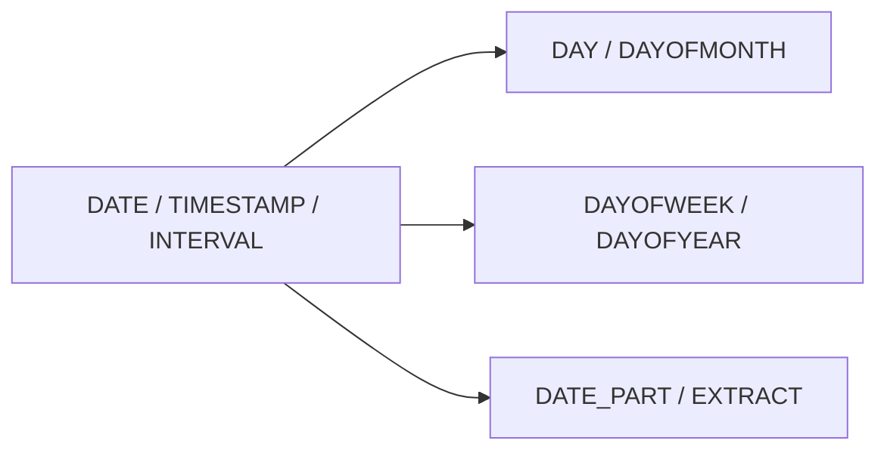

# :material-calendar-text: Date Parts

Spark SQL exposes both dedicated helpers such as `DAYOFWEEK` and generic extractors such as
`DATE_PART` / `EXTRACT` for pulling pieces out of dates, timestamps, and even intervals.

______________________________________________________________________

## :material-sitemap: Overview



### :material-animation-play: Interactive Visualization — Picking a Date Part

<div id="viz-date-parts" class="ts-viz"></div>

Select a field to see how the same sample timestamp exposes day-of-month, weekday numbering,
day-of-year, and fractional seconds.

## :material-pin: Core Functions

```sql
DAY(date)
DAYOFMONTH(date)
DAYOFWEEK(date)
DAYOFYEAR(date)
DATE_PART(field, source)
EXTRACT(field FROM source)
```

## :material-information-outline: Behavior

1. `DAY` and `DAYOFMONTH` return the same day-of-month value.
2. `DAYOFWEEK` uses Spark's numbering: `1 = Sunday` through `7 = Saturday`.
3. `DAYOFYEAR` counts through leap years correctly.
4. `DATE_PART` and `EXTRACT` are interchangeable for many common fields.
5. `DATE_PART` also works on interval values, not just dates and timestamps.
6. **Some extracted fields preserve fractional precision** — for example, `DATE_PART('SECONDS', timestamp)` can return `1.000001`, which is useful when checking sub-second parsing or truncation behavior.

______________________________________________________________________

## :material-flask-outline: Practical Examples

### :material-toy-brick: 1. `DAY` and `DAYOFMONTH` Are Equivalent

```sql
SELECT
  DAY(DATE '2024-07-19') AS day_fn,
  DAYOFMONTH(DATE '2024-07-19') AS dayofmonth_fn;
-- both return 19
```

### :material-toy-brick: 2. Weekday Numbering

```sql
SELECT DAYOFWEEK(DATE '2009-07-30') AS weekday_number;
-- 5  (Thursday)
```

### :material-toy-brick: 3. Leap-Year Day-of-Year

```sql
SELECT DAYOFYEAR(DATE '2024-02-29') AS leap_day_number;
-- 60
```

### :material-toy-brick: 4. Generic Extraction from a Timestamp

```sql
SELECT DATE_PART('YEAR', TIMESTAMP '2019-08-12 01:00:00.123456') AS ts_year;
-- 2019
```

### :material-toy-brick: 5. Extract from an Interval

```sql
SELECT DATE_PART('MONTH', INTERVAL '2021-11' YEAR TO MONTH) AS interval_month;
-- 11
```

### :material-alert-circle-outline: 6. Fractional Seconds Survive Extraction

```sql
SELECT DATE_PART('SECONDS', TIMESTAMP '2019-10-01 00:00:01.000001') AS seconds_part;
-- 1.000001
```

______________________________________________________________________

## :material-lightbulb-outline: When to Use

| Scenario                     | Best function              |
| ---------------------------- | -------------------------- |
| Fast day-of-month extraction | `DAY`, `DAYOFMONTH`        |
| Week-based reporting         | `DAYOFWEEK`, `DAYOFYEAR`   |
| Generic dynamic extraction   | `DATE_PART`, `EXTRACT`     |
| Interval introspection       | `DATE_PART(..., interval)` |
