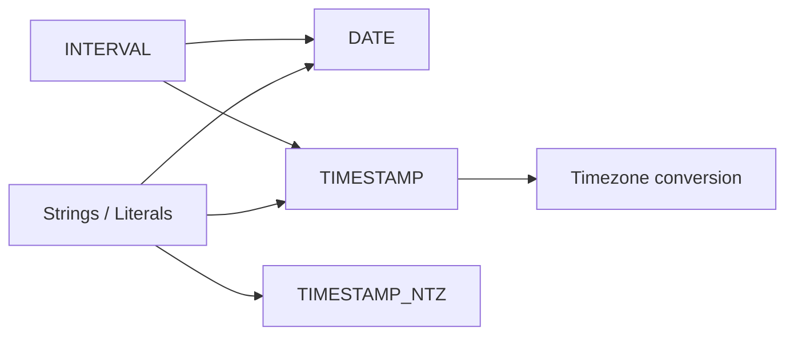

# :material-calendar-clock: DateTime Functions

Spark SQL groups date/time work into four related areas: `DATE`, `TIMESTAMP`, `TIMESTAMP_NTZ`,
`INTERVAL`, and timezone-conversion functions. Picking the right type first prevents many downstream
formatting, arithmetic, and daylight-saving surprises.

______________________________________________________________________

## :material-sitemap: Overview



### :material-animation-play: Interactive Visualization — Choosing the Right Temporal Type

<div id="viz-datetime-overview" class="ts-viz"></div>

Click each type to see what it keeps, what it drops, and which operations it is best suited for.
The goal is to separate calendar dates, instants, wall-clock timestamps, and durations.

## :material-pin: Categories

| Category           | What it represents                                 | Typical functions                                            |
| ------------------ | -------------------------------------------------- | ------------------------------------------------------------ |
| `DATE`             | Calendar day with no time-of-day                   | `CURRENT_DATE`, `DATE`, `DATE_ADD`, `DATEDIFF`               |
| `TIMESTAMP`        | Instant in time, displayed in the session timezone | `CURRENT_TIMESTAMP`, `TO_TIMESTAMP`, `DATE_TRUNC`            |
| `TIMESTAMP_NTZ`    | Wall-clock date+time without timezone conversion   | `TIMESTAMP_NTZ` literals, `CONVERT_TIMEZONE`                 |
| `INTERVAL`         | Duration to add/subtract                           | `INTERVAL ...`, `MAKE_INTERVAL`, `DATE_PART`                 |
| Timezone functions | Convert between timezones explicitly               | `FROM_UTC_TIMESTAMP`, `TO_UTC_TIMESTAMP`, `CONVERT_TIMEZONE` |

______________________________________________________________________

## :material-information-outline: Behavior

1. `DATE` stores only the calendar day; any time-of-day is discarded.
2. `TIMESTAMP` represents an instant and is interpreted/displayed using `spark.sql.session.timeZone`.
3. `TIMESTAMP_NTZ` keeps a wall-clock value and does not carry timezone semantics by itself.
4. `INTERVAL` is a duration, not a point in time, so it must be added to a date or timestamp to produce one.
5. Many extraction functions work across families: `DATE_PART` can read from dates, timestamps, and intervals.
6. **Type changes can be subtle** — `DATE_TRUNC` always returns a timestamp-like value, even when the input is a `DATE`, so day-level logic often reads more clearly with `DATE`, `DATE_ADD`, or `DATEDIFF` instead of truncating first.

______________________________________________________________________

## :material-flask-outline: Practical Examples

### :material-toy-brick: 1. Date Arithmetic Stays at Day Precision

```sql
SELECT DATE_ADD(DATE '2024-07-19', 7) AS next_week;
-- 2024-07-26
```

### :material-toy-brick: 2. Timestamp Parsing Produces an Instant

```sql
SET spark.sql.session.timeZone = 'UTC';

SELECT TO_TIMESTAMP('2024-07-19 14:05:00') AS parsed_ts;
-- 2024-07-19 14:05:00
```

### :material-toy-brick: 3. TIMESTAMP_NTZ Preserves Wall-Clock Time

```sql
SELECT TIMESTAMP_NTZ '2024-07-19 14:05:00' AS meeting_local_time;
-- 2024-07-19 14:05:00
```

### :material-toy-brick: 4. Intervals Add Durations

```sql
SELECT TIMESTAMP '2024-07-19 14:05:00' + INTERVAL 2 HOURS AS two_hours_later;
-- 2024-07-19 16:05:00
```

### :material-toy-brick: 5. Convert UTC into a Business Timezone

```sql
SET spark.sql.session.timeZone = 'America/New_York';

SELECT FROM_UTC_TIMESTAMP(TIMESTAMP '2024-07-19 18:00:00', 'America/New_York') AS ny_time;
-- 2024-07-19 14:00:00
```

### :material-alert-circle-outline: 6. `DATE_TRUNC` Returns a Timestamp

```sql
SELECT
  DATE '2024-07-19' AS original_date,
  DATE_TRUNC('MONTH', DATE '2024-07-19') AS month_start_ts;
-- original_date   = 2024-07-19
-- month_start_ts  = 2024-07-01 00:00:00
```

Use this when you really want a timestamp boundary. If you only need a date-level comparison,
keeping the value as `DATE` is usually clearer.

______________________________________________________________________

## :material-lightbulb-outline: When to Use

| Need                                                       | Best fit                                                     |
| ---------------------------------------------------------- | ------------------------------------------------------------ |
| Partitioning, reporting, day-level filters                 | `DATE`                                                       |
| Precise instants, event ordering, timezone-aware ingestion | `TIMESTAMP`                                                  |
| Local wall-clock schedules before assigning a timezone     | `TIMESTAMP_NTZ`                                              |
| “Add 7 days” / “subtract 1 month” logic                    | `INTERVAL`, `DATE_ADD`, `ADD_MONTHS`                         |
| Cross-region reporting or user-local display               | `FROM_UTC_TIMESTAMP`, `TO_UTC_TIMESTAMP`, `CONVERT_TIMEZONE` |
