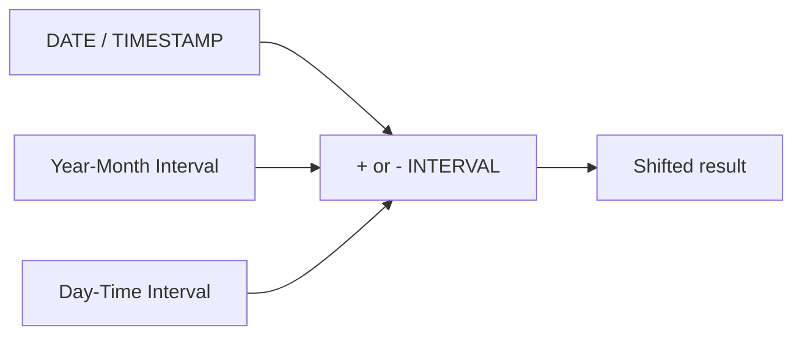

# :material-calendar-clock: Interval Arithmetic

`INTERVAL` values represent durations that you can add to or subtract from `DATE` and `TIMESTAMP`
values. Spark SQL supports both calendar-style intervals such as months and clock-style intervals
such as hours, minutes, and seconds.

______________________________________________________________________

## :material-sitemap: Overview



### :material-animation-play: Interactive Visualization — Month-End Interval Behavior

<div id="viz-interval-month-logic" class="ts-viz"></div>

Toggle between common bases to see how calendar-month arithmetic clamps to the last valid day,
while day-based arithmetic moves by elapsed days instead.

## :material-pin: Syntax

```sql
<date_or_timestamp> + INTERVAL 5 DAYS
<date_or_timestamp> - INTERVAL 2 MONTHS
INTERVAL '2024-02' YEAR TO MONTH
INTERVAL '3 04:05:06.007008' DAY TO SECOND
```

## :material-information-outline: Behavior

1. `YEAR`/`MONTH` intervals use calendar arithmetic, so month length matters.
2. `DAY`/`HOUR`/`MINUTE`/`SECOND` intervals use elapsed time arithmetic.
3. Adding an interval to a `DATE` returns a date for day/month arithmetic and a timestamp when sub-day precision is introduced.
4. Spark has two typed interval families: **year-month** and **day-time**.
5. You can chain multiple interval additions in one expression.
6. **Month-end arithmetic clamps instead of overflowing** — adding one month to January 31 lands on the last valid day of February, which is often exactly what billing and reporting logic expects.

______________________________________________________________________

## :material-flask-outline: Practical Examples

### :material-toy-brick: 1. Add Days to a Date

```sql
SELECT DATE '2025-07-21' + INTERVAL 5 DAYS AS new_date;
-- 2025-07-26
```

### :material-toy-brick: 2. Subtract Months from a Date

```sql
SELECT DATE '2025-07-21' - INTERVAL 2 MONTHS AS new_date;
-- 2025-05-21
```

### :material-toy-brick: 3. Add Multiple Intervals to a Timestamp

```sql
SELECT TIMESTAMP '2025-07-21 10:00:00'
       + INTERVAL 1 YEAR
       + INTERVAL 2 MONTHS
       + INTERVAL 10 DAYS
       + INTERVAL 3 HOURS AS future_time;
-- 2026-09-01 13:00:00
```

### :material-toy-brick: 4. Inspect the Two Interval Families

```sql
SELECT
  INTERVAL '2024-02' YEAR TO MONTH AS ym_interval,
  INTERVAL '3 04:05:06.007008' DAY TO SECOND AS dt_interval;
```

### :material-toy-brick: 5. Extract Parts from an Interval

```sql
SELECT
  DATE_PART('MONTH', INTERVAL '2021-11' YEAR TO MONTH) AS months_part,
  DATE_PART('MINUTE', INTERVAL '3 04:05:06.007008' DAY TO SECOND) AS minute_part;
-- months_part = 11, minute_part = 5
```

### :material-alert-circle-outline: 6. Month-End Clamp on `INTERVAL 1 MONTH`

```sql
SELECT
  DATE '2024-01-31' + INTERVAL 1 MONTH AS leap_year_result,
  DATE '2023-01-31' + INTERVAL 1 MONTH AS non_leap_year_result;
-- leap_year_result      = 2024-02-29
-- non_leap_year_result  = 2023-02-28
```

This is the same practical rule you see with `ADD_MONTHS`: Spark preserves calendar intent by
moving to the last valid day of the target month.

______________________________________________________________________

## :material-lightbulb-outline: When to Use

| Scenario                     | Why intervals help                                  |
| ---------------------------- | --------------------------------------------------- |
| Rolling deadlines            | Natural `+ INTERVAL 7 DAYS` syntax                  |
| Month-end billing cycles     | Calendar-aware month arithmetic                     |
| Scheduling future timestamps | Sub-day units compose cleanly                       |
| Extracting duration parts    | `DATE_PART(..., interval)` works on typed intervals |
