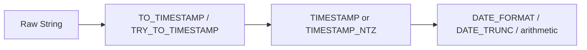

# :material-timeline-clock: Timestamp Parsing and Formatting

Spark SQL timestamps are the bridge between raw strings and analyzable event time. The most common
workflows are parsing text with `TO_TIMESTAMP`, tolerating bad data with `TRY_TO_TIMESTAMP`, and
formatting timestamps back to strings with `DATE_FORMAT`.

______________________________________________________________________

## :material-sitemap: Overview



### :material-animation-play: Interactive Visualization — Parsing Outcomes

<div id="viz-timestamp-parse-flow" class="ts-viz"></div>

Switch between valid, invalid, and timezone-bearing inputs to see when parsing succeeds, when ANSI
mode raises an error, and when `TRY_TO_TIMESTAMP` is the safer ingestion choice.

## :material-pin: Common Pattern Letters

| Pattern   | Meaning           | Example               |
| --------- | ----------------- | --------------------- |
| `y`       | Year              | `2024`                |
| `M`       | Month number/text | `07`, `Jul`           |
| `d`       | Day of month      | `19`                  |
| `H`       | Hour (0-23)       | `14`                  |
| `m`       | Minute            | `05`                  |
| `s`       | Second            | `09`                  |
| `S`       | Fractional second | `123456`              |
| `X` / `Z` | Zone offset       | `-07:00`, `+0000`     |
| `V`       | Zone ID           | `America/Los_Angeles` |

## :material-information-outline: Behavior

1. `TO_TIMESTAMP` parses a string into a timezone-aware `TIMESTAMP` instant.
2. `TRY_TO_TIMESTAMP` uses the same parsing rules but returns `NULL` instead of failing.
3. Offsets embedded in the string are honored during parsing.
4. `DATE_FORMAT` always returns a string, not a timestamp.
5. `TIMESTAMP_NTZ` stores wall-clock time without timezone conversion.
6. **ANSI mode makes bad timestamp parsing fail loudly** — a format mismatch raises an error with `TO_TIMESTAMP`, so ingestion pipelines that expect messy data should often use `TRY_TO_TIMESTAMP` first and then filter or audit the `NULL`s.

______________________________________________________________________

## :material-flask-outline: Practical Examples

### :material-toy-brick: 1. Parse a Known Format

```sql
SELECT TO_TIMESTAMP('2024-07-19 14:05', 'yyyy-MM-dd HH:mm') AS parsed_ts;
-- 2024-07-19 14:05:00
```

### :material-toy-brick: 2. Keep a Wall-Clock Value with `TIMESTAMP_NTZ`

```sql
SELECT TIMESTAMP_NTZ '2024-07-19 14:05:00' AS local_wall_clock;
-- 2024-07-19 14:05:00
```

### :material-toy-brick: 3. Parse a Timestamp that Includes an Offset

```sql
SET spark.sql.session.timeZone = 'UTC';

SELECT TO_TIMESTAMP('2024-07-19T12:00:00-07:00') AS parsed_utc;
-- 2024-07-19 19:00:00
```

### :material-toy-brick: 4. Format a Timestamp for Output

```sql
SELECT DATE_FORMAT(TIMESTAMP '2024-07-19 14:05:09.123456', 'yyyy-MM-dd HH:mm:ss.SSS') AS formatted;
-- 2024-07-19 14:05:09.123
```

### :material-toy-brick: 5. Fractional Seconds Can Be Extracted Precisely

```sql
SELECT DATE_PART('SECONDS', TIMESTAMP '2019-10-01 00:00:01.000001') AS seconds_part;
-- 1.000001
```

### :material-alert-circle-outline: 6. `TRY_TO_TIMESTAMP` for Messy Inputs

```sql
SELECT TRY_TO_TIMESTAMP('07/19/2024', 'yyyy-MM-dd') AS safe_parse;
-- NULL
```

The matching `TO_TIMESTAMP('07/19/2024', 'yyyy-MM-dd')` call raises a parse error in ANSI mode,
which is helpful for strict pipelines but noisy for exploratory ingestion.

______________________________________________________________________

## :material-lightbulb-outline: When to Use

| Scenario                                         | Recommended function |
| ------------------------------------------------ | -------------------- |
| Known clean input                                | `TO_TIMESTAMP`       |
| Dirty CSV / JSON ingest                          | `TRY_TO_TIMESTAMP`   |
| Display-only formatting                          | `DATE_FORMAT`        |
| Local schedule values before timezone assignment | `TIMESTAMP_NTZ`      |
| Rounding event time to a boundary                | `DATE_TRUNC`         |
