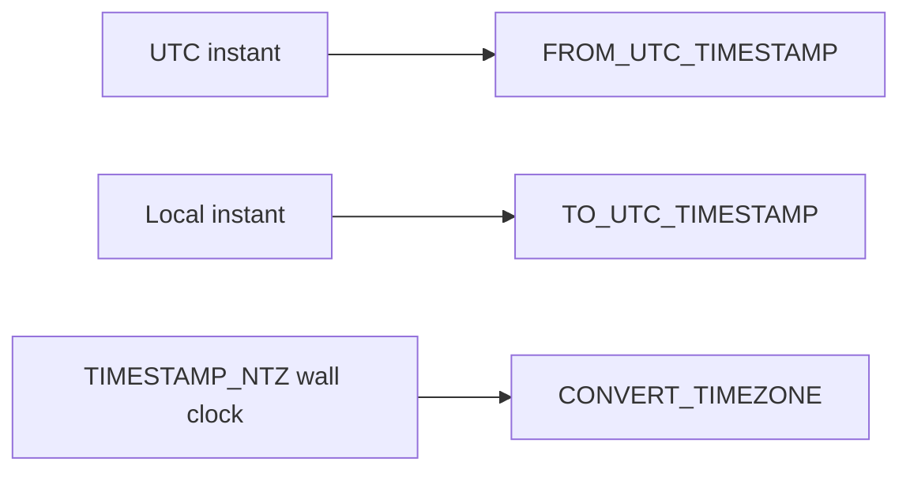

# :material-clock-outline: Time Zone Conversion

Timezone functions make the difference between “stored in UTC” and “displayed for a user” explicit.
Spark SQL gives you three main tools: session timezone settings, UTC conversion helpers, and the
`CONVERT_TIMEZONE` function for wall-clock `TIMESTAMP_NTZ` values.

______________________________________________________________________

## :material-sitemap: Overview



### :material-animation-play: Interactive Visualization — DST Jump and Duplicate Hour

<div id="viz-timezone-dst" class="ts-viz"></div>

Step through UTC instants around daylight-saving changes to see the spring-forward gap and the
fall-back duplicate hour. The same local wall clock can occur twice in autumn.

## :material-pin: Core Functions

```sql
SET spark.sql.session.timeZone = 'UTC';
SELECT current_timezone();

FROM_UTC_TIMESTAMP(timestamp, timezone)
TO_UTC_TIMESTAMP(timestamp, timezone)
CONVERT_TIMEZONE(source_tz, target_tz, timestamp_ntz)
```

## :material-information-outline: Behavior

1. `spark.sql.session.timeZone` affects how regular `TIMESTAMP` strings are interpreted and displayed.
2. `FROM_UTC_TIMESTAMP` converts a UTC instant into a timestamp displayed in another timezone.
3. `TO_UTC_TIMESTAMP` converts a local timestamp into UTC using the supplied source timezone.
4. `CONVERT_TIMEZONE` is the clearest choice when you start from a `TIMESTAMP_NTZ` wall-clock value.
5. Region IDs such as `America/Los_Angeles` are safer than ambiguous abbreviations because they carry real DST rules.
6. **DST boundaries are not linear wall-clock arithmetic** — during spring-forward, a whole local hour disappears, and during fall-back two distinct UTC instants can map to the same displayed local time.

______________________________________________________________________

## :material-flask-outline: Practical Examples

### :material-toy-brick: 1. Set and Inspect the Session Timezone

```sql
SET spark.sql.session.timeZone = 'UTC';
SELECT current_timezone();
-- UTC
```

### :material-toy-brick: 2. Convert a UTC Instant for New York Users

```sql
SET spark.sql.session.timeZone = 'America/New_York';

SELECT FROM_UTC_TIMESTAMP(TIMESTAMP '2024-07-19 18:00:00', 'America/New_York') AS ny_time;
-- 2024-07-19 14:00:00
```

### :material-toy-brick: 3. Convert a Local Business Time into UTC

```sql
SELECT TO_UTC_TIMESTAMP(TIMESTAMP '2024-07-19 09:00:00', 'America/New_York') AS utc_time;
-- 2024-07-19 13:00:00
```

### :material-toy-brick: 4. Shift a `TIMESTAMP_NTZ` Between Zones

```sql
SELECT CONVERT_TIMEZONE(
  'UTC',
  'America/Los_Angeles',
  TIMESTAMP_NTZ '2024-07-19 16:00:00'
) AS la_wall_clock;
-- 2024-07-19 09:00:00
```

### :material-alert-circle-outline: 5. DST Spring-Forward Skips 02:00

```sql
SELECT
  CONVERT_TIMEZONE('UTC', 'America/Los_Angeles', TIMESTAMP_NTZ '2024-03-10 09:30:00') AS before_jump,
  CONVERT_TIMEZONE('UTC', 'America/Los_Angeles', TIMESTAMP_NTZ '2024-03-10 10:30:00') AS after_jump;
-- before_jump = 2024-03-10 01:30:00
-- after_jump  = 2024-03-10 03:30:00
```

There is no `2024-03-10 02:30:00` local time in Los Angeles on that date.

### :material-alert-circle-outline: 6. DST Fall-Back Duplicates 01:30

```sql
SELECT
  CONVERT_TIMEZONE('UTC', 'America/Los_Angeles', TIMESTAMP_NTZ '2024-11-03 08:30:00') AS first_130,
  CONVERT_TIMEZONE('UTC', 'America/Los_Angeles', TIMESTAMP_NTZ '2024-11-03 09:30:00') AS second_130;
-- first_130   = 2024-11-03 01:30:00
-- second_130  = 2024-11-03 01:30:00
```

Two different UTC instants can therefore display as the same local wall clock during the fall-back hour.

______________________________________________________________________

## :material-lightbulb-outline: When to Use

| Scenario                                     | Best function                    |
| -------------------------------------------- | -------------------------------- |
| UTC data lake, local reporting               | `FROM_UTC_TIMESTAMP`             |
| User-entered local time, normalize to UTC    | `TO_UTC_TIMESTAMP`               |
| Wall-clock schedule migration across regions | `CONVERT_TIMEZONE`               |
| Consistent parsing/display across jobs       | `SET spark.sql.session.timeZone` |
