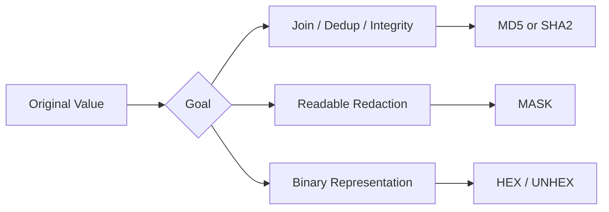

# :material-shield-lock: Encryption and Hash Function Concepts

This section covers the most common Spark SQL functions used to transform sensitive or
binary-looking values: checksums, one-way hashes, masking, and hexadecimal encoding.
The most important design choice is **what property you need afterward**.

______________________________________________________________________

## :material-sitemap: Overview



### :material-animation-play: Interactive Visualization — Masking vs Hashing for Analytics

<div id="viz-encryption-contrast" class="ts-viz"></div>

Toggle between **MASK** and **SHA2** to compare two different emails. One view is great for
safe display but collapses distinct values; the other stays distinct and is much better for
joins or deduplication.

______________________________________________________________________

## :material-information-outline: Behavior

1. Hash functions are **one-way** and deterministic, which makes them useful for joining the same identifier across datasets.
2. `MASK` is primarily for **human-facing redaction**, not for uniqueness.
3. `HEX` changes how bytes are written, but it does **not** hide the underlying data from anyone who can decode it.
4. `CRC32` is a checksum, not a cryptographic digest.
5. **Masked values are often many-to-one** — different inputs with the same character-class pattern can mask to the exact same output, so `MASK` is poor as a surrogate key even though it is useful for reports.

______________________________________________________________________

## :material-flask-outline: Practical Examples

### :material-toy-brick: 1. Hash an Identifier for Stable Joins

```sql
SELECT sha2(email, 256) AS email_hash
FROM users;
```

### :material-toy-brick: 2. Mask an Identifier for Human Review

```sql
SELECT mask(email) AS redacted_email
FROM users;
```

### :material-alert-circle-outline: 3. Distinct Inputs Can Collapse Under `MASK`

```sql
SELECT
  mask('alice@example.com') AS alice_mask,
  mask('bruce@example.com') AS bruce_mask,
  mask('alice@example.com') = mask('bruce@example.com') AS same_mask,
  sha2('alice@example.com', 256) = sha2('bruce@example.com', 256) AS same_hash;

-- alice_mask = xxxxx@xxxxxxx.xxx
-- bruce_mask = xxxxx@xxxxxxx.xxx
-- same_mask  = true
-- same_hash  = false
```

### :material-toy-brick: 4. `HEX` Is Reversible, Not Anonymous

```sql
SELECT
  hex('secret-token') AS encoded,
  CAST(unhex(hex('secret-token')) AS STRING) AS decoded;

-- decoded = secret-token
```

______________________________________________________________________

## :material-lightbulb-outline: When to Use

| Requirement                    | Recommended Function |
| ------------------------------ | -------------------- |
| Stable pseudonymous identifier | `SHA2(_, 256)`       |
| Fast legacy fingerprint        | `MD5`                |
| Accidental-change detection    | `CRC32`              |
| Report-safe redaction          | `MASK`               |
| Reversible text form for bytes | `HEX` / `UNHEX`      |

> **Note:** `MASK()` was verified in open-source Apache Spark 4.2 for these examples.
> This page intentionally focuses on the portable `MASK()` function rather than
> undocumented partial-mask variants.
