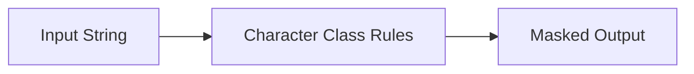

# :material-shield-lock: MASK

`MASK` redacts strings by replacing letters, digits, and other characters with configurable
substitutes. It is designed for **human-facing obfuscation**, not for stable unique keys.

______________________________________________________________________

## :material-sitemap: Overview



### :material-animation-play: Interactive Visualization — Character-Class Masking Rules

<div id="viz-mask-classes" class="ts-viz"></div>

Toggle between the default rule set and a custom version that keeps digits visible. The mapping
shows that `MASK` works by character class, not by memorizing or encrypting the source text.

______________________________________________________________________

## :material-pin: Syntax

```sql
mask(str)
mask(str, upper, lower, digit, other)
```

- `str`: input `STRING`
- `upper`: replacement for uppercase letters
- `lower`: replacement for lowercase letters
- `digit`: replacement for digits
- `other`: replacement for punctuation / symbols / everything else

!!! note "Portable Spark behavior used here"

    `MASK()` was verified directly on open-source Apache Spark 4.2 for these examples.
    This page avoids undocumented partial-mask variants and focuses on the portable core function.

______________________________________________________________________

## :material-information-outline: Behavior

1. By default, uppercase letters become `X`, lowercase letters become `x`, and digits become `n`.
2. Non-alphanumeric characters are preserved by default unless you supply a custom `other` mask character.
3. You can customize the replacement character for uppercase, lowercase, digits, and other characters.
4. Passing `NULL` for a replacement parameter leaves that character class unchanged.
5. `MASK` preserves output length, which helps keep familiar shapes such as emails or IDs visible.
6. **Masked output is not unique** — many different source values collapse to the same masked pattern, so `MASK` should not be used as a join key or dedup key.

______________________________________________________________________

## :material-flask-outline: Practical Examples

### :material-toy-brick: 1. Basic Masking

```sql
SELECT mask('John.Doe@example.com') AS masked;
-- Result: Xxxx.Xxx@xxxxxxx.xxx
```

### :material-toy-brick: 2. Custom Mask Characters

```sql
SELECT mask('ABC123', 'X', 'x', '0', '*') AS masked;
-- Result: XXX000
```

### :material-alert-circle-outline: 3. Pass `NULL` to Keep One Character Class Visible

```sql
SELECT mask('Ab-19', 'U', 'l', NULL, '*') AS masked;
-- Result: Ul*19
```

### :material-toy-brick: 4. Default Rules Preserve Punctuation and Length

```sql
SELECT
  mask('A1-') AS masked,
  length(mask('John.Doe@example.com')) AS masked_len,
  length('John.Doe@example.com') AS original_len;

-- masked       = Xn-
-- masked_len   = 20
-- original_len = 20
```

### :material-alert-circle-outline: 5. Distinct Inputs Can Produce the Same Masked Output

```sql
SELECT
  mask('alice@example.com') AS alice_mask,
  mask('bruce@example.com') AS bruce_mask,
  mask('alice@example.com') = mask('bruce@example.com') AS same_mask;

-- alice_mask = xxxxx@xxxxxxx.xxx
-- bruce_mask = xxxxx@xxxxxxx.xxx
-- same_mask  = true
```

______________________________________________________________________

## :material-lightbulb-outline: When to Use

| Scenario                         | Why `MASK`?                                      |
| -------------------------------- | ------------------------------------------------ |
| Redact emails, names, and IDs    | Hides content while keeping a recognizable shape |
| Share screenshots or QA extracts | Safer for humans to inspect                      |
| Preserve visible formatting      | Length and punctuation can remain recognizable   |
| Avoid storing raw PII in reports | One-line SQL redaction at query time             |

> **Tip:** If you need a stable pseudonymous key, prefer `SHA2`.
> If you need a report-safe display value, prefer `MASK`.
