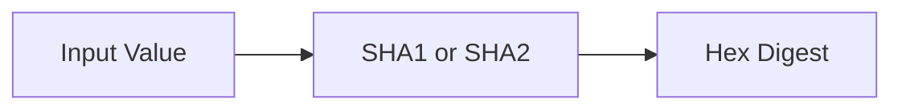

# :material-shield-lock: SHA1 / SHA2

The SHA family produces cryptographic digests with different output sizes. In Spark SQL,
`SHA1` is mainly for legacy interoperability, while `SHA2` is the usual choice for new work.

______________________________________________________________________

## :material-sitemap: Overview



### :material-animation-play: Interactive Visualization — Comparing SHA Variants

<div id="viz-sha-family" class="ts-viz"></div>

Click through the SHA variants to compare output lengths and recommendations. The key trade-off
is usually compatibility versus digest size, not reversibility — all of these are one-way hashes.

______________________________________________________________________

## :material-pin: Syntax

```sql
sha1(expr)
sha2(expr, bitLength)
```

- `sha1(expr)`: returns a 40-character hex string (160-bit digest)
- `sha2(expr, bitLength)`: returns a hex string with `224`, `256`, `384`, or `512` bits
- `sha2(expr, 0)`: alias for 256 bits
- `NULL` input returns `NULL`

______________________________________________________________________

## :material-information-outline: Behavior

1. `SHA1` produces a 160-bit digest and is considered weak for new cryptographic designs.
2. `SHA2` supports `224`, `256`, `384`, and `512` bit variants.
3. `SHA2(..., 0)` is a synonym for the 256-bit variant.
4. `NULL` input returns `NULL` for both `SHA1` and `SHA2`.
5. **Unsupported `bitLength` values return `NULL` rather than raising a parse error**, so validate user-supplied bit sizes upstream if you need strict guarantees.

!!! warning "Security guidance"

    Prefer `SHA2(_, 256)` or stronger for new development. Keep `SHA1` only when you must
    match an existing external system.

______________________________________________________________________

## :material-flask-outline: Practical Examples

### :material-toy-brick: 1. SHA1

```sql
SELECT sha1('Databricks') AS sha1_hash;
-- Result: 2d3dad417c3b2cb2a95f1b69e9b15dabad8c3a6a
```

### :material-toy-brick: 2. SHA2 with 256 Bits

```sql
SELECT sha2('Databricks', 256) AS sha256_hash;
-- Result: 5b5fea64c746773683cb2edea86e1191cf1bb66e0694fd4e2a64c2b8a3244a6e
```

### :material-toy-brick: 3. SHA2 with 512 Bits

```sql
SELECT sha2('Databricks', 512) AS sha512_hash;
-- Result: 128-character hex string
```

### :material-toy-brick: 4. Secure Row Fingerprint

```sql
SELECT
  id,
  sha2(CONCAT_WS('|', name, email, CAST(salary AS STRING)), 256) AS secure_hash
FROM employees;
```

### :material-alert-circle-outline: 5. Output Lengths, `0` Alias, and Invalid Bit Sizes

```sql
SELECT
  LENGTH(sha1('Spark')) AS sha1_len,
  LENGTH(sha2('Spark', 224)) AS sha224_len,
  LENGTH(sha2('Spark', 256)) AS sha256_len,
  LENGTH(sha2('Spark', 384)) AS sha384_len,
  LENGTH(sha2('Spark', 512)) AS sha512_len,
  sha2('Spark', 0) = sha2('Spark', 256) AS zero_means_256,
  sha2('Spark', 128) IS NULL AS invalid_returns_null;

-- sha1_len            = 40
-- sha224_len          = 56
-- sha256_len          = 64
-- sha384_len          = 96
-- sha512_len          = 128
-- zero_means_256      = true
-- invalid_returns_null= true
```

### :material-toy-brick: 6. NULL Input Propagates

```sql
SELECT
  sha1(CAST(NULL AS STRING)) AS sha1_null,
  sha2(CAST(NULL AS STRING), 256) AS sha256_null;

-- sha1_null   = NULL
-- sha256_null = NULL
```

______________________________________________________________________

## :material-lightbulb-outline: Choosing the Right SHA Variant

| Function       | Output              | Strength    | Typical Use                   |
| -------------- | ------------------- | ----------- | ----------------------------- |
| `sha1`         | 40 chars (160-bit)  | Weak        | Legacy interoperability       |
| `sha2(_, 224)` | 56 chars (224-bit)  | Moderate    | Smaller cryptographic digests |
| `sha2(_, 256)` | 64 chars (256-bit)  | Strong      | Recommended default           |
| `sha2(_, 384)` | 96 chars (384-bit)  | Very strong | Higher-assurance digests      |
| `sha2(_, 512)` | 128 chars (512-bit) | Very strong | Maximum digest size in Spark  |
