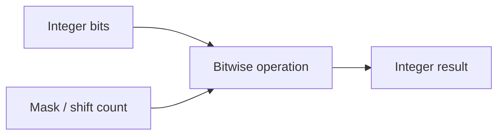

# :material-chip: Bitwise Functions

Bitwise functions operate on integer bits directly. They are useful for flags,
compact encodings, masks, and low-level transformations that would be awkward with arithmetic alone.

______________________________________________________________________

## :material-sitemap: Overview



### :material-animation-play: Interactive Visualization — Signed vs Unsigned Right Shift

<div id="viz-bitwise-shift" class="ts-viz"></div>

Move the shift slider to compare how `SHIFTRIGHT` preserves the sign bit while `SHIFTRIGHTUNSIGNED` fills from the left with zeros. The example uses `-8` because negative values make the difference obvious.

______________________________________________________________________

## :material-code-tags: Function Reference

| Function                         | Description                                                            |
| -------------------------------- | ---------------------------------------------------------------------- |
| `expr1 & expr2`                  | Bitwise AND                                                            |
| \`expr1                          | expr2\`                                                                |
| `expr1 ^ expr2`                  | Bitwise XOR                                                            |
| `~expr`                          | Bitwise NOT                                                            |
| `bit_count(expr)`                | Number of set bits in the value, treated as an unsigned 64-bit integer |
| `bit_get(expr, pos)`             | Bit value at zero-based position `pos`, counting from the right        |
| `getbit(expr, pos)`              | Alias for `bit_get(expr, pos)`                                         |
| `shiftright(base, expr)`         | Signed right shift                                                     |
| `shiftrightunsigned(base, expr)` | Unsigned right shift                                                   |

______________________________________________________________________

## :material-information-outline: Behavior

1. Bit positions are zero-based from right to left, so position `0` is the least-significant bit.
2. `bit_get(expr, pos)` and `getbit(expr, pos)` are equivalent.
3. `bit_count(expr)` counts set bits in the value's unsigned 64-bit representation, which is why `bit_count(-1)` returns `64`.
4. `shiftright(base, expr)` is an arithmetic shift: it preserves the sign bit for negative numbers.
5. `shiftrightunsigned(base, expr)` is a logical shift: it fills from the left with zeros.
6. For negative inputs, signed and unsigned right shifts can produce dramatically different numbers even with the same bit pattern movement.

______________________________________________________________________

## :material-flask-outline: Practical Examples

### :material-toy-brick: 1. Basic Masks

```sql
SELECT
  3 & 5 AS bitwise_and,
  3 | 5 AS bitwise_or,
  3 ^ 5 AS bitwise_xor,
  ~0 AS bitwise_not_zero;
-- Result: 1, 7, 6, -1
```

### :material-toy-brick: 2. Inspect Individual Bits

```sql
SELECT
  bit_get(11, 0) AS bit_0,
  bit_get(11, 1) AS bit_1,
  bit_get(11, 2) AS bit_2,
  getbit(11, 3) AS bit_3;
-- 11 = binary 1011, so the result is 1, 1, 0, 1
```

### :material-toy-brick: 3. Count Set Bits

```sql
SELECT
  bit_count(0) AS zero_bits,
  bit_count(11) AS bits_in_eleven,
  bit_count(-1) AS bits_in_negative_one;
-- Result: 0, 3, 64
```

### :material-toy-brick: 4. Right Shift a Positive Number

```sql
SELECT
  shiftright(4, 1) AS signed_pos,
  shiftrightunsigned(4, 1) AS unsigned_pos;
-- Result: 2, 2
```

### :material-alert-circle-outline: 5. Signed vs Unsigned Right Shift on a Negative Number

```sql
SELECT
  shiftright(-8, 1) AS signed_neg,
  shiftrightunsigned(-8, 1) AS unsigned_neg;
-- Result: -4, 2147483644
```

`SHIFTRIGHT(-8, 1)` keeps the leading `1` bit, so the value stays negative.
`SHIFTRIGHTUNSIGNED(-8, 1)` inserts a `0` on the left, so the result becomes a large positive integer.

### :material-alert-circle-outline: 6. Pick the Shift Function That Matches Your Intent

```sql
-- Keep the sign when dividing a signed flag field by powers of two.
SELECT shiftright(-8, 1) AS preserve_sign;
-- Result: -4

-- Use zero-fill when treating the same bits as an unsigned packed value.
SELECT shiftrightunsigned(-8, 1) AS zero_fill;
-- Result: 2147483644
```

______________________________________________________________________

## :material-lightbulb-outline: When to Use

| Scenario                             | Recommended function |
| ------------------------------------ | -------------------- |
| Check whether a flag bit is set      | `bit_get` / `getbit` |
| Count enabled flags                  | `bit_count`          |
| Clear or keep specific flags         | `&`, \`              |
| Preserve sign while shifting         | `shiftright`         |
| Zero-fill while shifting packed bits | `shiftrightunsigned` |
