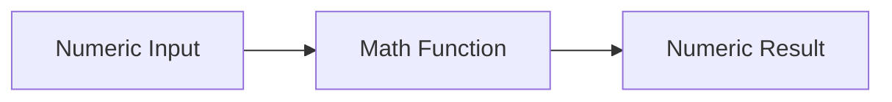

# :material-calculator: Math Functions

Spark SQL math functions cover rounding, exponentiation, logs, random sampling, and everyday arithmetic.

______________________________________________________________________

## :material-sitemap: Overview



### :material-animation-play: Interactive Visualization — Rounding Ties

`ROUND` and `BROUND` only differ on midpoint values such as `2.5` or `-2.5`. The visualization shows
why those tie cases matter in financial and reporting workloads.

<div id="viz-math-rounding" class="ts-viz"></div>

Try positive and negative midpoint values to compare half-up rounding with banker's rounding.

______________________________________________________________________

## :material-code-tags: Syntax

```sql
ABS(expr)
CEIL(expr)
FLOOR(expr)
ROUND(expr[, scale])
BROUND(expr[, scale])
POWER(expr1, expr2)
LOG(base, expr)
LN(expr)
EXP(expr)
SQRT(expr)
RAND([seed])
```

| Function           | Purpose                          |
| ------------------ | -------------------------------- |
| `ABS`              | Absolute value                   |
| `CEIL`, `FLOOR`    | Round upward or downward         |
| `ROUND`            | Half-up rounding                 |
| `BROUND`           | Half-even (banker's) rounding    |
| `POWER`            | Exponentiation                   |
| `LOG`, `LN`, `EXP` | Logarithmic and exponential math |
| `SQRT`             | Square root                      |
| `RAND`             | Pseudo-random values             |

______________________________________________________________________

## :material-information-outline: Behavior

1. `/` performs numeric division and can return a fractional `DOUBLE` result even when both operands are
    integers.
2. `CEIL` and `FLOOR` always move to the next whole number above or below the value.
3. `ROUND(expr, scale)` uses **half-up** rounding.
4. **`BROUND(expr, scale)` uses half-even rounding**. Tie values such as `2.5` and `-2.5` can produce a
    different result from `ROUND`.
5. `RAND(seed)` is useful when you need reproducible samples during testing or demos.

______________________________________________________________________

## :material-flask-outline: Practical Examples

### :material-toy-brick: 1. Basic Numeric Operations

```sql
SELECT
  abs(-10) AS abs_val,
  power(2, 3) AS pow_val,
  sqrt(81) AS sqrt_val;
```

### :material-toy-brick: 2. Integer Inputs Still Produce Fractional Division

```sql
SELECT
  5 / 2 AS division_result,
  typeof(5 / 2) AS result_type;
-- Result: 2.5, double
```

### :material-toy-brick: 3. Round Up and Down

```sql
SELECT
  ceil(3.01) AS rounded_up,
  floor(3.99) AS rounded_down;
-- Result: 4, 3
```

### :material-alert-circle-outline: 4. ROUND vs BROUND on Midpoint Values

```sql
SELECT
  round(2.5, 0) AS round_pos,
  bround(2.5, 0) AS bround_pos,
  round(-2.5, 0) AS round_neg,
  bround(-2.5, 0) AS bround_neg;
-- Result: 3, 2, -3, -2
```

### :material-toy-brick: 5. Use a Seed for Repeatable Random Numbers

```sql
SELECT rand(7) AS sample_a, rand(7) AS sample_b;
-- Same seed => repeatable values within the same query pattern
```

______________________________________________________________________

## :material-lightbulb-outline: When to Use

| Scenario                                    | Recommended function  |
| ------------------------------------------- | --------------------- |
| Standard business rounding                  | `ROUND`               |
| Reduce systematic tie bias across many rows | `BROUND`              |
| Bucket values to whole numbers              | `CEIL`, `FLOOR`       |
| Compute scores, rates, and growth curves    | `POWER`, `LOG`, `EXP` |
| Produce deterministic samples in tutorials  | `RAND(seed)`          |
