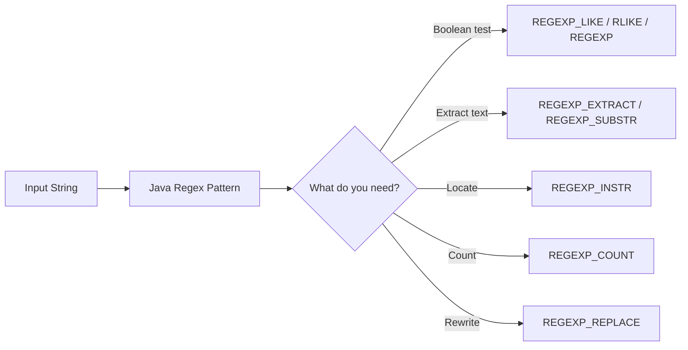

# :material-regex: Regex Functions Overview

Spark SQL's regex functions let you validate text, extract tokens, locate matches, count
occurrences, and rewrite strings without leaving SQL.

## :material-sitemap: Overview



### :material-animation-play: Interactive Visualization — One Pattern, Different Function Results

<div id="viz-regex-overview" class="ts-viz"></div>

Use the toggle to compare a matching string with a non-matching one. The same regex can yield
`TRUE`, `''`, `NULL`, `0`, or a positive count depending on which regex function you call.

______________________________________________________________________

## :material-pin: Functions at a Glance

| Function                                      | Purpose                         | Return Type     |
| --------------------------------------------- | ------------------------------- | --------------- |
| `REGEXP_LIKE(str, regex)`                     | Boolean regex match             | `BOOLEAN`       |
| `str RLIKE regex` / `str REGEXP regex`        | Operator form of regex match    | `BOOLEAN`       |
| `REGEXP_EXTRACT(str, regex[, idx])`           | Return one capture group        | `STRING`        |
| `REGEXP_EXTRACT_ALL(str, regex[, idx])`       | Return all matching groups      | `ARRAY<STRING>` |
| `REGEXP_SUBSTR(str, regex)`                   | Return the first full match     | `STRING`        |
| `REGEXP_INSTR(str, regex)`                    | Return the first match position | `INT`           |
| `REGEXP_COUNT(str, regex)`                    | Count regex matches             | `INT`           |
| `REGEXP_REPLACE(str, regex, rep[, position])` | Replace matched text            | `STRING`        |

______________________________________________________________________

## :material-magnify: Regex Syntax Notes

Spark SQL uses **Java regular expressions** (`java.util.regex`), not POSIX `grep` syntax and not
PCRE. That matters for escapes, inline flags such as `(?i)`, lookarounds, and backreferences.

| Pattern       | Meaning                       |
| ------------- | ----------------------------- |
| `.`           | Any single character          |
| `\d`          | Digit `[0-9]`                 |
| `\w`          | Word character `[A-Za-z0-9_]` |
| `*`, `+`, `?` | Quantifiers                   |
| `()`          | Capturing group               |
| `[abc]`       | Character class               |
| `^` / `$`     | Start / end anchor            |
| `(?i)`        | Inline case-insensitive flag  |

______________________________________________________________________

## :material-information-outline: Behavior

1. Spark regex functions use the **Java regex dialect**, so constructs like `(?i)` and lookaheads
    work, but wildcard expectations from `LIKE` do not carry over.
2. Regex patterns live inside SQL string literals, so backslashes usually need escaping:
    `\d+` in regex becomes `'\\d+'` in ordinary SQL strings.
3. Boolean match functions (`REGEXP_LIKE`, `RLIKE`, `REGEXP`) match **anywhere** in the string by
    default; use `^...$` when you need a full-string match.
4. **No-match outputs are intentionally different across the regex family**: `REGEXP_EXTRACT`
    returns `''`, `REGEXP_SUBSTR` returns `NULL`, `REGEXP_INSTR` returns `0`, and `REGEXP_COUNT`
    returns `0`.
5. `REGEXP_INSTR` positions are **1-based**, which makes them line up naturally with
    `SUBSTRING(str, position)`.

______________________________________________________________________

## :material-flask-outline: Practical Examples

### :material-toy-brick: 1. Validate a Structured Identifier

```sql
SELECT REGEXP_LIKE('order-2024-0007', '^order-\\d{4}-\\d{4}$') AS is_valid_order_id;
-- Result: true
```

### :material-toy-brick: 2. Extract a Numeric Token

```sql
SELECT REGEXP_EXTRACT('order-2024-0007', '(\\d{4})-(\\d{4})', 2) AS sequence_number;
-- Result: '0007'
```

### :material-alert-circle-outline: 3. Same No-Match, Different Return Values

```sql
SELECT
  REGEXP_EXTRACT('plain text', '(\\d+)', 1) AS extract_value,
  REGEXP_SUBSTR('plain text', '\\d+') AS substr_value,
  REGEXP_INSTR('plain text', '\\d+') AS instr_position,
  REGEXP_COUNT('plain text', '\\d+') AS match_count;

-- Result:
-- extract_value  = ''
-- substr_value   = NULL
-- instr_position = 0
-- match_count    = 0
```

### :material-toy-brick: 4. Use a Java Regex Inline Flag

```sql
SELECT REGEXP_LIKE('Spark SQL', '(?i)spark') AS case_insensitive_match;
-- Result: true
```

______________________________________________________________________

## :material-brain: When to Use

| Goal                      | Best Choice                         |
| ------------------------- | ----------------------------------- |
| Validate format           | `REGEXP_LIKE`, `RLIKE`, or `REGEXP` |
| Extract one token         | `REGEXP_EXTRACT`                    |
| Return the full match     | `REGEXP_SUBSTR`                     |
| Find where a match starts | `REGEXP_INSTR`                      |
| Count repeated patterns   | `REGEXP_COUNT`                      |
| Rewrite matched text      | `REGEXP_REPLACE`                    |

> **Tip:** If you need a missing match to behave like `NULL`, wrap `REGEXP_EXTRACT(...)` with
> `NULLIF(..., '')`.
