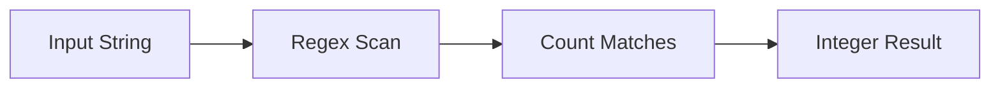

# :material-regex: REGEXP_COUNT

`REGEXP_COUNT` returns how many times a regular expression matches within a string.

## :material-sitemap: Overview



### :material-animation-play: Interactive Visualization — Non-Overlapping vs Overlapping Matches

<div id="viz-regex-count-scan" class="ts-viz"></div>

Switch between the default scan and a lookahead-based workaround. `REGEXP_COUNT` normally counts
non-overlapping matches, so a second match that starts inside the first one is skipped.

______________________________________________________________________

## :material-pin: Syntax

```sql
REGEXP_COUNT(str, regexp)
```

| Parameter | Description                      |
| --------- | -------------------------------- |
| `str`     | Input string to scan             |
| `regexp`  | Java regular expression to count |

______________________________________________________________________

## :material-information-outline: Behavior

1. Returns the number of substrings in `str` that match `regexp`.
2. Counts **non-overlapping** matches by default.
3. Returns `0` when no match is found.
4. Returns `NULL` if `str` or `regexp` is `NULL`.
5. In open-source Spark 4.2, `REGEXP_COUNT` has a **two-argument signature only**; there is no
    `position` or `match_type` parameter on this function.

______________________________________________________________________

## :material-flask-outline: Practical Examples

### :material-toy-brick: 1. Count Digits

```sql
SELECT REGEXP_COUNT('a1b2c3', '\\d') AS digit_count;
-- Result: 3
```

### :material-toy-brick: 2. Count Repeated Tokens

```sql
SELECT REGEXP_COUNT('error|warn|error|error', 'error') AS error_count;
-- Result: 3
```

### :material-alert-circle-outline: 3. Overlap Gotcha — `aba` in `ababa`

```sql
SELECT REGEXP_COUNT('ababa', 'aba') AS default_count;
-- Result: 1  -- the second "aba" starts inside the first match, so it is not counted again
```

### :material-toy-brick: 4. Count Overlapping Starts with a Lookahead

```sql
SELECT REGEXP_COUNT('ababa', '(?=(aba))') AS overlap_count;
-- Result: 2
```

### :material-toy-brick: 5. NULL Input Propagates

```sql
SELECT REGEXP_COUNT(NULL, '\\d+') AS null_input;
-- Result: NULL
```

______________________________________________________________________

## :material-brain: When to Use

| Scenario                       | Why `REGEXP_COUNT`?                   |
| ------------------------------ | ------------------------------------- |
| Count occurrences of a token   | Avoid `SIZE(REGEXP_EXTRACT_ALL(...))` |
| Validate repetition thresholds | Easy input for `CASE` or filters      |
| Find overlap starts            | Use a lookahead like `(?=(pattern))`  |
| Detect missing patterns        | `0` is a clean no-match signal        |
