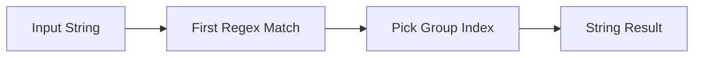

# :material-regex: REGEXP_EXTRACT

`REGEXP_EXTRACT` returns one capture group from the **first** regex match in a string.

## :material-sitemap: Overview



### :material-animation-play: Interactive Visualization — Group 0 vs Group 1 vs Group 2

<div id="viz-regex-extract-groups" class="ts-viz"></div>

Choose a capture group to see what Spark returns. The interactive example also shows an optional
capture that did not participate, which comes back as `''` rather than `NULL`.

______________________________________________________________________

## :material-pin: Syntax

```sql
REGEXP_EXTRACT(str, regexp[, idx])
```

| Parameter | Description                                            |
| --------- | ------------------------------------------------------ |
| `str`     | Input string to search                                 |
| `regexp`  | Java regular expression with optional capturing groups |
| `idx`     | Group index to return; defaults to `1` when omitted    |

______________________________________________________________________

## :material-information-outline: Behavior

1. Extracts from the **first match only**.
2. `idx = 0` returns the entire matched substring.
3. `idx = 1` returns the first parenthesized capture group; `2` returns the second, and so on.
4. If the regex does not match at all, Spark returns an **empty string** `''`, not `NULL`.
5. If the overall regex matches but an **optional capture group** does not participate, that group
    also returns `''`.
6. If `str` or `regexp` is `NULL`, the function returns `NULL`.

______________________________________________________________________

## :material-flask-outline: Practical Examples

### :material-toy-brick: 1. Extract the Numeric Part of a Code

```sql
SELECT REGEXP_EXTRACT('sku-2048', '([a-z]+)-(\\d+)', 2) AS sku_number;
-- Result: '2048'
```

### :material-toy-brick: 2. Compare Group 0, 1, and 2

```sql
SELECT
  REGEXP_EXTRACT('abc-123', '([a-z]+)-(\\d+)', 0) AS group_0,
  REGEXP_EXTRACT('abc-123', '([a-z]+)-(\\d+)', 1) AS group_1,
  REGEXP_EXTRACT('abc-123', '([a-z]+)-(\\d+)', 2) AS group_2;

-- Result:
-- group_0 = 'abc-123'
-- group_1 = 'abc'
-- group_2 = '123'
```

### :material-toy-brick: 3. Omit `idx` to Use the First Capture Group

```sql
SELECT REGEXP_EXTRACT('abc-123', '([a-z]+)-(\\d+)') AS default_group;
-- Result: 'abc'
```

### :material-alert-circle-outline: 4. Optional Group Did Not Match

```sql
SELECT
  REGEXP_EXTRACT('color=blue', 'color=(red)?(blue)', 1) AS optional_group,
  REGEXP_EXTRACT('color=blue', 'color=(red)?(blue)', 2) AS required_group,
  NULLIF(REGEXP_EXTRACT('color=blue', 'color=(red)?(blue)', 1), '') AS optional_as_null;

-- Result:
-- optional_group  = ''
-- required_group  = 'blue'
-- optional_as_null = NULL
```

### :material-toy-brick: 5. No Match Returns an Empty String

```sql
SELECT REGEXP_EXTRACT('plain text', '(\\d+)', 1) AS missing_number;
-- Result: ''
```

______________________________________________________________________

## :material-brain: When to Use

| Scenario                    | Why `REGEXP_EXTRACT`?            |
| --------------------------- | -------------------------------- |
| Pull a capture group        | Direct access by group index     |
| Need the full match instead | Use `idx = 0`                    |
| Want `NULL` on no match     | Wrap with `NULLIF(..., '')`      |
| Need every match, not first | Use `REGEXP_EXTRACT_ALL` instead |
