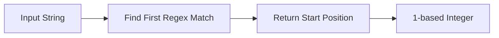

# :material-regex: REGEXP_INSTR

`REGEXP_INSTR` returns the **1-based starting position** of the first regex match in a string.

## :material-sitemap: Overview



### :material-animation-play: Interactive Visualization — 1-Based Positions and No-Match Zero

<div id="viz-regex-instr-position" class="ts-viz"></div>

The visualization highlights the first match and shows the returned position. Toggle to a string
with no digits to see the special no-match result: `0`, not `NULL`.

______________________________________________________________________

## :material-pin: Syntax

```sql
REGEXP_INSTR(str, regexp)
```

| Parameter | Description                     |
| --------- | ------------------------------- |
| `str`     | Input string to search          |
| `regexp`  | Java regular expression pattern |

______________________________________________________________________

## :material-information-outline: Behavior

1. Returns the **1-based** start position of the first match.
2. Returns `0` when no match is found.
3. Returns `NULL` if `str` or `regexp` is `NULL`.
4. The position is the **beginning** of the matched substring, not the end.
5. Because `SUBSTRING` is also 1-based, you can safely pass `REGEXP_INSTR` into `SUBSTRING`
    after guarding against the `0` no-match case.

______________________________________________________________________

## :material-flask-outline: Practical Examples

### :material-toy-brick: 1. Find the Start of a Domain

```sql
SELECT REGEXP_INSTR('user@spark.apache.org', '@[^.]*') AS domain_start;
-- Result: 5
```

### :material-toy-brick: 2. Locate the First Digit

```sql
SELECT REGEXP_INSTR('order-ABC-123', '\\d+') AS first_digit_pos;
-- Result: 11
```

### :material-alert-circle-outline: 3. No Match Returns `0`, Not `NULL`

```sql
SELECT REGEXP_INSTR('hello world', '\\d+') AS no_digit_position;
-- Result: 0
```

### :material-toy-brick: 4. Use with `SUBSTRING` After Guarding the Zero Case

```sql
SELECT CASE
  WHEN REGEXP_INSTR('item-456-detail', '\\d+') = 0 THEN NULL
  ELSE SUBSTRING('item-456-detail', REGEXP_INSTR('item-456-detail', '\\d+'))
END AS numeric_tail;
-- Result: '456-detail'
```

### :material-toy-brick: 5. NULL Input Propagates

```sql
SELECT REGEXP_INSTR(NULL, '\\d+') AS null_input;
-- Result: NULL
```

______________________________________________________________________

## :material-brain: When to Use

| Scenario                       | Why `REGEXP_INSTR`?                     |
| ------------------------------ | --------------------------------------- |
| Need the match position        | Returns an integer offset directly      |
| Need the matched text          | Use `REGEXP_SUBSTR` instead             |
| Need a boolean existence check | Use `REGEXP_LIKE`, `RLIKE`, or `REGEXP` |
| Slice from the first match     | Pair with `SUBSTRING`                   |
