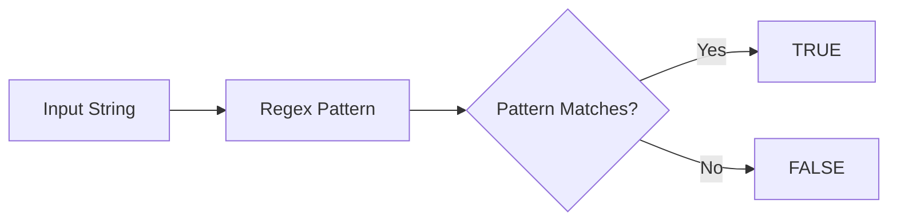

# :material-regex: REGEXP_LIKE

`REGEXP_LIKE` tests whether a string matches a Java regular expression and returns a boolean.

## :material-sitemap: Overview



### :material-animation-play: Interactive Visualization — Regex Match vs LIKE-Style Expectation

<div id="viz-regex-like-anchor" class="ts-viz"></div>

Compare a SQL wildcard pattern with a true regex. `%` and `_` are meaningful in `LIKE`/`ILIKE`,
but they are just ordinary characters in `REGEXP_LIKE` unless your regex explicitly uses `.*` or `.`.

______________________________________________________________________

## :material-pin: Syntax

```sql
REGEXP_LIKE(str, regexp)
```

| Parameter | Description                     |
| --------- | ------------------------------- |
| `str`     | Input string to test            |
| `regexp`  | Java regular expression pattern |

______________________________________________________________________

## :material-information-outline: Behavior

1. Returns `TRUE` when `regexp` matches **anywhere** in `str`.
2. Use `^...$` when you need a **full-string** match.
3. `REGEXP_LIKE(str, pattern)` uses the same matcher as `str RLIKE pattern`.
4. `NULL` input or `NULL` pattern returns `NULL`.
5. **`REGEXP_LIKE` is regex, not `LIKE`**: `%` is not a wildcard here, so translate `LIKE`-style
    intent into real regex tokens such as `.*` and `.`.

______________________________________________________________________

## :material-flask-outline: Practical Examples

### :material-toy-brick: 1. Partial Match Anywhere in the String

```sql
SELECT REGEXP_LIKE('Apache Spark', 'Spark') AS has_spark;
-- Result: true
```

### :material-toy-brick: 2. Full-String Validation with Anchors

```sql
SELECT REGEXP_LIKE('Spark', '^Spark$') AS exact_match;
-- Result: true
```

### :material-toy-brick: 3. Validate an Email-Like Pattern

```sql
SELECT REGEXP_LIKE('user@example.com', '^[\\w.]+@[\\w.]+\\.[A-Za-z]{2,}$') AS looks_like_email;
-- Result: true
```

### :material-alert-circle-outline: 4. `LIKE` Wildcard Habit Does Not Carry Over

```sql
SELECT
  REGEXP_LIKE('file-12.csv', 'file-%.csv') AS wrong_pattern,
  REGEXP_LIKE('file-12.csv', '^file-.*\\.csv$') AS correct_regex;

-- Result:
-- wrong_pattern = false
-- correct_regex = true
```

### :material-toy-brick: 5. Inline Flag for Case-Insensitive Regex

```sql
SELECT REGEXP_LIKE('Spark SQL', '(?i)spark') AS case_insensitive_match;
-- Result: true
```

______________________________________________________________________

## :material-brain: When to Use

| Scenario                   | Best Choice                         |
| -------------------------- | ----------------------------------- |
| Regex validation           | `REGEXP_LIKE`                       |
| Operator-style regex match | `RLIKE` or `REGEXP`                 |
| Case-insensitive wildcard  | `ILIKE`                             |
| Need the matching text     | `REGEXP_SUBSTR` or `REGEXP_EXTRACT` |
