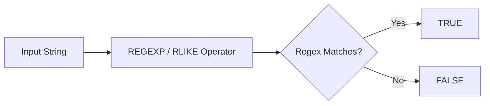

# :material-regex: REGEXP Operator

The `REGEXP` operator is an **operator alias** for `RLIKE`. It performs a boolean regex match
using the same Java regular expression engine.

## :material-sitemap: Overview



### :material-animation-play: Interactive Visualization — `REGEXP` and `RLIKE` Are the Same Matcher

<div id="viz-regexp-operator-alias" class="ts-viz"></div>

Switch between `RLIKE`, `REGEXP`, and `NOT REGEXP` to see that only the operator spelling changes.
`REGEXP` and `RLIKE` return the same result for the same string and pattern.

______________________________________________________________________

## :material-pin: Syntax

```sql
str [NOT] REGEXP regex
```

| Part    | Description                     |
| ------- | ------------------------------- |
| `str`   | Input string expression         |
| `regex` | Java regular expression pattern |

______________________________________________________________________

## :material-information-outline: Behavior

1. `str REGEXP regex` is equivalent to `str RLIKE regex`.
2. Like `RLIKE`, the regex can match **any substring** unless you anchor it with `^` and `$`.
3. `NOT REGEXP` negates the boolean result.
4. If either side is `NULL`, the result is `NULL`.
5. The pattern is a Java regex, so raw string literals such as `r'\\d+'` are handy when many
    backslashes are involved.

______________________________________________________________________

## :material-flask-outline: Practical Examples

### :material-toy-brick: 1. `REGEXP` and `RLIKE` Return the Same Answer

```sql
SELECT
  'abc123' RLIKE '\\d+' AS rlike_result,
  'abc123' REGEXP '\\d+' AS regexp_result;

-- Result:
-- rlike_result  = true
-- regexp_result = true
```

### :material-toy-brick: 2. Anchor When You Need an Exact Match

```sql
SELECT 'abc123' REGEXP '^\\d+$' AS digits_only;
-- Result: false
```

### :material-toy-brick: 3. Negate with `NOT REGEXP`

```sql
SELECT
  'abc' NOT REGEXP '\\d+' AS has_no_digits,
  'abc123' NOT REGEXP '\\d+' AS also_no_digits;

-- Result:
-- has_no_digits  = true
-- also_no_digits = false
```

### :material-toy-brick: 4. Raw String Literal for Heavy Escaping

```sql
SELECT r'%SystemDrive%\Users\John' REGEXP r'%SystemDrive%\\Users.*' AS path_match;
-- Result: true
```

______________________________________________________________________

## :material-brain: When to Use

| Scenario                          | Why `REGEXP`?                      |
| --------------------------------- | ---------------------------------- |
| Prefer operator syntax            | Reads naturally in `WHERE` clauses |
| Need the same behavior as `RLIKE` | Pure alias, no semantic difference |
| Need full regex power             | Uses Java regex, not SQL wildcards |
