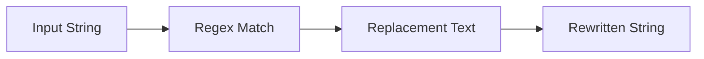

# :material-regex: REGEXP_REPLACE

`REGEXP_REPLACE` replaces substrings that match a regex pattern with new text.

## :material-sitemap: Overview



### :material-animation-play: Interactive Visualization — Backreferences and Start Position

<div id="viz-regexp-replace-backref" class="ts-viz"></div>

Toggle between a backreference example and a `position` example. The first rewrites captured groups;
the second shows that `position` changes where scanning begins, but still replaces **all** matches
from that point onward.

______________________________________________________________________

## :material-pin: Syntax

```sql
REGEXP_REPLACE(str, regexp, rep[, position])
```

| Parameter  | Description                                               |
| ---------- | --------------------------------------------------------- |
| `str`      | Input string to rewrite                                   |
| `regexp`   | Java regular expression pattern                           |
| `rep`      | Replacement text, including optional backreferences       |
| `position` | Optional 1-based character position where scanning starts |

______________________________________________________________________

## :material-information-outline: Behavior

1. Replaces **all** matches of `regexp`, not just the first one.
2. Replacement strings can reference capture groups with `$1`, `$2`, and so on.
3. When `position` is supplied, characters before that 1-based position stay unchanged.
4. `position` changes where Spark **starts searching**; it does **not** mean “replace only the
    Nth occurrence”.
5. If `str`, `regexp`, or `rep` is `NULL`, the result is `NULL`.

______________________________________________________________________

## :material-flask-outline: Practical Examples

### :material-toy-brick: 1. Replace Every Digit

```sql
SELECT REGEXP_REPLACE('call 555-1234', '\\d', 'X') AS masked_phone;
-- Result: 'call XXX-XXXX'
```

### :material-toy-brick: 2. Reformat with Backreferences

```sql
SELECT REGEXP_REPLACE(
  '2024-01-15',
  '(\\d{4})-(\\d{2})-(\\d{2})',
  '$2/$3/$1'
) AS us_style_date;
-- Result: '01/15/2024'
```

### :material-toy-brick: 3. Remove Punctuation

```sql
SELECT REGEXP_REPLACE('Hello, World! 123', '[^A-Za-z0-9 ]', '') AS cleaned_text;
-- Result: 'Hello World 123'
```

### :material-alert-circle-outline: 4. `position` Does Not Mean “Only One Replacement”

```sql
SELECT
  REGEXP_REPLACE('cat bat rat', '[a-z]at', 'X') AS replace_all,
  REGEXP_REPLACE('cat bat rat', '[a-z]at', 'X', 5) AS start_at_char_5;

-- Result:
-- replace_all      = 'X X X'
-- start_at_char_5  = 'cat X X'
```

### :material-toy-brick: 5. Skip the Prefix, Then Replace Later Matches

```sql
SELECT REGEXP_REPLACE('abc123abc456', 'abc', 'X', 4) AS later_only;
-- Result: 'abc123X456'
```

______________________________________________________________________

## :material-brain: When to Use

| Scenario                    | Why `REGEXP_REPLACE`?                  |
| --------------------------- | -------------------------------------- |
| Mask sensitive data         | Replace classes like `\d` or `\w`      |
| Reformat structured strings | Backreferences preserve captured parts |
| Skip an initial prefix      | Use the optional `position` argument   |
| Simple 1:1 character swap   | Prefer `TRANSLATE`                     |
