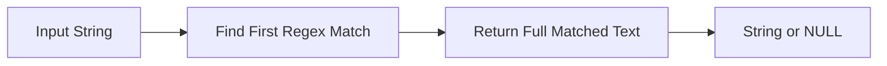

# :material-regex: REGEXP_SUBSTR

`REGEXP_SUBSTR` returns the substring matched by the **first** regex occurrence in a string.

## :material-sitemap: Overview



### :material-animation-play: Interactive Visualization — First Match vs No Match

<div id="viz-regexp-substr-first-match" class="ts-viz"></div>

The demo highlights the first match that `REGEXP_SUBSTR` returns. Toggle to a no-match example to
see that this function returns `NULL`, unlike `REGEXP_EXTRACT`, which returns `''`.

______________________________________________________________________

## :material-pin: Syntax

```sql
REGEXP_SUBSTR(str, regexp)
```

| Parameter | Description                     |
| --------- | ------------------------------- |
| `str`     | Input string to search          |
| `regexp`  | Java regular expression pattern |

______________________________________________________________________

## :material-information-outline: Behavior

1. Returns the **first** substring that matches the regex.
2. Returns the **full match**, not a specific capture group.
3. Returns `NULL` when no match is found.
4. Returns `NULL` if `str` or `regexp` is `NULL`.
5. For the first full match, `REGEXP_SUBSTR(str, regex)` is equivalent to
    `REGEXP_EXTRACT(str, regex, 0)`.

______________________________________________________________________

## :material-flask-outline: Practical Examples

### :material-toy-brick: 1. Return the First Number

```sql
SELECT REGEXP_SUBSTR('order-12345-item', '\\d+') AS first_number;
-- Result: '12345'
```

### :material-toy-brick: 2. Extract an Email Domain Tail

```sql
SELECT REGEXP_SUBSTR('user@spark.apache.org', '@[\\w.]+') AS domain_tail;
-- Result: '@spark.apache.org'
```

### :material-toy-brick: 3. Match Currency-Like Text

```sql
SELECT REGEXP_SUBSTR('Price: $99.50 USD', '\\$[\\d.]+') AS amount_text;
-- Result: '$99.50'
```

### :material-alert-circle-outline: 4. No Match Returns `NULL`

```sql
SELECT REGEXP_SUBSTR('hello world', '\\d+') AS missing_number;
-- Result: NULL
```

### :material-toy-brick: 5. Compare with `REGEXP_EXTRACT(..., 0)`

```sql
SELECT
  REGEXP_SUBSTR('id=42', '\\d+') AS via_substr,
  REGEXP_EXTRACT('id=42', '(\\d+)', 0) AS via_extract_0;

-- Result:
-- via_substr    = '42'
-- via_extract_0 = '42'
```

______________________________________________________________________

## :material-brain: When to Use

| Scenario                      | Best Choice                   |
| ----------------------------- | ----------------------------- |
| Need the full first match     | `REGEXP_SUBSTR`               |
| Need a specific capture group | `REGEXP_EXTRACT`              |
| Need the match position       | `REGEXP_INSTR`                |
| Need a clear no-match `NULL`  | `REGEXP_SUBSTR` is convenient |
