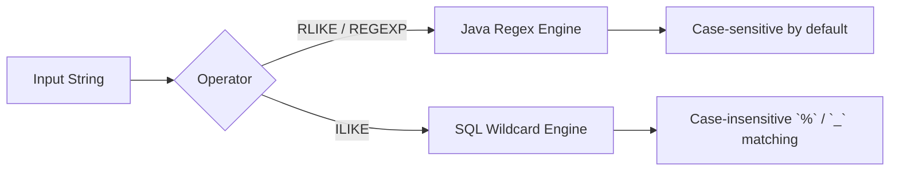

# :material-regex: RLIKE and ILIKE

`RLIKE` and `ILIKE` are both pattern-matching operators, but they solve **different** problems.
`RLIKE` uses Java regular expressions; `ILIKE` uses SQL wildcard patterns and ignores case.

## :material-sitemap: Overview



### :material-animation-play: Interactive Visualization — Regex vs Wildcard Matching

<div id="viz-rlike-ilike-case" class="ts-viz"></div>

Switch between `RLIKE`, case-insensitive regex with `(?i)`, and `ILIKE`. The same input can fail a
plain regex, pass a flagged regex, and also pass a case-insensitive wildcard pattern.

______________________________________________________________________

## :material-pin: Syntax

```sql
str RLIKE regex
str REGEXP regex
str ILIKE pattern [ESCAPE escape]
```

| Operator           | Pattern Language           |
| ------------------ | -------------------------- |
| `RLIKE` / `REGEXP` | Java regular expressions   |
| `ILIKE`            | SQL wildcards: `%` and `_` |

______________________________________________________________________

## :material-information-outline: Behavior

1. `RLIKE` and `REGEXP` are regex operators and are **case-sensitive by default**.
2. `ILIKE` is **case-insensitive** and uses SQL wildcards: `%` means “zero or more characters” and
    `_` means “exactly one character”.
3. Regex tokens such as `\d+`, `.*`, lookaheads, and inline flags belong to `RLIKE`/`REGEXP`, not
    to `ILIKE`.
4. To emulate case-insensitive regex matching with `RLIKE`, use an inline flag such as `(?i)`.
5. If either side of either operator is `NULL`, the result is `NULL`.

______________________________________________________________________

## :material-flask-outline: Practical Examples

### :material-toy-brick: 1. Case-Sensitive Regex Match

```sql
SELECT 'Spark-42' RLIKE '\\d+' AS has_digits;
-- Result: true
```

### :material-alert-circle-outline: 2. Plain `RLIKE` Is Case-Sensitive

```sql
SELECT
  'Spark' RLIKE 'spark' AS plain_regex,
  'Spark' RLIKE '(?i)spark' AS regex_with_flag;

-- Result:
-- plain_regex     = false
-- regex_with_flag = true
```

### :material-toy-brick: 3. `ILIKE` Uses Wildcards, Not Regex Tokens

```sql
SELECT 'Spark' ILIKE 'sp%rk' AS wildcard_match;
-- Result: true
```

### :material-alert-circle-outline: 4. `%` Means Nothing Special to `RLIKE`

```sql
SELECT
  'Spark' ILIKE 'sp%rk' AS ilike_match,
  'Spark' RLIKE 'sp%rk' AS rlike_literal_percent,
  'Spark' RLIKE '(?i)sp.*rk' AS rlike_regex_fix;

-- Result:
-- ilike_match            = true
-- rlike_literal_percent  = false
-- rlike_regex_fix        = true
```

### :material-toy-brick: 5. Use `ESCAPE` to Match a Literal Percent in `ILIKE`

```sql
SELECT '%SystemDrive%/Users/John' ILIKE '/%SYSTEMDrive/%//Users%' ESCAPE '/' AS escaped_percent;
-- Result: true
```

______________________________________________________________________

## :material-brain: When to Use

| Need                               | Use                    |
| ---------------------------------- | ---------------------- |
| Full regex features                | `RLIKE` / `REGEXP`     |
| Case-insensitive wildcard matching | `ILIKE`                |
| Case-insensitive regex matching    | `RLIKE '(?i)...'`      |
| Literal `%` or `_` in a wildcard   | `ILIKE ... ESCAPE ...` |
