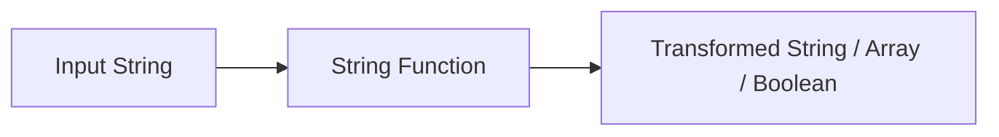

# :material-text: String Functions

Spark SQL string functions help you search, split, normalize, and compose text without leaving SQL.

______________________________________________________________________

## :material-sitemap: Overview



### :material-animation-play: Interactive Visualization — Regex vs Literal Split

`SPLIT` uses a regular-expression delimiter, so regex metacharacters such as `|` must be escaped when
you mean a literal character.

<div id="viz-string-split-regex" class="ts-viz"></div>

Click between the naive and escaped delimiters to see why `split('a|b|c', '|')` does not behave like a
literal pipe split.

______________________________________________________________________

## :material-code-tags: Syntax

```sql
instr(str, substr)
contains(left, right)
startswith(left, right)
endswith(left, right)
split(str, delimiter)
split_part(str, delimiter, partIndex)
concat(col1, col2, ..., colN)
concat_ws(sep[, str | array(str)]+)
format_string(fmt, arg1, ...)
to_char(numeric, format)   -- alias: to_varchar
levenshtein(left, right[, threshold])
char_length(expr)
lpad(str, len, pad)
rpad(str, len, pad)
```

| Function                          | Purpose                                                       |
| --------------------------------- | ------------------------------------------------------------- |
| `instr`                           | Return the 1-based position of the first match                |
| `contains`                        | Test whether one string or binary value occurs inside another |
| `startswith` / `endswith`         | Test prefix / suffix matches                                  |
| `split`                           | Break a string into an array using a regex delimiter          |
| `split_part`                      | Return a single 1-based field (negative counts from the end)  |
| `concat`, `concat_ws`             | Combine strings or arrays                                     |
| `format_string`                   | printf-style interpolation (`%s`, `%05.2f`, …)                |
| `to_char` / `to_varchar`          | Format a number as text with a format model                   |
| `levenshtein`                     | Edit distance for fuzzy matching (optional threshold)         |
| `char_length`, `character_length` | Count characters, including trailing spaces                   |
| `lpad`, `rpad`                    | Pad a string to a fixed width                                 |

______________________________________________________________________

## :material-information-outline: Behavior

1. `instr` returns a **1-based** position, not a zero-based index.
2. `contains` and `endswith` are case-sensitive; `contains('Spark SQL', 'SPARK')` returns `FALSE`.
3. `concat_ws` skips `NULL` inputs, making it useful for optional name or path segments.
4. `char_length` counts trailing spaces in strings.
5. **`split` treats the delimiter as a regular expression**. A metacharacter such as `|`, `.`, `+`, or `*`
    must be escaped when you want a literal split character instead of regex behavior.
6. `contains`, `endswith`, and similar search functions return `NULL` when one of their inputs is `NULL`.

______________________________________________________________________

## :material-flask-outline: Practical Examples

### :material-toy-brick: 1. Find the Position of a Substring

```sql
SELECT instr('SparkSQL', 'SQL') AS sql_pos;
-- Result: 6
```

### :material-toy-brick: 2. Build Strings While Skipping NULL Parts

```sql
SELECT concat_ws('/', 'warehouse', NULL, 'daily') AS safe_path;
-- Result: warehouse/daily
```

### :material-toy-brick: 3. Confirm Case-Sensitive Search

```sql
SELECT
  contains('Spark SQL', 'Spark') AS exact_case,
  contains('Spark SQL', 'SPARK') AS different_case;
-- Result: true, false
```

### :material-toy-brick: 4. Count Trailing Spaces Too

```sql
SELECT char_length('Spark SQL ') AS padded_len;
-- Result: 10
```

### :material-alert-circle-outline: 5. Regex Delimiter Gotcha in SPLIT

```sql
-- '|' is regex alternation, not a literal pipe
SELECT split('a|b|c', '|') AS naive_split;
-- Result: [a, |, b, |, c, ]

-- Escape the metacharacter to split on a literal pipe
SELECT split('a|b|c', '\\|') AS literal_pipe_split;
-- Result: [a, b, c]
```

### :material-toy-brick: 6. Parse Name Parts from a Column

```sql
SELECT
  split(full_name, ' ')[0] AS first_name,
  split(full_name, ' ')[1] AS last_name
FROM VALUES
  ('Ada Lovelace'),
  ('Grace Hopper')
AS people(full_name);
```

______________________________________________________________________

## :material-scissors-cutting: Extraction, Formatting, and Fuzzy Matching

Beyond the tokenizing basics above, these functions cover the day-to-day string work of
picking one field out of a delimited value, formatting numbers as text, and fuzzy matching.

### :material-toy-brick: 7. `split_part` — one field, no array

`split` returns the whole array; `split_part` grabs a **single 1-based field** directly —
cleaner when you only want one piece.

```sql
SELECT split_part('a,b,c,d', ',',  2) AS second,   -- b
       split_part('a,b,c,d', ',', -1) AS last,      -- d  (negative counts from the end)
       split_part('a,b,c,d', ',',  9) AS oor;       -- '' (out-of-range → empty string, not NULL)
```

```text
+------+----+---+
|second|last|oor|
+------+----+---+
|b     |d   |   |
+------+----+---+
```

!!! note "Negative index counts from the end; out-of-range returns an empty string"

    `split_part(..., -1)` is the idiomatic way to grab the **last** segment (e.g. a file
    extension or the final path component) without first measuring the array length. An
    index past the end yields `''`, never an error or `NULL`.

### :material-toy-brick: 8. `startswith` / `endswith` — prefix and suffix tests

```sql
SELECT startswith('SparkSQL', 'Spark') AS s,   -- true
       endswith('SparkSQL', 'SQL')     AS e;    -- true
```

Both are case-sensitive and return `NULL` if either argument is `NULL`. They read better
than `LIKE 'Spark%'` / `LIKE '%SQL'` and avoid escaping metacharacters in the pattern.

### :material-toy-brick: 9. `format_string` — printf-style formatting

```sql
SELECT format_string('%s=%05.2f', 'pi', CAST(3.14159 AS DOUBLE)) AS f;   -- pi=03.14
```

Uses Java `String.format` conversion specifiers (`%s`, `%d`, `%05.2f`, `%x`, …). Note that
`%f`/`%e` require a **floating-point** argument — a decimal literal like `3.14159` is parsed
as `DECIMAL` and raises `IllegalArgumentException: ... != Decimal`; `CAST(... AS DOUBLE)`
first.

### :material-toy-brick: 10. `to_char` / `to_varchar` — number-to-text with a format model

```sql
SELECT to_char(1234.5,   '9,999.99') AS money,    -- 1,234.50
       to_char(7,        '000')      AS padded,    -- 007
       to_char(-42,      'S999')     AS signed;    -- -42  (S = sign position)
```

`to_varchar` is an exact alias of `to_char`. Format elements: `9` (digit, blank if absent),
`0` (digit, zero-padded), `,` (grouping), `.` (decimal), `S` (sign), `$` (currency).

!!! warning "Value wider than the format prints `#` fill, not a truncated number"

    ```sql
    SELECT to_char(1234567.89, '9,999.99') AS overflow;   -- "# ###.##"
    ```

    If the number has more integer digits than the format provides, Spark fills the output
    with `#` characters rather than silently dropping digits — a visible signal that the
    format model is too narrow. Widen the format (add more `9`s) to fix it.

### :material-toy-brick: 11. `levenshtein` — edit distance for fuzzy matching

```sql
SELECT levenshtein('kitten', 'sitting')    AS d,          -- 3
       levenshtein('kitten', 'sitting', 2) AS d_capped;   -- -1
```

```text
+---+--------+
|d  |d_capped|
+---+--------+
|3  |-1      |
+---+--------+
```

!!! tip "The optional threshold short-circuits and returns `-1`"

    `levenshtein(a, b, threshold)` stops as soon as the distance exceeds `threshold` and
    returns `-1`. On large joins this is far cheaper than computing the full distance and
    then filtering — use it as an early "too different to care" cutoff for fuzzy dedup or
    near-match lookups.

______________________________________________________________________

## :material-lightbulb-outline: When to Use

| Scenario                          | Why these functions help                        |
| --------------------------------- | ----------------------------------------------- |
| Tokenizing delimited text         | `split` avoids manual substring math            |
| Extracting one delimited field    | `split_part` — 1-based, `-1` for the last piece |
| Checking for flags in free text   | `contains` and `instr` keep logic readable      |
| Prefix / suffix tests             | `startswith` / `endswith` beat `LIKE 'x%'`      |
| Formatting numbers as text        | `to_char` / `to_varchar` with a format model    |
| printf-style interpolation        | `format_string` (cast floats to `DOUBLE`)       |
| Fuzzy matching / near-duplicates  | `levenshtein` with a threshold cutoff           |
| Building optional labels or paths | `concat_ws` skips `NULL` parts automatically    |
| Enforcing fixed-width exports     | `lpad` and `rpad` normalize widths              |
| Preserving user-entered spacing   | `char_length` reveals trailing blanks           |
