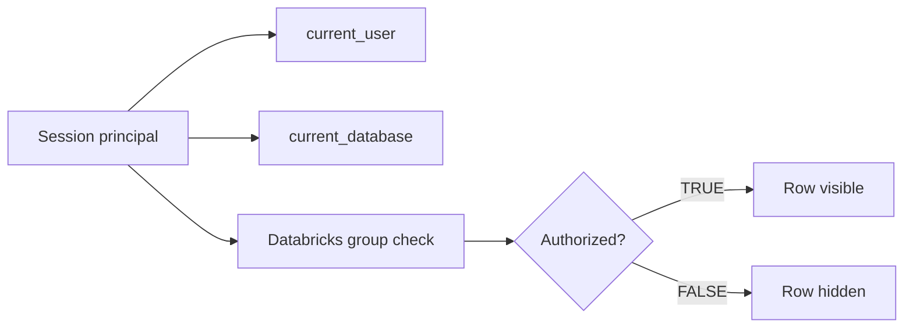

# :material-lock: ACL and Session Context Functions

This page covers the scalar functions most often used alongside access-control logic:
functions that reveal the current principal or current schema, plus Databricks-only
membership checks used inside row filters and views.

______________________________________________________________________

## :material-sitemap: Overview



### :material-animation-play: Interactive Visualization — Session Principal vs Group Check

<div id="viz-acl-context" class="ts-viz"></div>

This schematic compares an interactive user session with an automated service-principal job. The functions behave the same in both cases, but `CURRENT_USER()` reflects the principal that actually runs the query.

______________________________________________________________________

## :material-code-tags: Common Functions

| Function               | Availability              | Purpose                                                            |
| ---------------------- | ------------------------- | ------------------------------------------------------------------ |
| `current_user()`       | Apache Spark + Databricks | Current authenticated principal for the SQL session                |
| `current_database()`   | Apache Spark + Databricks | Current database/schema name for name resolution                   |
| `spark_partition_id()` | Apache Spark + Databricks | Current partition ID during execution                              |
| `is_member(group)`     | Databricks Runtime        | Whether the current principal belongs to a workspace/account group |

!!! info "Databricks Runtime only"

    `IS_MEMBER(...)` is not part of open-source Apache Spark. In local PySpark 4.2 OSS,
    `SELECT is_member('admins')` fails with `[UNRESOLVED_ROUTINE]`.

______________________________________________________________________

## :material-information-outline: Behavior

1. `current_user()` returns the identity that is executing the current query, not the notebook author or table owner.
2. Because it is session-based, `current_user()` can differ between an interactive analyst session and an automated job run under a service principal.
3. `current_database()` shows the schema/database Spark uses for unqualified object names.
4. `spark_partition_id()` is execution metadata, not an ACL decision function, but it often appears on this page because it is session/runtime context.
5. `is_member(group)` is a boolean membership test typically used in row filters, dynamic views, or guard expressions on Databricks.
6. There is no `acl()` scalar function in Spark SQL; on Databricks, actual permissions are managed with DDL such as `GRANT`, `REVOKE`, and `SHOW GRANTS`.

______________________________________________________________________

## :material-flask-outline: Practical Examples

### :material-toy-brick: 1. Inspect the Current Session Principal

```sql
SELECT current_user() AS session_principal;
-- Example result in local PySpark: 'malam'
```

### :material-toy-brick: 2. Inspect the Current Database

```sql
SELECT current_database() AS active_database;
-- Example result in a fresh local session: 'default'
```

### :material-toy-brick: 3. Add Execution Context for Debugging

```sql
SELECT
  value,
  spark_partition_id() AS partition_id
FROM VALUES (10), (20), (30) AS t(value);
```

### :material-toy-brick: 4. Databricks Group Membership Check

!!! info "Databricks Runtime only"

    Run this on Databricks Runtime or Databricks SQL, not open-source Spark.

```sql
SELECT is_member('finance-analysts') AS can_read_finance_rows;
```

### :material-alert-circle-outline: 5. `CURRENT_USER()` Depends on the Running Principal

```sql
SELECT current_user() AS session_principal;
```

The same query can legitimately return different values in different execution contexts:

- an interactive notebook or SQL warehouse session often returns the signed-in user
- an automated job may return the service principal or job-run identity that executed it

That difference matters when row filters or dynamic views depend on `CURRENT_USER()`.

### :material-alert-circle-outline: 6. There Is No `acl()` Scalar Function

!!! info "Databricks Runtime / Databricks SQL example"

    `SHOW GRANTS` is part of the Databricks permission-management workflow, not open-source Spark SQL.

```sql
-- Permissions are managed with DDL, not a scalar acl() function.
SHOW GRANTS ON TABLE finance.budget;
```

Use scalar functions such as `CURRENT_USER()` and `IS_MEMBER()` to **inspect context** inside queries,
not to grant or revoke access.

______________________________________________________________________

## :material-lightbulb-outline: When to Use

| Scenario                                            | Recommended function             |
| --------------------------------------------------- | -------------------------------- |
| Personalize row filters by executing identity       | `current_user()`                 |
| Resolve unqualified object names safely             | `current_database()`             |
| Debug skew or task placement                        | `spark_partition_id()`           |
| Check Databricks group membership in a dynamic view | `is_member(group)`               |
| Manage actual privileges                            | `GRANT`, `REVOKE`, `SHOW GRANTS` |
