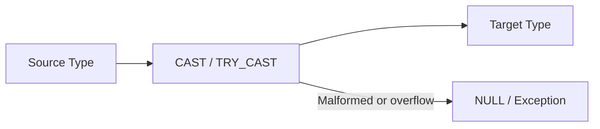

# :material-swap-horizontal: Conversion Functions

Spark SQL conversion functions change values between strings, numbers, dates, timestamps, booleans, and
binary representations.

______________________________________________________________________

## :material-sitemap: Overview



### :material-animation-play: Interactive Visualization — CAST vs TRY_CAST

Use the controls below to compare strict conversion with tolerant conversion for clean values, malformed
strings, and overflow cases.

<div id="viz-conversion-cast-trycast" class="ts-viz"></div>

Select an input to see when `CAST` throws and when `TRY_CAST` safely returns `NULL` instead.

______________________________________________________________________

## :material-code-tags: Syntax

```sql
cast(expr AS type)
try_cast(expr AS type)
bigint(expr)
binary(expr)
boolean(expr)
date(expr)
decimal(expr)
double(expr)
float(expr)
int(expr)
smallint(expr)
string(expr)
timestamp(expr)
tinyint(expr)
```

| Function                               | Target type                        |
| -------------------------------------- | ---------------------------------- |
| `bigint`, `int`, `smallint`, `tinyint` | Integral numeric types             |
| `decimal`, `double`, `float`           | Exact or approximate numeric types |
| `boolean`                              | Boolean                            |
| `date`, `timestamp`                    | Temporal types                     |
| `binary`                               | Binary bytes                       |
| `string`                               | Text                               |
| `cast`, `try_cast`                     | General explicit conversion        |

______________________________________________________________________

## :material-information-outline: Behavior

1. Helper functions such as `int(expr)` and `timestamp(expr)` are shorthand for explicit casts.
2. `CAST` follows Spark's ANSI conversion rules when ANSI mode is enabled.
3. **Malformed input and overflow raise an error with `CAST`, but `TRY_CAST` returns `NULL`.**
4. Casting a non-integer string such as `'42.9'` directly to `INT` does not truncate in ANSI mode; it is
    treated as malformed input.
5. Temporal casts succeed only when the input text matches a supported date or timestamp format.

______________________________________________________________________

## :material-flask-outline: Practical Examples

### :material-toy-brick: 1. Convert Text to Common Numeric Types

```sql
SELECT
  bigint('12345') AS as_bigint,
  decimal('123.456') AS as_decimal,
  float('123.456') AS as_float;
```

### :material-toy-brick: 2. Convert to Temporal Types

```sql
SELECT
  date('2025-07-20') AS as_date,
  timestamp('2024-01-01 12:34:56') AS as_timestamp;
```

### :material-toy-brick: 3. Convert to Binary and Back to Hex

```sql
SELECT hex(binary('abc')) AS binary_hex;
-- Result: 616263
```

### :material-alert-circle-outline: 4. CAST vs TRY_CAST on Malformed Input

```sql
-- CAST raises an error in ANSI mode
SELECT CAST('abc' AS INT) AS cast_value;
-- Error: [CAST_INVALID_INPUT] ... Use `try_cast` to tolerate malformed input and return NULL instead.

SELECT TRY_CAST('abc' AS INT) AS try_cast_value;
-- Result: NULL
```

### :material-alert-circle-outline: 5. Decimal-Looking Text Does Not Auto-Truncate to INT

```sql
SELECT TRY_CAST('42.9' AS INT) AS tolerant_int;
-- Result: NULL

SELECT TRY_CAST('128' AS TINYINT) AS tinyint_overflow;
-- Result: NULL
```

______________________________________________________________________

## :material-lightbulb-outline: When to Use

| Scenario                                               | Best choice                |
| ------------------------------------------------------ | -------------------------- |
| Enforce a required type for downstream logic           | `CAST`                     |
| Land messy source data without failing the whole query | `TRY_CAST`                 |
| Parse dates and timestamps from ingest text            | `date`, `timestamp`        |
| Prepare text values for numeric math                   | `decimal`, `double`, `int` |
| Inspect raw bytes or encoded payloads                  | `binary`                   |
