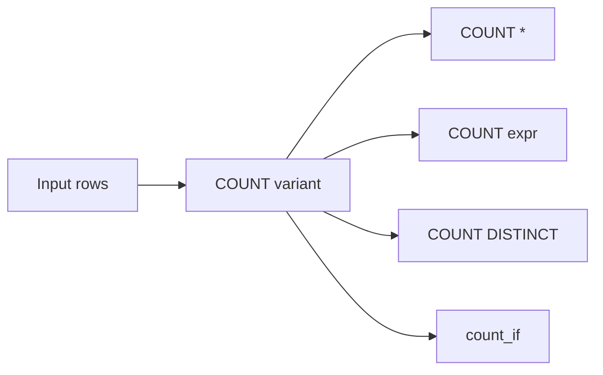

# :material-counter: Count Functions

`COUNT` answers different questions depending on what you count: rows, non-NULL values,
distinct values, or rows where a condition is `TRUE`.

!!! info "Related: COUNT in GROUP BY aggregation"

    For `COUNT_IF`, `APPROX_COUNT_DISTINCT`, `APPROX_PERCENTILE`, and how
    `COUNT(DISTINCT a, b)` combines with `FILTER (WHERE ...)` in a `GROUP BY`
    context, see [Count Functions](../../aggregate/count.md) in Aggregate
    Functions.

______________________________________________________________________

## :material-sitemap: Overview



### :material-animation-play: Interactive Visualization — Count Variants

<div id="viz-count-modes" class="ts-viz"></div>

Step through the four common count variants on the same sample rows. Click a mode to see which rows are included and why `NULL` and duplicate values change the answer.

______________________________________________________________________

## :material-code-tags: Syntax

```sql
COUNT(*)
COUNT(expr)
COUNT(DISTINCT expr)
COUNT(DISTINCT expr1, expr2, ...)
count_if(condition)
```

| Form                                | What it counts                                               |
| ----------------------------------- | ------------------------------------------------------------ |
| `COUNT(*)`                          | Every input row                                              |
| `COUNT(expr)`                       | Rows where `expr` is not `NULL`                              |
| `COUNT(DISTINCT expr)`              | Distinct non-`NULL` values of one expression                 |
| `COUNT(DISTINCT expr1, expr2, ...)` | Distinct non-`NULL` combinations across multiple expressions |
| `count_if(condition)`               | Rows where `condition` evaluates to `TRUE`                   |

______________________________________________________________________

## :material-information-outline: Behavior

1. `COUNT(*)` counts every row, even when every selected column is `NULL`.
2. `COUNT(expr)` skips rows where the expression evaluates to `NULL`.
3. `COUNT(DISTINCT expr)` removes duplicates **after** dropping `NULL` values.
4. `COUNT(DISTINCT expr1, expr2, ...)` skips any row where **any** counted expression is `NULL`.
5. `count_if(condition)` counts `TRUE` only; `FALSE` and `NULL` are both ignored.
6. Windowed counts such as `COUNT(*) OVER (...)` add a count per row without collapsing the result set.
7. If you need distinct combinations **including** `NULL` values, `COUNT(DISTINCT col1, col2)` is not enough; use a single distinct expression such as a `NAMED_STRUCT(...)` instead (see Example 7).

______________________________________________________________________

## :material-flask-outline: Practical Examples

### :material-toy-brick: 1. Count All Rows

```sql
SELECT COUNT(*) AS total_rows
FROM VALUES
  (1, 'Sales'),
  (2, NULL),
  (3, 'HR')
AS employees(id, department);
-- Result: 3
```

### :material-toy-brick: 2. Count Non-NULL Values

```sql
SELECT COUNT(department) AS populated_departments
FROM VALUES
  (1, 'Sales'),
  (2, NULL),
  (3, 'HR')
AS employees(id, department);
-- Result: 2
```

### :material-toy-brick: 3. Count Distinct Non-NULL Values

```sql
SELECT COUNT(DISTINCT department) AS unique_departments
FROM VALUES
  ('Sales'),
  ('Sales'),
  ('HR'),
  (NULL)
AS departments(department);
-- Result: 2
```

### :material-toy-brick: 4. Count Distinct Multi-Column Combinations

```sql
SELECT COUNT(DISTINCT department, role) AS unique_pairs
FROM VALUES
  ('Sales', 'Rep'),
  ('Sales', 'Rep'),
  ('Sales', 'Mgr'),
  ('HR', 'Mgr')
AS employees(department, role);
-- Result: 3
```

### :material-toy-brick: 5. Conditional Counting with `count_if`

```sql
SELECT
  count_if(status = 'completed') AS completed_orders,
  count_if(status = 'cancelled') AS cancelled_orders,
  count_if(status IS NULL) AS missing_statuses
FROM VALUES
  ('completed'),
  ('cancelled'),
  ('completed'),
  (NULL)
AS orders(status);
-- Result: completed_orders = 2, cancelled_orders = 1, missing_statuses = 1
```

### :material-toy-brick: 6. Compare `COUNT(*)`, `COUNT(col)`, and `COUNT(DISTINCT col)`

```sql
SELECT
  COUNT(*) AS all_rows,
  COUNT(v) AS non_null_rows,
  COUNT(DISTINCT v) AS distinct_non_null_rows
FROM VALUES
  (1),
  (1),
  (NULL),
  (2),
  (NULL)
AS t(v);
-- Result: all_rows = 5, non_null_rows = 3, distinct_non_null_rows = 2
```

### :material-alert-circle-outline: 7. `COUNT(DISTINCT col1, col2)` Drops Rows with `NULL`

```sql
SELECT COUNT(DISTINCT department, role) AS distinct_pairs
FROM VALUES
  ('Sales', 'Rep'),
  ('Sales', NULL),
  ('Sales', NULL),
  (NULL, 'Rep'),
  (NULL, 'Rep')
AS employees(department, role);
-- Result: 1
-- Only ('Sales', 'Rep') is counted; any row with a NULL in either expression is skipped.

-- Fix: wrap the full combination in one expression so NULL-bearing combinations remain distinct values.
SELECT COUNT(DISTINCT NAMED_STRUCT('department', department, 'role', role)) AS distinct_pairs_including_nulls
FROM VALUES
  ('Sales', 'Rep'),
  ('Sales', NULL),
  ('Sales', NULL),
  (NULL, 'Rep'),
  (NULL, 'Rep')
AS employees(department, role);
-- Result: 3
```

### :material-toy-brick: 8. Window Count Without Grouping Away Detail

```sql
SELECT
  employee,
  department,
  COUNT(*) OVER (PARTITION BY department) AS department_size
FROM VALUES
  ('Alice', 'Sales'),
  ('Bob', 'Sales'),
  ('Cara', 'HR')
AS staff(employee, department);
-- Alice -> 2, Bob -> 2, Cara -> 1
```

______________________________________________________________________

## :material-lightbulb-outline: When to Use

| Scenario                                            | Recommended form                    |
| --------------------------------------------------- | ----------------------------------- |
| Count all input rows                                | `COUNT(*)`                          |
| Measure column completeness                         | `COUNT(column)`                     |
| Count unique populated values                       | `COUNT(DISTINCT column)`            |
| Count rows matching a rule                          | `count_if(condition)`               |
| Keep row detail while adding counts                 | `COUNT(...) OVER (...)`             |
| Count distinct combinations that may contain `NULL` | `COUNT(DISTINCT NAMED_STRUCT(...))` |
