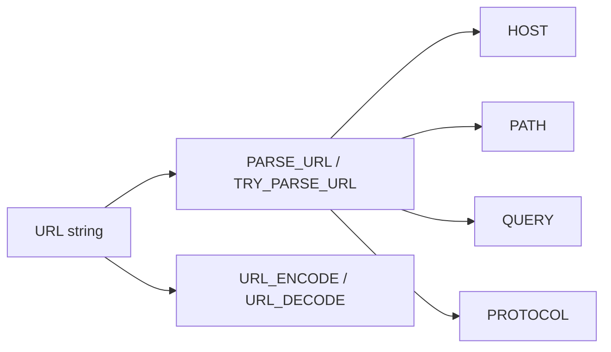

# :material-web: Web Functions

Web functions parse URLs and safely transform query-string values. They are especially useful
when semi-structured logs, clickstream events, or API payloads store links as raw text.

______________________________________________________________________

## :material-sitemap: Overview



### :material-animation-play: Interactive Visualization — URL Parts and Encoding

<div id="viz-web-url-parts" class="ts-viz"></div>

Switch between a valid and malformed URL to compare `PARSE_URL` with `TRY_PARSE_URL`, then inspect how `URL_ENCODE` and `URL_DECODE` transform spaces and special characters during a round trip.

______________________________________________________________________

## :material-code-tags: Common Functions

```sql
parse_url(url, partToExtract[, key])
try_parse_url(url, partToExtract[, key])
url_encode(str)
url_decode(str)
```

| Function        | Purpose                                                       |
| --------------- | ------------------------------------------------------------- |
| `parse_url`     | Extract a URL component and raise an error for malformed URLs |
| `try_parse_url` | Extract a URL component but return `NULL` for malformed URLs  |
| `url_encode`    | Percent-encode / form-encode a string for use in a URL        |
| `url_decode`    | Decode an encoded URL string                                  |

______________________________________________________________________

## :material-information-outline: Behavior

1. `parse_url(url, part)` extracts one component such as `HOST`, `PATH`, `QUERY`, `REF`, or `PROTOCOL`.
2. `parse_url(url, 'QUERY', key)` extracts a single query parameter value.
3. In Spark 4.2 OSS, malformed URLs do **not** return `NULL` from `parse_url`; they raise `[INVALID_URL]`.
4. Use `try_parse_url(...)` when bad input is expected and you want `NULL` instead of an exception.
5. Extracted query parameter values are returned as they appear in the URL; percent-encoding is not automatically decoded.
6. `url_encode` encodes spaces as `+`, and `url_decode` converts `+` back to a space.

______________________________________________________________________

## :material-flask-outline: Practical Examples

### :material-toy-brick: 1. Extract the Host

```sql
SELECT parse_url('http://spark.apache.org/path?query=1', 'HOST') AS host;
-- Result: 'spark.apache.org'
```

### :material-toy-brick: 2. Extract Multiple Parts

```sql
SELECT
  parse_url(url, 'PROTOCOL') AS protocol,
  parse_url(url, 'HOST') AS host,
  parse_url(url, 'PATH') AS path,
  parse_url(url, 'QUERY') AS query_string
FROM VALUES
  ('https://spark.apache.org/docs/latest?format=pdf')
AS t(url);
```

### :material-toy-brick: 3. Extract a Specific Query Parameter

```sql
SELECT
  parse_url('http://example.com/search?q=spark&lang=en', 'QUERY', 'q') AS q,
  parse_url('http://example.com/search?q=spark&lang=en', 'QUERY', 'lang') AS lang;
-- Result: 'spark', 'en'
```

### :material-alert-circle-outline: 4. Malformed URLs Raise an Error with `PARSE_URL`

```sql
SELECT parse_url('not a url', 'HOST') AS bad_host;
-- Error: [INVALID_URL] The url is invalid: not a url
```

```sql
SELECT try_parse_url('not a url', 'HOST') AS bad_host_safe;
-- Result: NULL
```

### :material-alert-circle-outline: 5. Query Values May Need Explicit Decoding

```sql
SELECT parse_url(
  'https://example.com/search?q=spark%20sql&lang=en',
  'QUERY',
  'q'
) AS raw_q;
-- Result: 'spark%20sql'

SELECT url_decode(parse_url(
  'https://example.com/search?q=spark%20sql&lang=en',
  'QUERY',
  'q'
)) AS decoded_q;
-- Result: 'spark sql'
```

### :material-toy-brick: 6. Encode and Decode a Round Trip

```sql
SELECT
  url_encode('Spark SQL + D3.js') AS encoded,
  url_decode('Spark%20SQL%20%2B%20D3.js') AS decoded;
-- Result: 'Spark+SQL+%2B+D3.js', 'Spark SQL + D3.js'
```

### :material-toy-brick: 7. `+` Also Decodes Back to a Space

```sql
SELECT
  parse_url('https://example.com/search?q=Spark+SQL', 'QUERY', 'q') AS raw_plus_value,
  url_decode(parse_url('https://example.com/search?q=Spark+SQL', 'QUERY', 'q')) AS decoded_plus_value;
-- Result: 'Spark+SQL', 'Spark SQL'
```

______________________________________________________________________

## :material-lightbulb-outline: When to Use

| Scenario                                              | Recommended function           |
| ----------------------------------------------------- | ------------------------------ |
| Reliable parsing of known-good URLs                   | `parse_url`                    |
| Defensive parsing of messy source data                | `try_parse_url`                |
| Read one query parameter                              | `parse_url(..., 'QUERY', key)` |
| Convert extracted query values to human-readable text | `url_decode(...)`              |
| Build safe query strings                              | `url_encode(...)`              |
